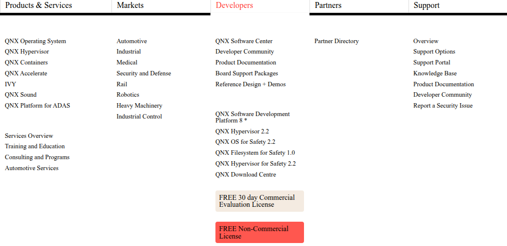
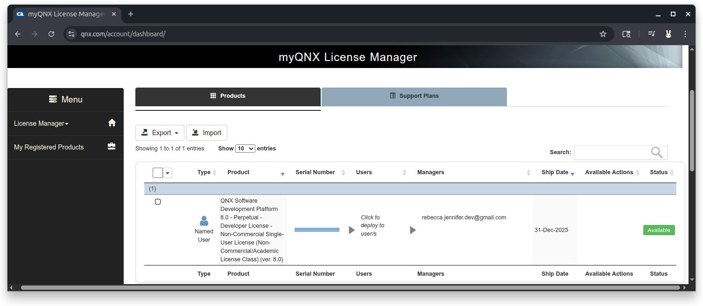
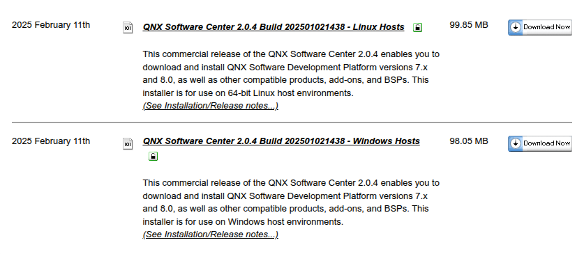
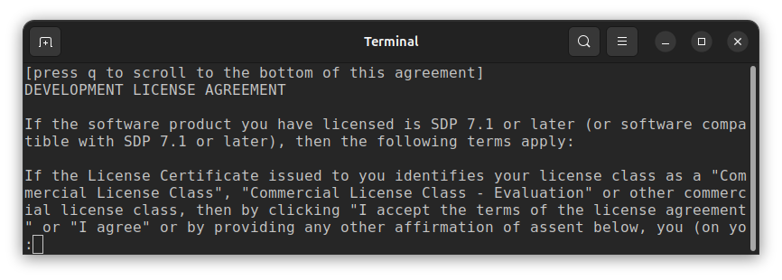
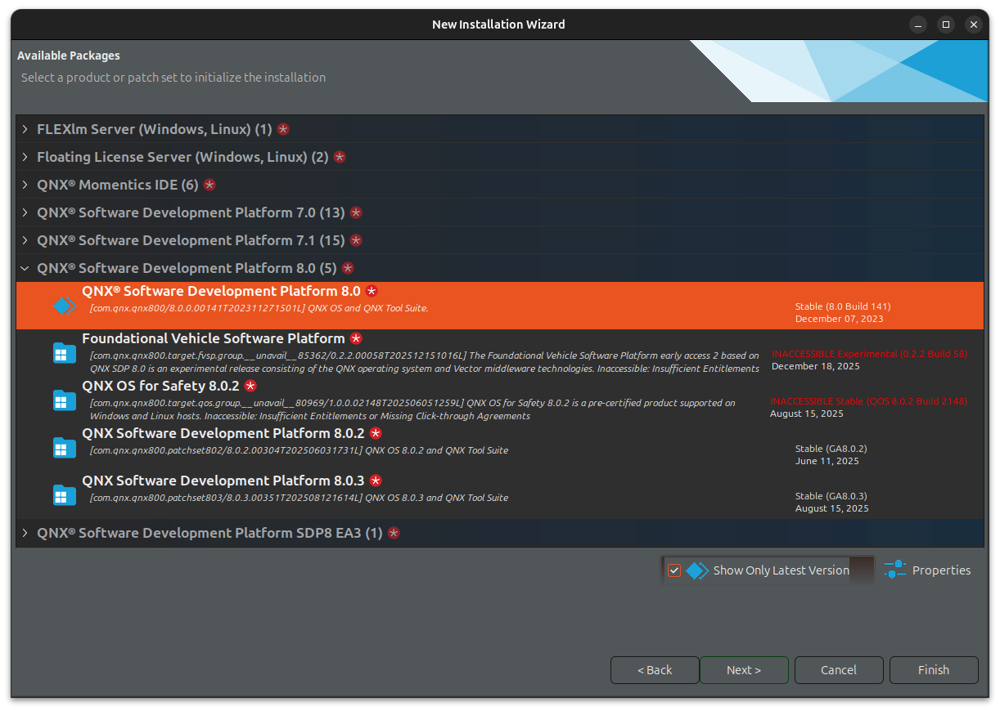
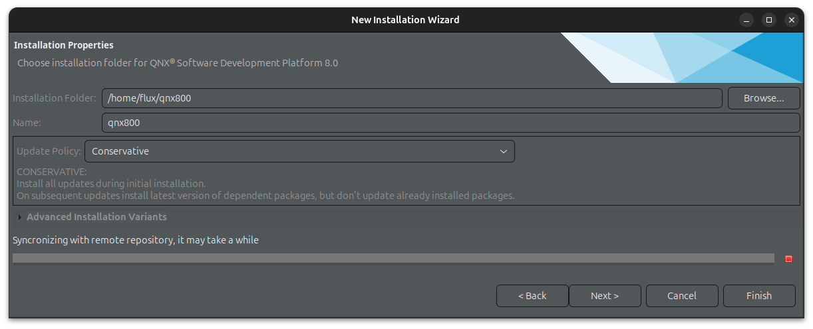
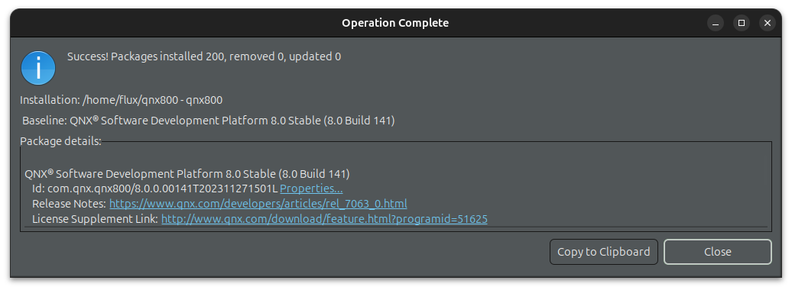



## Installation

1. Sign up for myQNX account from <https://qnx.com>.

1. Log in with myQNX. Hover over Developers, then click `FREE Non-Commercial License`.


1. If you click this more than once, you will see this screen after you've already requested a license.

   

1. You should receive an email within 30 minutes indicating that your Non-Commercial license is ready.

1. Go to <https://qnx.com/account/dashboard/>.

   

1. Under the `Users` column, click on the text `Click to deploy to users` then on the button `Deploy`. Type the email address used for your QNX account.

   
   

1. From myQNX home <https://qnx.com/account>, click on the `QNX Software Center` link.

   

1. Scroll down to the download section and select the appropriate version for your OS.

   

1. In your terminal window, navigate to the downloaded file and make the file executable.

   ```bash
   (prompt): chmod +x qnx-setup-2.0.4-202501021438-linux.run
   ```

1. Run the file to install software center.

   ```bash
   (prompt): ./qnx-setup-2.0.4-202501021438-linux.run
   ```

1. Scroll to the bottom of the license agreement by hitting `<enter>` several times or type `q` to jump to the bottom.

   

1. Type `y` to accept agreement.

   

1. Specify installation path. Hit `<enter>` to accept the default install location.

   ```bash
   Specify installation path (default: /home/flux/qnx):
   ```

1. After specifying the installation path, your terminal will look similar to this.

   ```bash
   (prompt): chmod +x qnx-setup-2.0.4-202501021438-linux.run
   (prompt): ./qnx-setup-2.0.4-202501021438-linux.run
   Verifying archive integrity... All good.
   Uncompressing QNX Software Center 2.0.4  100%
   Please type y to accept, n otherwise: y
   Current directory: /home/flux/Downloads
   Specify installation path (default: /home/flux/qnx):

   Installing QNX Software Center into /home/flux/qnx/qnxsoftwarecenter
   User configuration is stored in /home/flux/.qnx
   Launching QNX Software Center using /home/flux/qnx/qnxsoftwarecenter/qnxsoftwarecenter
   ```

1. Type your myQNX credentials.

   
   

1. From the QNX Software Center window, click `Add Installation`.

   

1. Expand `QNX Software Development Platform 8.0`, select `QNX Software Development Platform 8.0` and click `Next` on this and the following window.

   
   

1. The window might show `Synchronizing with remote repository, it may take a while` for a few minutes. Click `Next` when the window changes. Click `Next` for the next couple screens.
   
   
   

1. Accept the license agreement and click `Finish`.

   

1. After a few minutes, this window will pop up. Click `Close`.

   

1. From QNX Software Center, click `Installed` and expand `QNX Software Development Platform 8.0` to view installed packages.

   

<!--
<head>
    <link rel="stylesheet" href="../flux-bunny-style.css">
</head>
-->

## Installed Files

After installation, in your terminal, navigate to the QNX installation folder.

```bash
(prompt): ls ~/qnx800
host  qnxsdp-env.bat  qnxsdp-env.sh  target

#_______________________________________________________________
# Contains list of host binaries included in SDP
# binaries that run on Linux / Development host that allow
# you to best interact with QNX SDP
#_______________________________________________________________
host

#_______________________________________________________________
# Contains list of binaries, libraries, tools intended to
# run on QNX target
#_______________________________________________________________
target

#_______________________________________________________________
# Set up QNX shell environment
#_______________________________________________________________
qnxsdp-env.sh
```

```bash
# Sets up shell environment for QNX development
# Sets environment variables:
# QNX_HOST=/home/username/qnx800/host/linux/x86_64
# QNX_TARGET=/home/username/qnx800/target/qnx
# MAKEFLAGS=-I/home/username/qnx800/target/qnx/usr/include
source qnxsdp-env.sh
```

## QNX Momentix IDE

Setting up a new project

Field | Entry | Notes
-|-|-
`CPU Variant` | `aarch64le` | For Raspberry Pi

## VS Code QNX Toolkit

<https://www.qnx.com/developers/docs/qnxtoolkit/>

Need to tell VS Code where QNX documentation is.

From QNX extension in the Activity Bar

---

## QNX Toolkit for Visual Studio Code + QNX OS 8.0 Deep Dive

[Quickstart Guide](https://www.qnx.com/developers/docs/8.0/com.qnx.doc.qnxtoolkit.user_guide/topic/quickstart_guide.html)

<https://www.youtube.com/watch?v=M02X6AqdK7M>

From settings, verify SDP path.


This corresponds with this property in `settings.json`

```json
"qnx.sdpPath": "/home/username/qnx800"
```

### Prereqs

- Raspberry Pi 4
  - Ethernet connection
  - Serial connection

Get image from software center

### Confirm Target is Running

- Connect over serial - from RazPi to computer over USB

From command line:

```bash
# Confirm target is connected
(prompt): ls /dev/ttyUSB*
/dev/tty/ttyUSB0

#
(prompt): sudo screen /dev/ttyUSB0 115200
[sudo] password for username:

# uname -a
QNX localhost 8.0.0 YYYY/MM/DD-hh:mm:ssEST RaspberryPi4B aarch64le
```

## New Project
