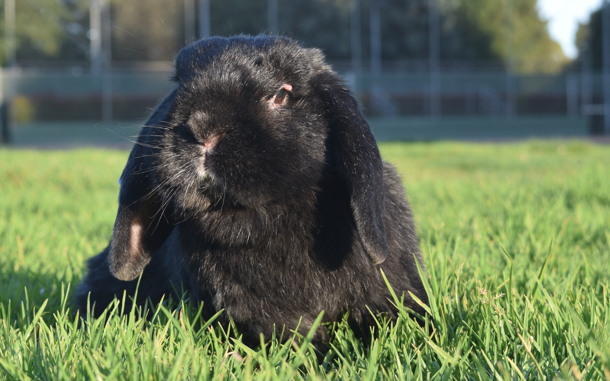

<!--___________________________________________________________________|
|______________________________________________________________________|
|        _   __   _   _ _   _   _   _         _                        |
|   |   |_| | _  | | | V | | | | / |_/ |_| | /                         |
|   |__ | | |__| |_| |   | |_| | \ |   | | | \_                        |
|    _  _         _ ___  _       _ ___   _                    / /      |
|   /  | | |\ |  \   |  | / | | /   |   \                    (^^)      |
|   \_ |_| | \| _/   |  | \ |_| \_  |  _/                    (____)o   |
|______________________________________________________________________|
|______________________________________________________________________|
|                                                                      |
|----------------------------------------------------------------------|
|   Copyright 2025, Rebecca Rashkin                                    |
|   -------------------------------                                    |
|   This code may be copied, redistributed, transformed, or built      |
|   upon in any format for educational, non-commercial purposes.       |
|                                                                      |
|   Please give me appropriate credit should you choose to use this    |
|   resource. Thank you :)                                             |
|----------------------------------------------------------------------|
|                                                                      |
|______________________________________________________________________|
|   //\^.^/\\  //\^.^/\\  //\^.^/\\  //\^.^/\\  //\^.^/\\  //\^.^/\\   |
|____________________________________________________________________-->

<!--
---
title: Salutations!
format: html
subtitle: My name is Rebecca.
---
-->

::: {.full-bleed}

Salutations!

My name is Rebecca.

  

  
  

:::

## Who I Am
  I’m a software engineer who values clean code, workflow efficiency, and clear documentation. I’m also an educator and enjoy sharing my knowledge of computer engineering and movement, two areas that bring me joy. I find satisfaction in lifting others up and leaving every space I occupy better than I found it. My favorite things are coding, handstands, and rabbits 🐰

## What I Care About

  <a class="flux-button _2" href="/education/comp-org/comp-org.html">Engineering</a>
  <a class="flux-button _2" href="https://flyingrabbitmovement.com">Movement</a>
  <a class="flux-button _2" href="/education/comp-org/comp-org.html">Education</a>
  <a class="flux-button _2" href="projects/color-clock/about-color-clock.html">Creativity</a>

<a id="FLUX">TEST</a>

