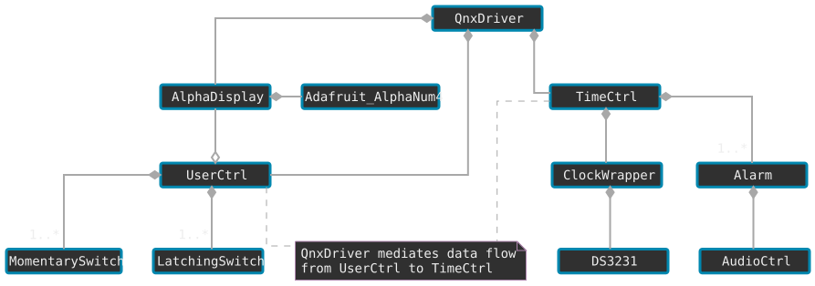
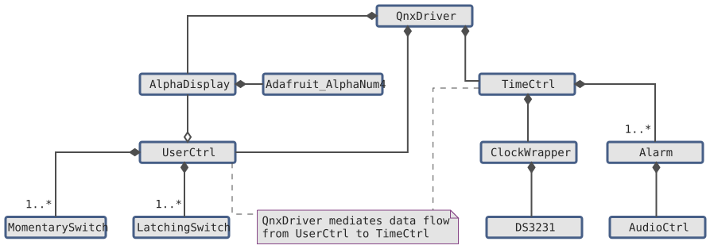

<!--___________________________________________________________________|
|______________________________________________________________________|
|        _   __   _   _ _   _   _   _         _                        |
|   |   |_| | _  | | | V | | | | / |_/ |_| | /                         |
|   |__ | | |__| |_| |   | |_| | \ |   | | | \_                        |
|    _  _         _ ___  _       _ ___   _                    / /      |
|   /  | | |\ |  \   |  | / | | /   |   \                    (^^)      |
|   \_ |_| | \| _/   |  | \ |_| \_  |  _/                    (____)o   |
|______________________________________________________________________|
|______________________________________________________________________|
|                                                                      |
|----------------------------------------------------------------------|
|   Copyright 2026, Rebecca Rashkin                                    |
|   -------------------------------                                    |
|   This code may be copied, redistributed, transformed, or built      |
|   upon in any format for educational, non-commercial purposes.       |
|                                                                      |
|   Please give me appropriate credit should you choose to use this    |
|   resource. Thank you :)                                             |
|----------------------------------------------------------------------|
|                                                                      |
|______________________________________________________________________|
|   //\^.^/\\  //\^.^/\\  //\^.^/\\  //\^.^/\\  //\^.^/\\  //\^.^/\\   |
|____________________________________________________________________-->

## PlantUML

I began my UML diagram using AutoCAD due to my background knowledge, but I quickly realized the tedium of this exercise and searched for a more automated way to construct a class diagram. A quick internet search introduced me to PlantUML, a scripting language based on GraphViz where I can define architectural elements and their relationships to have the diagram generated automatically.

I have mixed feelings about GraphViz. I appreciate the ability to generate a diagram with text alone, but in the past I found that I had to do quite a lot of of tweaking to get an automated diagram to look a particular way. A well-designed diagram makes information easy to consume, and I am particular about how I present visuals I've created. Previously, I spent a significant amount of time "hacking" to achieve a specific look. However, I was pleased with the straightforward customization options for PlantUML and the resulting diagrams it produced.

For reference, here is the official documentation for use of PlantUML:

[PlantUML User Guide](https://plantuml.com/guide){class="flux-button _2"}

## Sans Members

Since PlantUML allows for including files, I can generate multiple versions of the same drawing by selectively hiding or showing specific elements. This diagram includes the main classes without listing member variables or methods.

{.dark-only}
{.lite-only}

## Class Descriptions

Class | Description
-|-
`Adafruit_AlphaNum4 ` | Third party class to control LED display.
`Alarm              ` | Alarm information.
`AlphaDisplay       ` | Alphanumeric display control and formatting.
`AudioCtrl          ` | Interacts with speaker for alarm.
`ClockWrapper       ` | Clock object and time setter functions based on hardware implementation. Tracks off-Friday week.
`DS3231             ` | Third party real-time clock module driver.
`LatchingSwitch     ` | State logic for toggle switch.
`MomentarySwitch    ` | State logic for buttons.
`QNXDriver          ` | Main driver for entire project. Manages data flow between user inputs, time calculations, and display output.
`TimeCtrl           ` | Interacts with `ClockWrapper` to set date / time and determines if its an off-Friday
`UserCtrl           ` | User interface for controlling the clock. Contains buttons and switches.

## With Members

I'm leveraging a lot of the class functionality I implemented in [ColorClock](/projects/color-clock/) and also started to outline


## A Side Note

I know Quarto supports embedding GraphViz directly, but I quickly hit a technical rabbit hole trying to get it working. To allocate my energy effectively, I decided to skip that endeavor and use static images instead. My priority is this project, not the website infrastructure. Maybe I'll get it working one day...

<!--
## How to Enable plantuml in quarto

did not work:
```
quarto add quarto-ext/diagrams
quarto add mcanouil/quarto-plantuml
```

include in _quarto.yaml
this did not work
```
filters:
  - diagrams


filters:
  - quarto-ext/diagrams
```

Install plantuml locally

```
sudo apt update && sudo apt install default-jre graphviz plantuml
```
-->