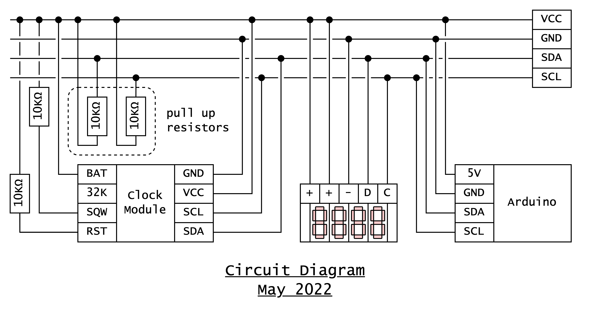

Imagine you are getting ready to do the thing. Ask yourself:

1. What equipment do I need?
2. What am I going to wear?
3. Do I need to fuel myself?

What can you prepare in advance to minimize obstacles to follow through?

For me, showing up means going to the makerspace to work on ColorClock. I prepare by packing my bag with my computer, and my electronics tool box. I plan to change out from my work clothes, and to make sure I pack dinner for me and treats for Trevor (doggo).

<figure>



<figcaption>
Here is a digital display showing the current minute and second that is tracked by my clock module 🤓
</figcaption>
</figure>

## Circuit Diagram

I've wired up the clock module along with the debugging display. Here's where I'm at.

