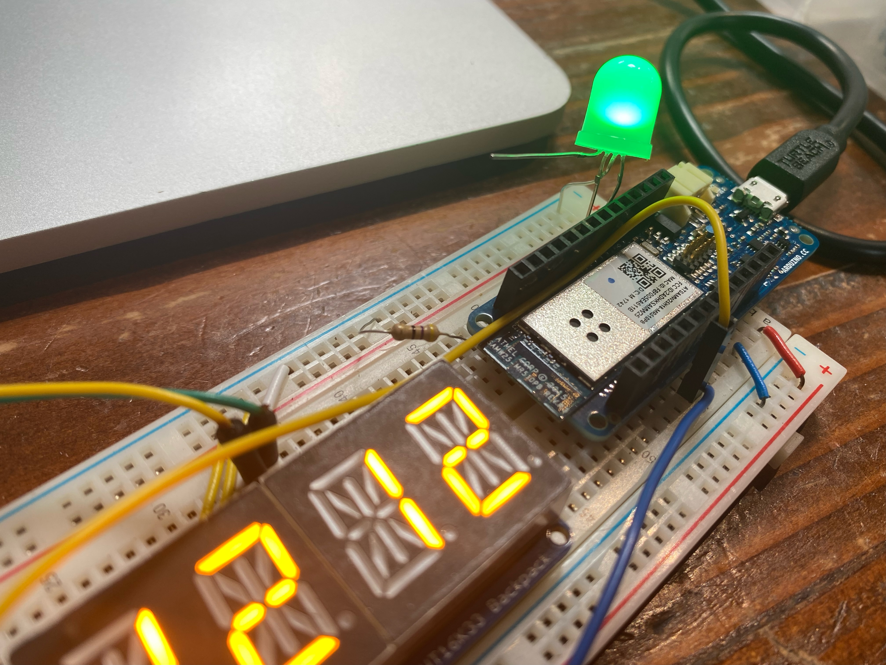

“It doesn’t matter how slow you progress so as long as you never stop.” I think my grad school advisor shared this with me. Maybe that wasn’t the really the quote. And maybe it wasn’t my advisor. But you get the gist 😉

## The First Software Prototype

ColorClock is progressing. Sllloooooowwwwwllllllyyyy. At some point during the pandemic time warp (a year ago… maybe two?), I finished coding the software prototype in [Processing3](https://processing.org/). It was a window with a black background and a solid circle that changed color according to the system time. In the last year I’ve been porting that code to hardware (Arduino) so that I can fabricate an actual RGB LED wall piece or sculpture.

<figure>

<figcaption>
This video demonstrates how the color changes over time. The cycle length displayed here is ~6 seconds. The current design is for the final piece to have a cycle length of 24 hours; the audience will not perceive a color change if the piece is viewed for a short time period.
</figcaption>
</figure>

## The Importance of Incremental Development

A month or two ago I had to start over because I realized that I was converting code but barely testing it beyond making sure that the project built properly - and then at some point it stopped compiling 😬 And even though I was using version control, I couldn’t figure out the last commit with a known good build 😩 Though this is a personal project, it was crazy to reflect on similar challenges I have experienced in my work life.

Soooooooo…

Since then, I have added a debug class for serial monitor print statements, refactored the project to be completely object oriented, and started using branches and pull requests for my repository even though I’m the only developer.

This past week I also started exploring how to unit test portions of the code without running it on actual hardware. The Arduino language is basically C++ so I just made a small driver function where I include my classes that don’t have any Arduino dependencies. I’m proud of myself for the forethought I put in to the architecture so that I can build software only tests without needing to modify the code I’m testing 🤓

## Hardware Prototyping Progress

The photo below depicts the current state of the hardware prototype. The alphanumeric display will be hidden from view in the final piece. While testing the color changing capabilities, I realized that the Arduino board I'm using only has two pulse width modulation I/O pins so I can only cycle through colors that are combinations of two primary colors, like red and green, red and blue, or green and blue.

<figure>

<figcaption>
</figcaption>
</figure>

## Sometimes You Just Need to Stare at It

I’m actually kind of stuck at the moment - the contents of my RGB <-> HSV color conversion functions seem to be working, but not when the class definitions are included in a different file 🤷‍♀️ I’m going to stare at the code a bit more and possibly call in some reinforcements 🧑‍💻

