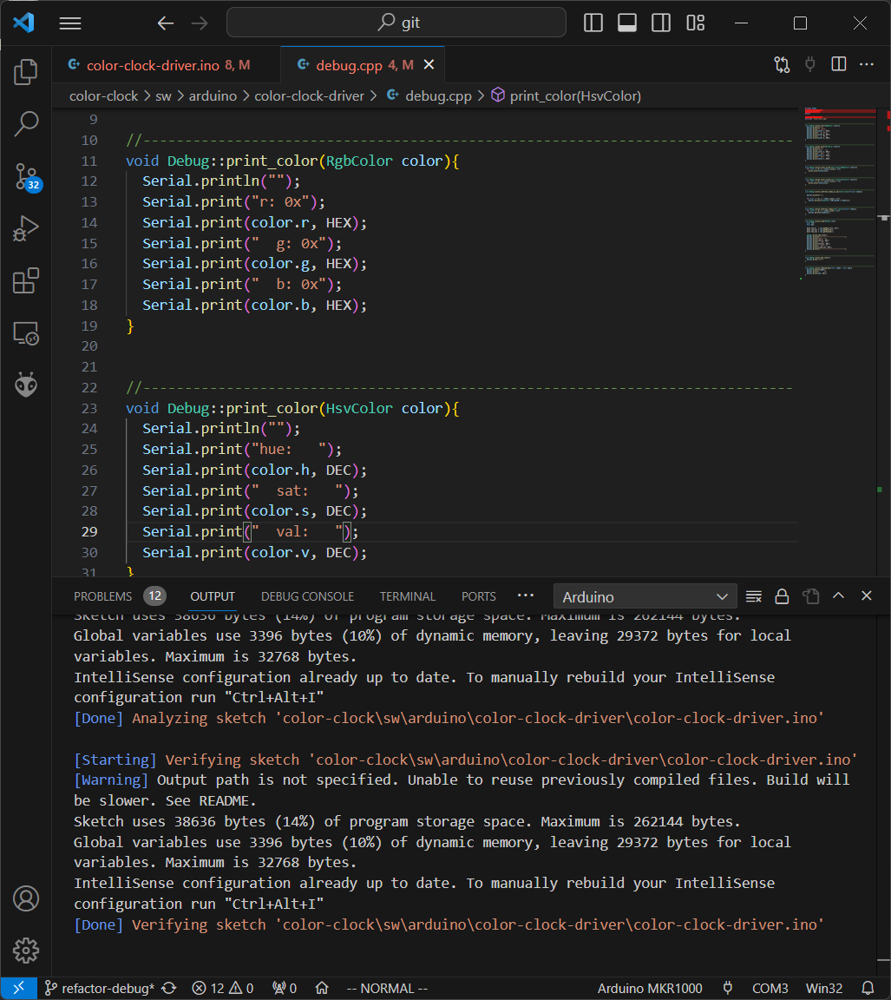

[Windows Subsystem for Linux (WSL) 2](https://learn.microsoft.com/en-us/windows/wsl/install) cannot interface with the serial ports on my PC and it makes me sad. Because that means I can't use WSL for the one use case I reallllly want it for: programming an Arduino.

It's been about a year and a half since last looking at the code base for my ColorClock project and I finally have the mental capacity to continue work on this endeavor. In one of my previous posts I shared my excitement over using the [Arduino Command Line Interface](https://arduino.github.io/arduino-cli/0.35/) because it enabled me to code and upload my programs all in a single terminal window. But, I should mention that all of my Arduino development up until this point has been on a MacBook i.e. a UNIX environment.

This past weekend I tried to recreate this development environment on my newly remodeled Windows gaming tower. I was super excited about the prospect of getting to use Windows Subsystem for Linux (WSL) and no longer needing to use Cygwin or some other Linux emulator-like-thing.

It took me hours to just to get compiling again - between dealing with Git issues, installing the toolchain, tracking and installing library files, and relearning how to interact with Arduino CLI. My efforts felt worth something for a tiny while because I got it to compile on the command line 🥳 But then... the internet rained on my parade 😭

I read somewhere that WSL doesn't play nice with the serial ports, but I was not deterred. Surely SOMEONE has been able to get WSL to communicate through serial? I was determined to find a way.

## A Possible Solution?

I learned about a third party program, [USBIPD](https://github.com/dorssel/usbipd-win) that would allow WSL to see my serial ports. And this was confirmed! I performed the commands on the PowerShell side (e.g. bind, attach) and then I saw my Arduino on the WSL side using lsusb!! But when when it was time to run the upload command my console spits out a no communication error.

## I Accept Defeat

I felt defeated. Fine. Windows. YOU WIN.

It crossed my mind to use keep using my old development environment, but that was using my 10 year old Macbook - which I love, but I have a new computer and I want to use it!

I proceeded to use VS Code with the Arduino plugin, had trouble, got it to work with PlatformIO, which worked but created so much overhead I went back to the Arduino extension and FINALLY got it to work.

To be fair, I like VS Code. The more I learn about it the more I like it. The Vim plugin is actually quite good (I can use my own .vimrc file) and the Python debugger is pretty sweet.

Honestly, I'm  just happy to be working on a fun project again.

## References

[Arduino CLI](https://arduino.github.io/arduino-cli/0.35/)
[PlatformIO](https://platformio.org/install/ide?install=vscode)
[USBIPD](https://github.com/dorssel/usbipd-win)
[VS Code](https://code.visualstudio.com/)
[WSL](https://learn.microsoft.com/en-us/windows/wsl/install)

