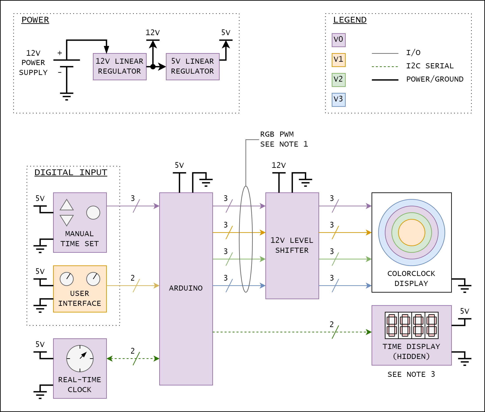

I have decided on a multi-stage approach to development where each iteration has increased functionality to the previous. This diagram illustrates the top-level electronic design, with each iteration of implementation.

<figure>

<figcaption>
Top level schematic
</figcaption>
</figure>

## Notes

1. RGB PWM wires represent the red, green, and blue PWM outputs from the Arduino. The output from the Arduino will be stepped up to 12V to power the LEDs on the light display.
1. I2C serial wires include clock (SCL) and data (SDA) lines.
1. Time display is used by the artist during installation. Time display will be hidden from viewers.

## Version Summary

Version | Implementation
-|-
V0 | Minimum viable product; one ColorClock with 24 hr cycle time
V1 | Includes interface and second ColorClock for participant interaction
V2 | Includes additional ColorClock to previous versions with 60 min cycle time
V3 | Includes additional ColorClock to previous versions with cycle time equivalent to length of event week

