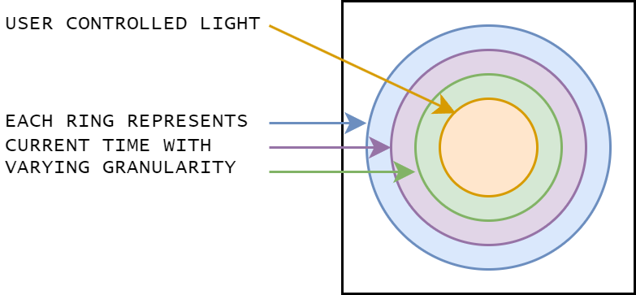
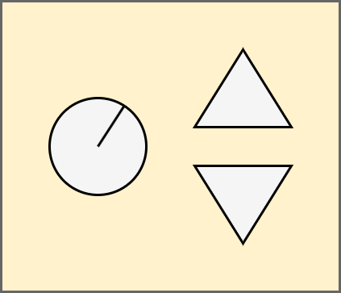
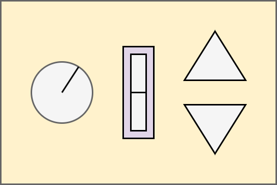
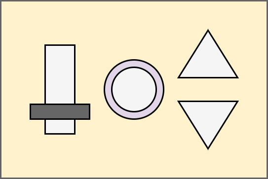

<!-- Center all images on this page -->



This week I've been navigating the balance between my artistic vision and feasibility of execution for the user interface of the piece. I've also been working on the software development involved in accepting user input through button presses.



## Software Development

Recent software development efforts have been focused on button logic. The control panel interface will have two purposes:

1. Time set control (should only need to be used once)
1. User interface control

I created a [class](https://www.geeksforgeeks.org/c-classes-and-objects/) for a momentary switch with a [state machine](https://www.geeksforgeeks.org/difference-between-mealy-machine-and-moore-machine/?ref=header_search) to determine the kind of input it might receive by the user, e.g. short press, long press, double press. And of course before it enters the state machine I added a function to [debounce](https://docs.arduino.cc/built-in-examples/digital/Debounce/) the input so that the electronics would not register multiple button presses even though the user intended to only press the button once.

In the last few days I've realized that I will need to have different kinds of MomentarySwitch classes to register different types of button presses. For instance, the MomentarySwitch class I designed will not register a press and hold for the purpose of incrementing a value multiple times. For example, if we want to set our oven timer to 90 minutes, we shouldn't have to press the increase time button 90x. We know that we can hold the button then it will start to increment first by 1 minute, then 10.

So I will likely have a base class of MomentarySwitch with a set of states (IDLE, PRESS, RELEASE, WAIT) and several sub classes that will handle states differently.



## User Interface Design

All this button pressing talk has also gotten me thinking a lot about what the user input would actually look like.

---

### Light Display

To recap, the light fixture design entails two or three outer rings of light reflecting the current time, complemented by a central light in the middle, providing users with interactive capabilities.

<figure>

<figcaption>
**Light Display:** Outer rings of color light traverse through the spectrum at different rates, representing different granularity of time. The central light can be controlled by participants.
</figcaption>
</figure>

---

### User Interface Design Version 1

A straightforward user input option involves a basic knob (involving an additional software design effort) to control the cycle time of the central light. However, I'd also like to offer participants a way to influence the color as well.

The user interface should be simple, clean, and intuitive. I was initially really attached to the minimalist design illustrated in Version 1. There would be a knob on the left that would control the cycle time and a set of increment decrement buttons to control... something. Alternatively, the up and down buttons could cycle through a set of pre-defined color schemes. But with pre-defined color schemes, there would really be no reason to have the buttons represent increment or decrement.

<figure>

<figcaption>
**Version 1**: The initial concept for participant interaction with light display. A knob selects cycle time and two triangular buttons control an aspect of visual effect. This design was discarded due to limitations in user control while maintaining intuitive design.
</figcaption>
</figure>

---

### User Interface Design Version 2

I started to wonder, "What aspect of color could the user feasible control with only an increment and decrement button?" I could program some logic that involves pressing multiple buttons at once. But then the control wouldn't be intuitive. So I came up with the design in Version 2 where the middle switch is an RGB LED 3-way rocker which would serve as an RGB color select. The user would select which aspect of the color they want to change for the spectrum, then they would increment or decrement the overall values of red, green, or blue.

<figure>

<figcaption>
**Version 2**: Left-most switch is a knob to control cycle time as indicated in Version 1. The middle switch is a 3-way rocker for color selection. Triangular buttons increment or decrement color selected by rocker switch. Either rocker or triangular buttons illuminate in red, green, or blue, reflecting user selection.
</figcaption>
</figure>

---

### User Interface Design Version 3

I knew that there was a slim chance that an RGB LED rocker switch would exist without having to make one myself. So then I decided that the increment and decrement buttons could be RGB and that they would reflect the color selected from the rocker switch. How hard can it be to find RGB LED triangular arcade buttons? Well, it turns out that I can't really find these either.

My quest for RGB LED arcade buttons revealed only round options. For aesthetic purposes, it is important to me that there be shape differentiation between the switches for cycle time control and color select. And I'm pretty attached to triangles for increment and decrement. So, I've come up with the design in Version 3 where I'm now using a round RGB LED button for color select and a slider for cycle time.

<figure>

<figcaption>
**Version 3**: The left-most switch is a slider used to control the cycle time, the center button will illuminate as either red, green or blue, and the right set of triangular switches will be white or grey.
</figcaption>
</figure>

The control panel design will likely continue to evolve as I search for slider switches that align with my vision, but for now I need to put some of these buttons on order. And in the mean time I need to expand my software to account for new switch input behavior.


