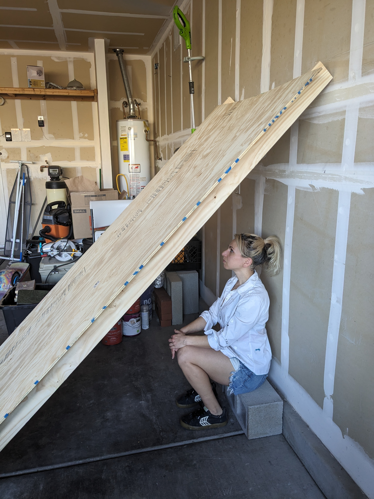
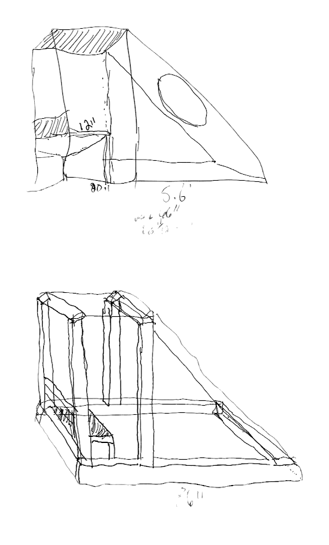
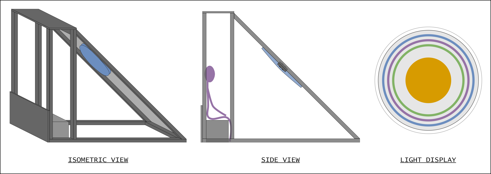
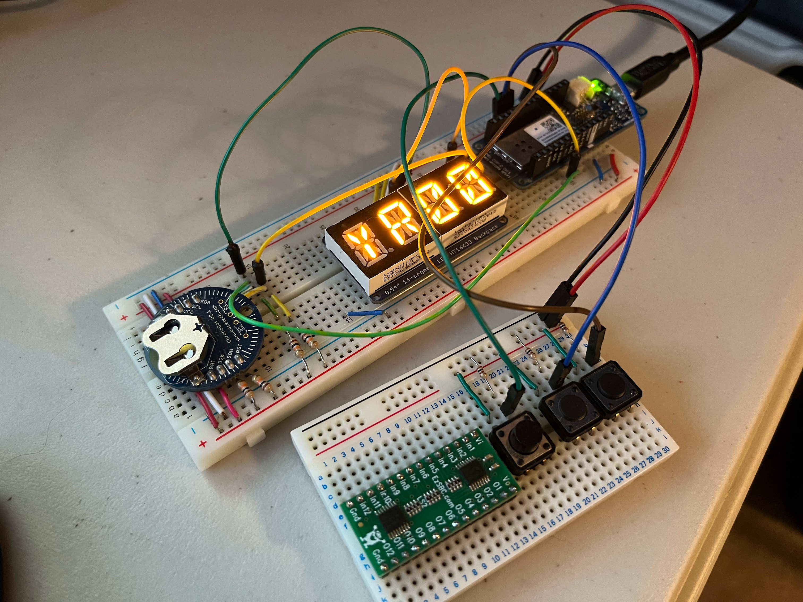

## A Tight Fit

In the previous construction design we had a simple lean-to structure where the participant would be sitting under the diagonally positioned shade panel. We mocked it up in the garage and noticed that the participant would be a little too cozy with the light display. We decided to create an extension with a roof-top to enable a greater appreciation for the piece.

<figure>

<figcaption>
The participant is sitting quite close to the light display in the original structural design.
</figcaption>
</figure>

## The Rooftop Extension

I don't have much experience with structural fabrication, so my construction lead sketched out this design of the rooftop extension.

<figure>

<figcaption>
The rooftop extension enables the participant to sit further from the light.
</figcaption>
</figure>

🌈

Then I prettied it up and drafted a couple kind-of-but-not-exactly-to-scale isometric and side views.

<figure>

<figcaption>
To provide scale, the human figure in the side view is approximately me-sized (around 5 ft tall). As for the light display, each ring's color corresponds to different time granularities, such as day, hour, and minute. The central light will be user-controllable.
</figcaption>
</figure>

## Time Controller Development

Regarding the software, I've been working on developing the time controller. This element enables the artist to designate the current time, which acts as the input for the RGB LED light display, mapping time to color.

<figure>

<figcaption>
</figcaption>
</figure>

There's a lot left to do and we have about five months to complete this thing. But I know we'll make it happen 🤓

