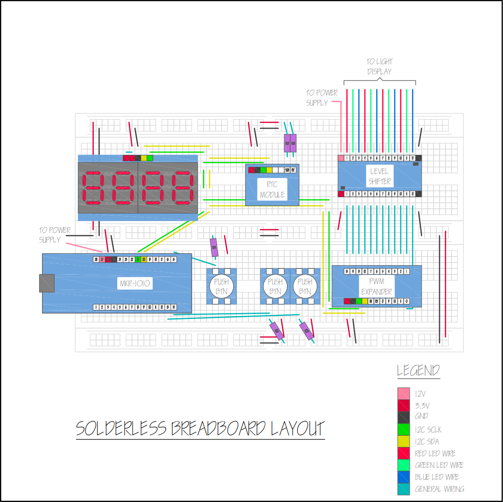
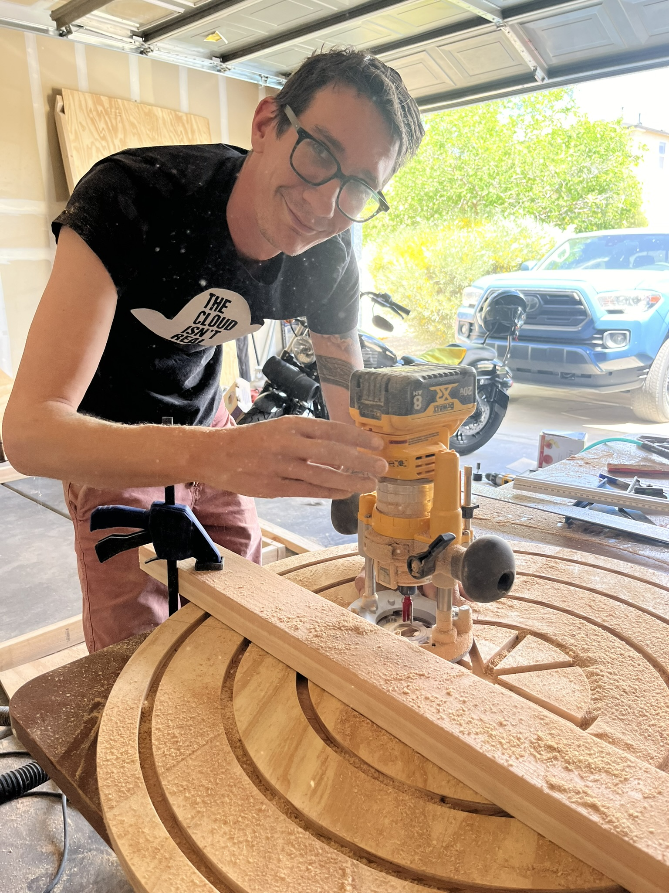
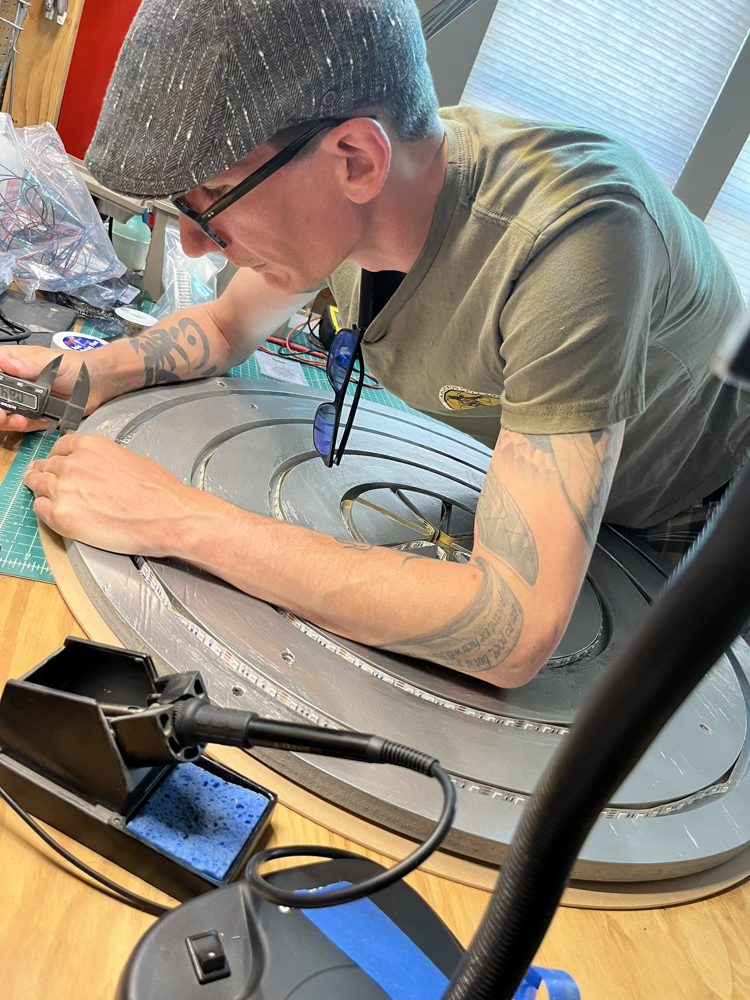
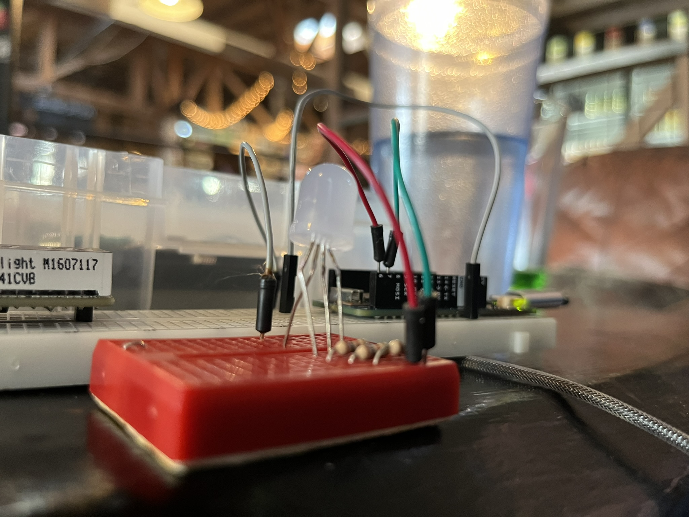

## A Beautiful Breadboard

Behold! The first design of the of the fully populated solderless breadboard!

<figure>

<figcaption>
This to-scale-ish design contains all of the modules that will be present on the final circuit board for ColorClock. The user interface controls are not present on this board.
</figcaption>
</figure>

🌈

To streamline the final phase of hardware testing and preempt the challenges of electronic troubleshooting, I found it important to meticulously design the layout of the prototyping breadboard. I started this layout by looking at the datasheets, obtaining the dimensions of each module, and drawing each component to scale. Then I decided it would be actually be more functional if I were using units of breadboard holes (approximately 0.1" between holes) instead of true dimensions. To determine the size represented on the diagram I placed each module on the breadboard and noted how many holes they covered and the positioning of all the pins. The next step is to actually wire this thing up and get to testing with the real LED light display 🙌

## Clock Crafting

And on the topic of the light display, it's just about finished! My partner bought a plunge base and circle jig in order to cut the circle and route out pockets for the LED strips to rest in. I'm very pleased with the results 😀 We are using a reflective metallic finish to maximize the light output, and a sheet of translucent acrylic that will sit on top to diffuse the light.

<figure>

<figcaption>
The final routed wood piece features outer rings designed to house RGB LED strips. Each ring will display colors corresponding to the current time in days, hours, and minutes. The center of the piece will have a flower-like shape of LEDs that will be controllable by participant interaction via user control panel.
</figcaption>
</figure>

🌈

<figure>

<figcaption>
The LEDs are glued to the inside of the pockets, and the colored light will be reflected off the metallic finish.
</figcaption>
</figure>

## IO Expander Integration Trials

In my last post, I was working on integrating the Arduino Nano ESP32 into the project. I successfully tested this board with the new RTC module and the new alphanumeric display 🤗 But then... I was in the process of testing the IO expander and ended up messing with my board configuration so much that I was no longer able to upload any code to the board 😦 Thankfully, ptillisch came to the rescue and resolved my issue 🥳

Though I was able to talk to the Nano board, I was unable to include the library to interface with the IO expander 😭 I chased my tail for a couple of weeks before I decided to move in a different direction (see notes at the end of this post).

The good news was that I could interface the IO expander with the MKR 1000 that I had been testing on before I got the Nano board. Sooooo I ordered two more Arduinos, the MKR 1010 (they no longer make the MKR 1000) and decided to move forward.

## Can I Just Get Some Variable Voltage Control??

The plan:
- Use the **IO expander** for analog output (required to create the RGB color mixing)
- Use the **Arduino on-board GPIO** for digital input from user interface

When the new boards came in, I promptly began testing the IO expander. I was able to get the digitalWrite functions to work with ease, but I struggled with the analogWrite function. After days of banging my head against the wall 😖 my new contingency plan was to swap the IO functionality of the on-board Arduino GPIO and the IO expander, i.e. the IO expander for the digital IO and Arduino PWM for the RGB LED control.

ColorClock has four light strips and three variable voltage lines per strip (one for each red, green and blue) so I need exactly 12 PWM pins. According to the product page for the MKR 1010, there are supposed to be 13 PWM pins on the board BUT one of those listed pins would be unusable for variable voltage output on ColorClock because it needed to be used for the I2C SCL required for communication to the various modules.

This PWM output count would leave me NO wiggle room if one of the pins didn't work as expected. My concern grew when I noticed that the datasheet had conflicting information from the product website on which pins were capable of PWM output (see the notes at the end of this post for more information).

So, to get some clarity, I manually tested each individual pin. I wrote a tiny test program and hooked up a simple circuit with an LED where I varied the output voltage. I observed the LED to see if the light got brighter as the value of the output increased. I discovered more discrepancies between my empirical testing and the documentation  (see notes).

<figure>

<figcaption>
We spent the afternoon at a brewery where I performed my variable output voltage test while my partner played his Steam Deck killing zombies or something.
</figcaption>
</figure>

## Wiring Matters

The inconsistency between my findings and the documentation left me uneasy, so I went back to testing the IO expander with a minimal example. I knew my code was solid, so I double-checked the circuit wiring and sure enough, there was a mistake. After fixing it, I was able to see a variable output voltage on a multimeter using the analogWrite function using the IO expander 🎉 So now I'm back to the original plan of using the IO expander to control the lights, and the on-board GPIO for the digital inputs.

The input values set by my program didn’t correlate as expected with the measured voltage with the multimeter, so it looks like I’ll need to write some calibration functions so I can programmatically compensate for hardware characteristics.

## Moving Forward

So, next steps will be:

Wire up the breadboard so beautifully depicted above.

Characterize the RGB LED strip, so I can programmatically adjust for the non-linear relationship between the IO expander's output voltage and the visible color from the lights.

We've got 2 1/2 months and counting... 😅

## Notes

### IO Expander Adafruit AW9523

There have been others that have had issues integrating the Adafruit_AW9523 library with the Arduino Nano ESP32. Though the GitHub issues page states that this issue was resolved, I'm not so sure it was...

### Arduino MKR 1010 PWM Pins
According to the MKR 1010 product website, the following pins are available for PWM out:

```text
0 .. 8, 10, 12, A3, A4
```

According to the MKR 1010 datasheet the following pins are available for PWM out:

```text
0 .. 9
```

According to my empirical testing, the following pins are available for variable voltage output:

```text
0 .. 8, 10, A3, A4, A0* **
```

\* I learned that the A0 pin provides a true analog output, not a PWM signal which is why it was listed on neither the website nor the datasheet as a PWM pin. This page describes the difference between analog and PWM output.

\*\* Pins 9 and 12, as listed on the datasheet and website, respectively, did not produce variable output voltages in my experiment.
