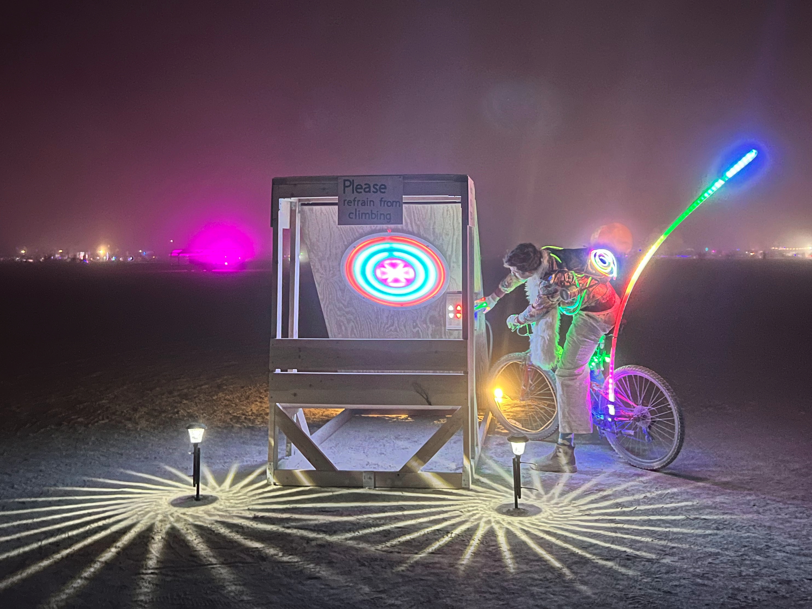

<!--___________________________________________________________________|
|______________________________________________________________________|
|        _   __   _   _ _   _   _   _         _                        |
|   |   |_| | _  | | | V | | | | / |_/ |_| | /                         |
|   |__ | | |__| |_| |   | |_| | \ |   | | | \_                        |
|    _  _         _ ___  _       _ ___   _                    / /      |
|   /  | | |\ |  \   |  | / | | /   |   \                    (^^)      |
|   \_ |_| | \| _/   |  | \ |_| \_  |  _/                    (____)o   |
|______________________________________________________________________|
|______________________________________________________________________|
|                                                                      |
|----------------------------------------------------------------------|
|   Copyright 2025, Rebecca Rashkin                                    |
|   -------------------------------                                    |
|   This code may be copied, redistributed, transformed, or built      |
|   upon in any format for educational, non-commercial purposes.       |
|                                                                      |
|   Please give me appropriate credit should you choose to use this    |
|   resource. Thank you :)                                             |
|----------------------------------------------------------------------|
|                                                                      |
|______________________________________________________________________|
|   //\^.^/\\  //\^.^/\\  //\^.^/\\  //\^.^/\\  //\^.^/\\  //\^.^/\\   |
|____________________________________________________________________-->
<!--DESCRIPTION
|   This file contains configuration information for the blog.
|____________________________________________________________________-->

---
title: "The Evolution of ColorClock"
subtitle: Check out the ColorClock development journey 🌈 ⏱️
listing:
  contents: blog__color-clock
  type: grid
  sort: "date desc"
  categories: true
---

