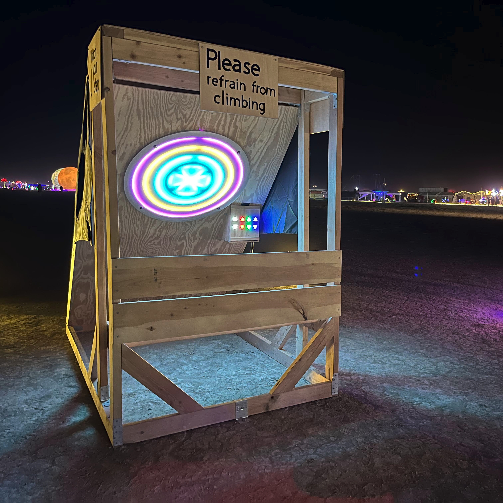
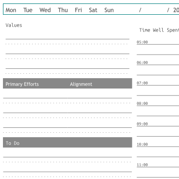
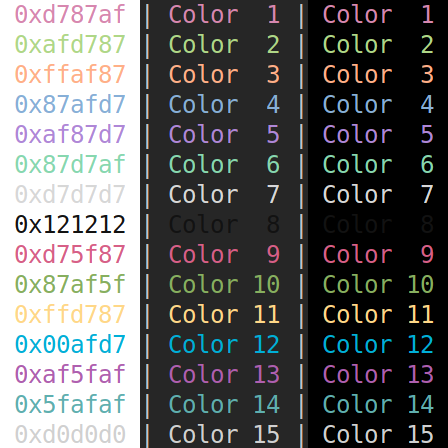
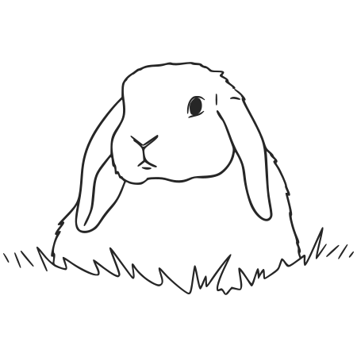

<!--___________________________________________________________________|
|______________________________________________________________________|
|        _   __   _   _ _   _   _   _         _                        |
|   |   |_| | _  | | | V | | | | / |_/ |_| | /                         |
|   |__ | | |__| |_| |   | |_| | \ |   | | | \_                        |
|    _  _         _ ___  _       _ ___   _                    / /      |
|   /  | | |\ |  \   |  | / | | /   |   \                    (^^)      |
|   \_ |_| | \| _/   |  | \ |_| \_  |  _/                    (____)o   |
|______________________________________________________________________|
|______________________________________________________________________|
|                                                                      |
|----------------------------------------------------------------------|
|   Copyright 2026, Rebecca Rashkin                                    |
|   -------------------------------                                    |
|   This code may be copied, redistributed, transformed, or built      |
|   upon in any format for educational, non-commercial purposes.       |
|                                                                      |
|   Please give me appropriate credit should you choose to use this    |
|   resource. Thank you :)                                             |
|----------------------------------------------------------------------|
|                                                                      |
|______________________________________________________________________|
|   //\^.^/\\  //\^.^/\\  //\^.^/\\  //\^.^/\\  //\^.^/\\  //\^.^/\\   |
|____________________________________________________________________-->
<!--DESCRIPTION
|   This page lists my personal projects
|____________________________________________________________________-->

The projects I build are an expression of my values and a source of fulfillment. Explore some of the work I’ve been building in my personal time.

 

::: {.grid}
::: {.g-col-12 .g-col-md-8}
## [ColorClock](/projects/color-clock/index.qmd)
Tell time with color. An immersive art installation that transforms time passage into a light spectrum. A decade-long journey from initial concept to final deployment.

**Developed in C++ using the Arduino Command Line Interface.**

:::
::: {.g-col-12 .g-col-md-4}
[{.img-fluid}](/projects/color-clock/index.qmd)
:::
:::

::: {.grid .project-grid-flipped}
::: {.g-col-12 .g-col-md-8}
## [The Book of Plans](./the-book-of-plans/index.qmd)
A paper-based system for personal growth, providing the structure needed to align your daily actions with your long-term identity.

**Developed in Python using the svgwrite library.**

:::
::: {.g-col-12 .g-col-md-4}
[{.background}](./the-book-of-plans/index.qmd)
:::
:::

::: {.grid}
::: {.g-col-12 .g-col-md-8}
## [Color Scheme Exporter](./color-scheme-exporter/index.qmd)
A utility for generating consistent color schemes across various terminal emulators, designed to bring a unified aesthetic and creative joy to your development environment.

**Developed in Python.**

:::
::: {.g-col-12 .g-col-md-4}

:::
:::

::: {.grid .project-grid-flipped}
::: {.g-col-12 .g-col-md-8}
## [rebeccajennifer.com](/index.qmd)
A digital home for my projects and resources. An open notebook for my technical work and a collection of notes for my future self that I hope others find useful, too.

**Developed with the Quarto publishing framework.**

:::
::: {.g-col-12 .g-col-md-4}
[{.img-fluid .lite-only}](/index.qmd)
[{.img-fluid .dark-only}](/index.qmd)
:::
:::