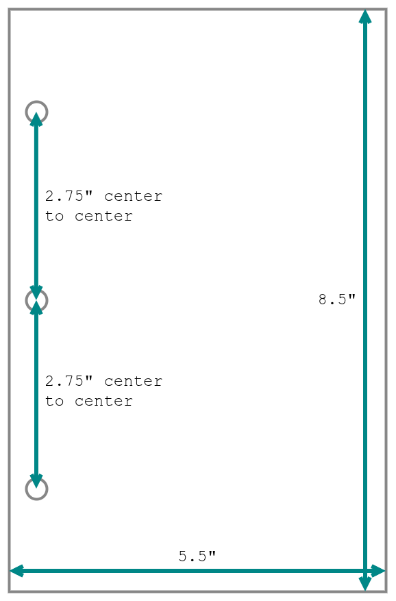

<!--___________________________________________________________________|
|______________________________________________________________________|
|        _   __   _   _ _   _   _   _         _                        |
|   |   |_| | _  | | | V | | | | / |_/ |_| | /                         |
|   |__ | | |__| |_| |   | |_| | \ |   | | | \_                        |
|    _  _         _ ___  _       _ ___   _                    / /      |
|   /  | | |\ |  \   |  | / | | /   |   \                    (^^)      |
|   \_ |_| | \| _/   |  | \ |_| \_  |  _/                    (____)o   |
|______________________________________________________________________|
|______________________________________________________________________|
|                                                                      |
|----------------------------------------------------------------------|
|   Copyright 2025, Rebecca Rashkin                                    |
|   -------------------------------                                    |
|   This code may be copied, redistributed, transformed, or built      |
|   upon in any format for educational, non-commercial purposes.       |
|                                                                      |
|   Please give me appropriate credit should you choose to use this    |
|   resource. Thank you :)                                             |
|----------------------------------------------------------------------|
|                                                                      |
|______________________________________________________________________|
|   //\^.^/\\  //\^.^/\\  //\^.^/\\  //\^.^/\\  //\^.^/\\  //\^.^/\\   |
|____________________________________________________________________-->
<!--DESCRIPTION
|   Instructions on how to assemble The Book of Plans
|____________________________________________________________________-->

The pages are formatted for both double-sided and single-sided printing. Assembly instructions for each are provided below.

These steps are admittedly tedious. I can print and prepare the pages for you and mail them for a fee. [Contact me](../..//contact.qmd)
 if you'd like to arrange this.

## Required Tools

[Paper cutter](https://a.co/d/4dDv39s)

[1/2 sheet 3 hole punch](https://a.co/d/0RXiLUx)

[3-ring mini binder](https://a.co/d/5YXWTKB)

### Note

These products are just examples of tools you can use to assemble _The Book of Plans_. I’m not an Amazon affiliate and don’t earn anything from these links.

## Instructions

### Hole Punch Settings

Set your holes to punch at the following measurements to fit in a 3-ring mini binder:

{width="50%" .background}

### General Notes

1. Print, cut and stack each individual PDF separately to ensure proper page ordering.

1. You can mix single- and double-sided printing. I print everything single-sided except the nightly log, which I print double-sided. Do whatever works for you.

### Single-Sided Assembly Instructions

1. Each PDF should be printed with the following settings:

   Print Property | Value
   -|-
   Scaling            | `100%`
   Print double sided | `false`

1. Use the paper cutter to cut down the center. You will be left with two stacks of paper. Take the stack on the left, and put it right on top of the stack on the right.
1. Hole punch the packet.
1. Insert into binder.

### Double-Sided Print Instructions

1. Each PDF should be printed with the following settings:

   Print Property | Value
   -|-
   Scaling            | `100%`
   Print double sided | `true`, set to `flip on short edge` <- This will likely be different from the default print double-sided setting.

1. Use the paper cutter to cut down the center. You will be left with two stacks of paper. Think of this as an open book. Take the left stack and fold it over the right stack like you are closing a book.
1. Hole punch the packet.
1. Insert into binder.

## The PDFs

### PDF Descriptions

File Name | Print Quantity | Description
-|-|-
`__0__main-intr.pdf` | Print one copy for the entire quarter.           | Contains vision prompts, goal entries, calendar.
`__1__main-week.pdf` | Print one copy per week, i.e. 12 copies total.   | Contains one weekly log and seven daily logs.
`__2__xtra-nite.pdf` | Print as needed.                                 | Each page contains enough space for one week's worth of entries.
`__3__ace_-ref_.pdf` | Print once.                                      | Contains instructions for using the ACE Worksheets.
`__4__ace_-wksh.pdf` | Print as needed.                                 | Contains worksheets for the ACE exercise.

### Single-Sided PDFs

This section contains links to the PDFs that are intended to be printed single-sided.

<a class="flux-button" href="https://github.com/rebeccajennifer/responsible-rabbit/blob/main/planner/layouts/single-sided/pdf/__0__main-intr.pdf">`__0__main-intr.pdf`</a>
<a class="flux-button" href="https://github.com/rebeccajennifer/responsible-rabbit/blob/main/planner/layouts/single-sided/pdf/__1__main-week.pdf">`__1__main-week.pdf`</a>
<a class="flux-button" href="https://github.com/rebeccajennifer/responsible-rabbit/blob/main/planner/layouts/single-sided/pdf/__2__xtra-nite.pdf">`__2__xtra-nite.pdf`</a>
<a class="flux-button" href="https://github.com/rebeccajennifer/responsible-rabbit/blob/main/planner/layouts/single-sided/pdf/__3__ace_-ref_.pdf">`__3__ace_-ref_.pdf`</a>
<a class="flux-button" href="https://github.com/rebeccajennifer/responsible-rabbit/blob/main/planner/layouts/single-sided/pdf/__4__ace_-wksh.pdf">`__4__ace_-wksh.pdf`</a>

### Double-Sided PDFs

This section contains links to the PDFs that are intended to be printed double-sided.

<a class="flux-button" href="https://github.com/rebeccajennifer/responsible-rabbit/blob/main/planner/layouts/double-sided/pdf/__0__main-intr.pdf">`__0__main-intr.pdf`</a>
<a class="flux-button" href="https://github.com/rebeccajennifer/responsible-rabbit/blob/main/planner/layouts/double-sided/pdf/__1__main-week.pdf">`__1__main-week.pdf`</a>
<a class="flux-button" href="https://github.com/rebeccajennifer/responsible-rabbit/blob/main/planner/layouts/double-sided/pdf/__2__xtra-nite.pdf">`__2__xtra-nite.pdf`</a>
<a class="flux-button" href="https://github.com/rebeccajennifer/responsible-rabbit/blob/main/planner/layouts/double-sided/pdf/__3__ace_-ref_.pdf">`__3__ace_-ref_.pdf`</a>
<a class="flux-button" href="https://github.com/rebeccajennifer/responsible-rabbit/blob/main/planner/layouts/double-sided/pdf/__4__ace_-wksh.pdf">`__4__ace_-wksh.pdf`</a>
