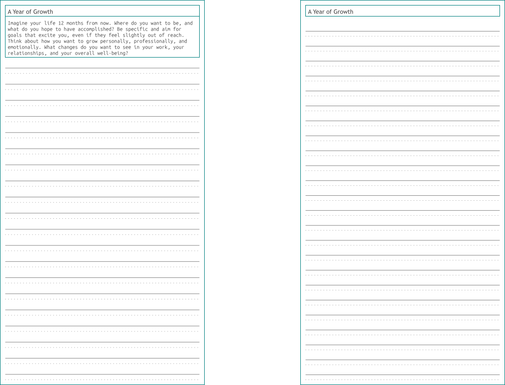
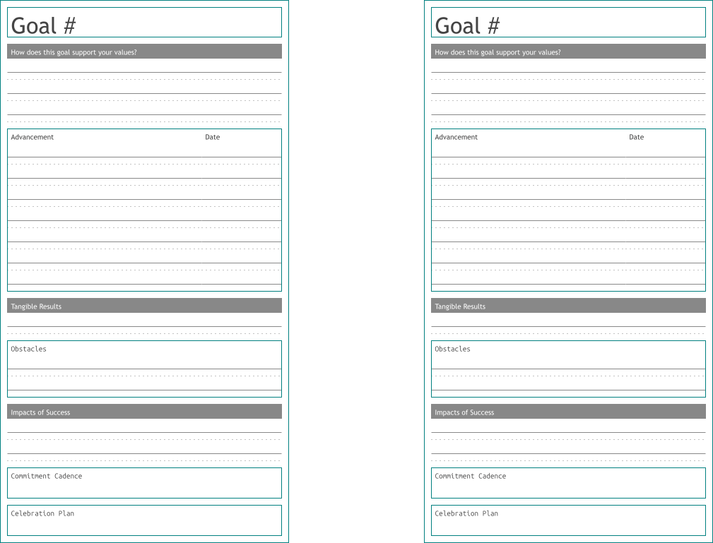
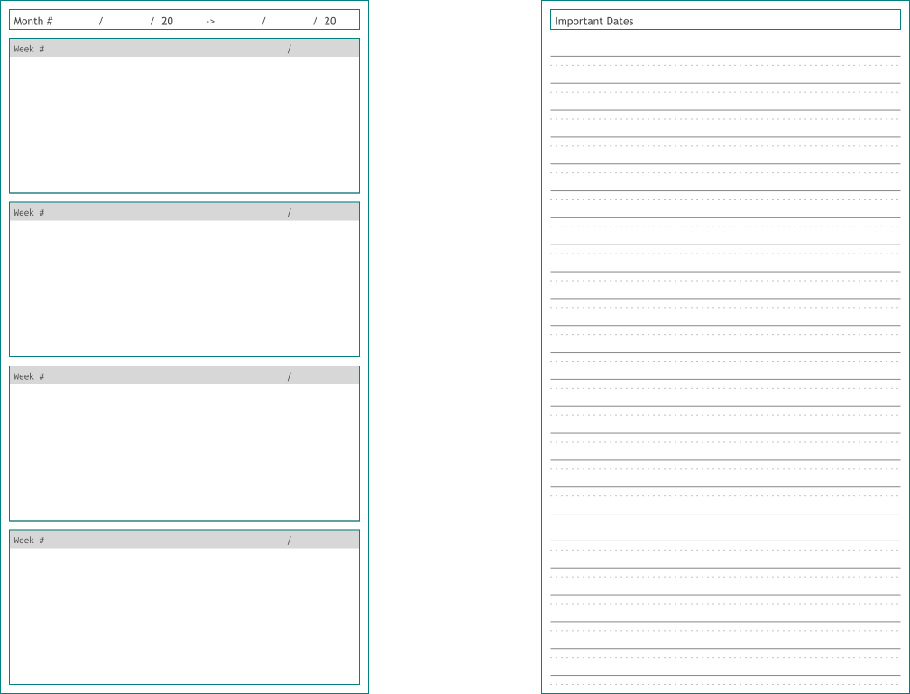
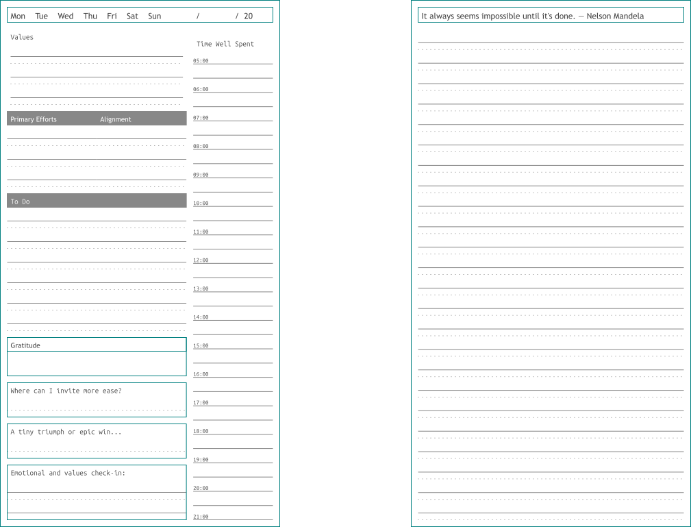
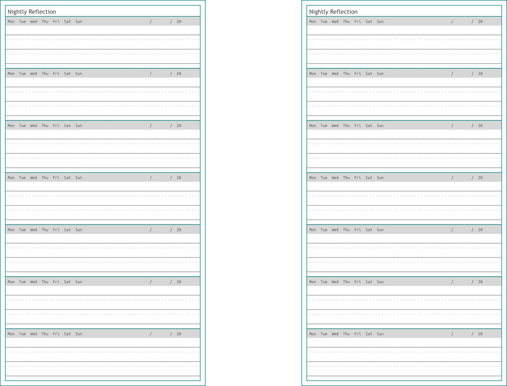
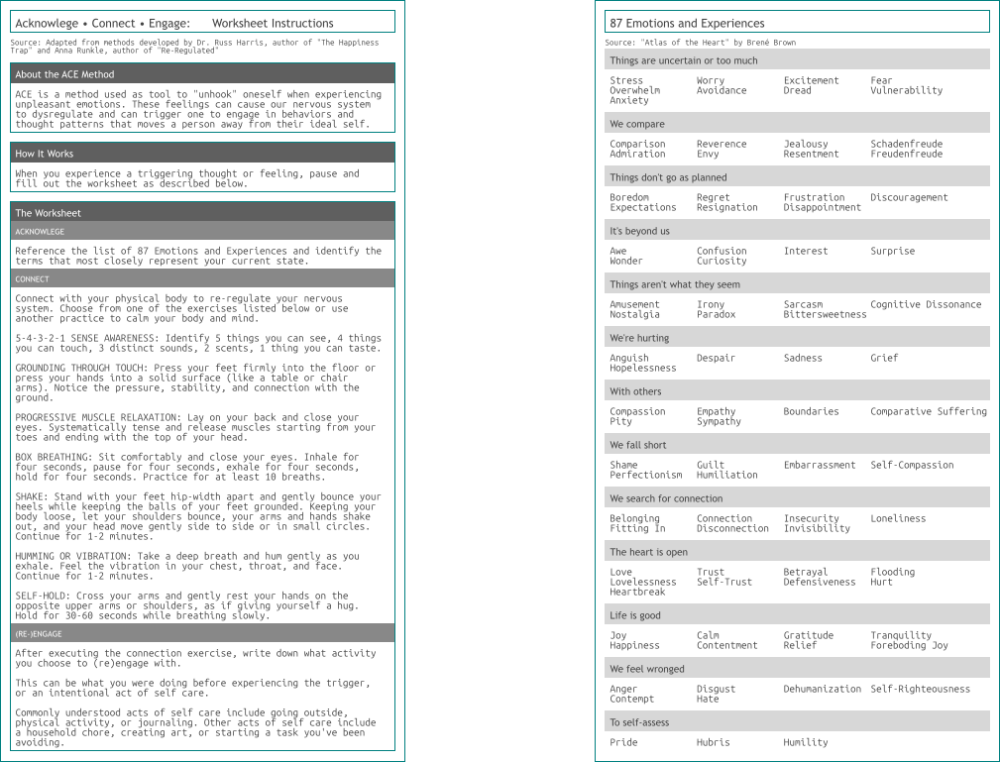
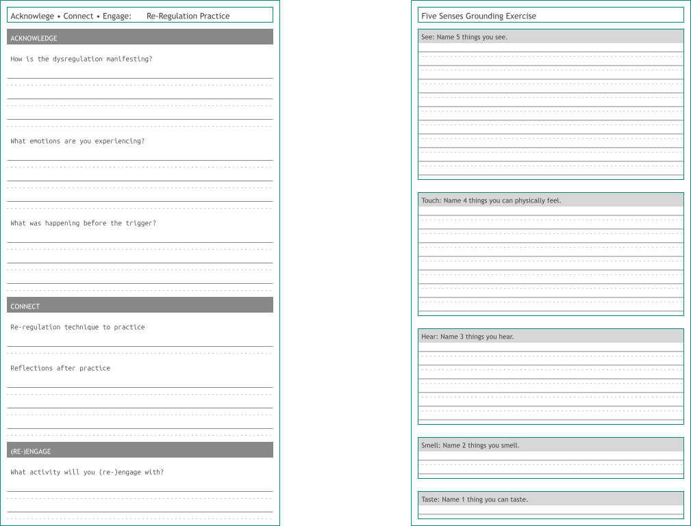

<!--___________________________________________________________________|
|______________________________________________________________________|
|        _   __   _   _ _   _   _   _         _                        |
|   |   |_| | _  | | | V | | | | / |_/ |_| | /                         |
|   |__ | | |__| |_| |   | |_| | \ |   | | | \_                        |
|    _  _         _ ___  _       _ ___   _                    / /      |
|   /  | | |\ |  \   |  | / | | /   |   \                    (^^)      |
|   \_ |_| | \| _/   |  | \ |_| \_  |  _/                    (____)o   |
|______________________________________________________________________|
|______________________________________________________________________|
|                                                                      |
|----------------------------------------------------------------------|
|   Copyright 2025, Rebecca Rashkin                                    |
|   -------------------------------                                    |
|   This code may be copied, redistributed, transformed, or built      |
|   upon in any format for educational, non-commercial purposes.       |
|                                                                      |
|   Please give me appropriate credit should you choose to use this    |
|   resource. Thank you :)                                             |
|----------------------------------------------------------------------|
|                                                                      |
|______________________________________________________________________|
|   //\^.^/\\  //\^.^/\\  //\^.^/\\  //\^.^/\\  //\^.^/\\  //\^.^/\\   |
|____________________________________________________________________-->
<!--
________________________________________________________________________
    DESCRIPTION
    Site page for The Book of Plans
________________________________________________________________________
-->

---
title: How to Use The Book of Plans
toc: true
---

Instructions for how to fill out each section of the planner.



## Sections

This planner has four main sections and optional add-ons to help you practically move toward your ideal self. A full preview of the planner can be found [here](https://github.com/rebeccajennifer/responsible-rabbit/tree/main/planner/layouts/preview/pdf). Note that this preview is not formatted for printing. For printing and assembly instructions, see [this page](./assembly-instructions.qmd).

#### Core Sections

1. Vision
2. Goals
3. Calendar
4. Daily and weekly logs

#### Optional Sections

1. Nightly log
2. ACE exercise pages



## Vision

This section includes prompts and free-write space to help you shape your vision over different time frames, along with a commitment to support your accountability.

Take your time. You might want to complete this section over several days of contemplation. These exercises help you surface what matters most and align your goals with those priorities.

<figure>

<figcaption>
For this prompt, imagine what your ideal life could be in one year if you stick to your commitments.
</figcaption>
</figure>



## Goals

After completing your responses to your vision, set up to four bold yet realistic goals for the quarter. How can you break down that goal into smaller targets? What are tangible outcomes of reaching the goal? What obstacles to follow through can you anticipate? How often can you commit to working on that goal? How will you celebrate?

<figure>

<figcaption>
Think about steps you can take over the three months that will help you stay on track to reach your goal.
</figcaption>
</figure>



## Calendar

Use the calendar section however it best supports you, whether for goal targets or noting important dates.

<figure>

<figcaption>
The last page of the calendar section gives space to track dates that aren't in the time frame of this quarter, or other important dates you don't want to forget.
</figcaption>
</figure>



## Weekly and Daily Logs

The weekly and daily logs are the core of the planner. Reflect weekly, plan ahead with your goals in mind, and use each day to restate your values, set priorities, and check in with your emotional state.

### Weekly Log

<figure>

<figcaption>
In the top-right corner, record the date of the week’s first day.
</figcaption>
</figure>

---

### Daily Log

<figure>

<figcaption>
The right side of the page allows space for reflection or notes.
</figcaption>
</figure>



## Optional Pages

### Nightly Log

In this optional section, use the space to write a few sentences about what you did that day, how you felt, or anything else you want to track on a daily basis. I personally keep these pages in a separate notebook that stays on my bedside table.

<figure>

<figcaption>
A few brief notes are enough; it doesn't need to be detailed.
</figcaption>
</figure>



### ACE Exercises

Thoughts and emotions can sometimes interfere with daily life and pull us away from our goals. ACE stands for Accept, Connect, and Re-Engage. It is a simple exercise that helps reduce the intensity of uncomfortable emotions and the dysregulation they can cause. This model is inspired by the work of Russ Harris and Anna Runkle. Use these pages whenever you feel your nervous system is becoming dysregulated.

<figure>

<figcaption>
This printout gives an overview of the ACE method and how to use the worksheet.
</figcaption>
</figure>

---

<figure>

<figcaption>
One exercise for nervous system regulation is __5-4-3-2-1 Sense Awareness__ that can help us become grounded in the present.
</figcaption>
</figure>


