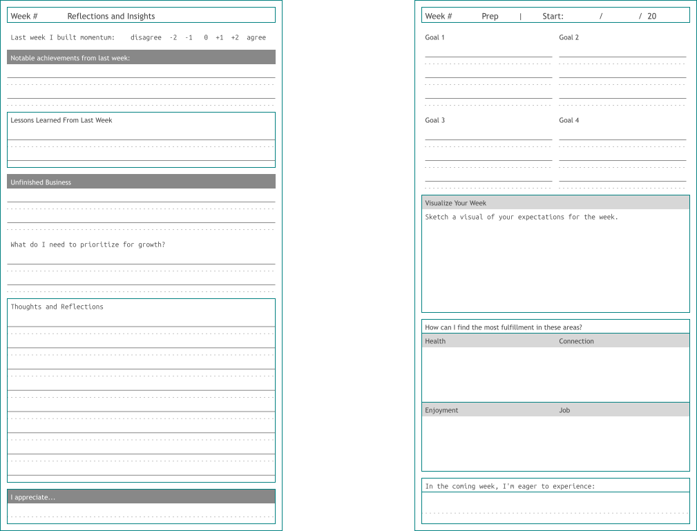

<!--___________________________________________________________________|
|______________________________________________________________________|
|        _   __   _   _ _   _   _   _         _                        |
|   |   |_| | _  | | | V | | | | / |_/ |_| | /                         |
|   |__ | | |__| |_| |   | |_| | \ |   | | | \_                        |
|    _  _         _ ___  _       _ ___   _                    / /      |
|   /  | | |\ |  \   |  | / | | /   |   \                    (^^)      |
|   \_ |_| | \| _/   |  | \ |_| \_  |  _/                    (____)o   |
|______________________________________________________________________|
|______________________________________________________________________|
|                                                                      |
|----------------------------------------------------------------------|
|   Copyright 2025, Rebecca Rashkin                                    |
|   -------------------------------                                    |
|   This code may be copied, redistributed, transformed, or built      |
|   upon in any format for educational, non-commercial purposes.       |
|                                                                      |
|   Please give me appropriate credit should you choose to use this    |
|   resource. Thank you :)                                             |
|----------------------------------------------------------------------|
|                                                                      |
|______________________________________________________________________|
|   //\^.^/\\  //\^.^/\\  //\^.^/\\  //\^.^/\\  //\^.^/\\  //\^.^/\\   |
|____________________________________________________________________-->
<!--
________________________________________________________________________
    DESCRIPTION
    Site page for The Book of Plans
________________________________________________________________________
-->

---
title: The Book of Plans
---

Enable your journey to your ideal self.



## About The Book of Plans

The Book of Plans is a value-based three-month planner that helps you make meaningful progress on your goals and grow into the person you want to become.

The planner consists of a series of PDFs formatted for printing on 8.5×11 sheets, which are then cut in half and placed into a half-sheet three-ring binder. Assembly instructions are provided [here](./assembly-instructions.qmd).

### Why Three Months?

Three months is long enough to make meaningful progress and short enough to stay flexible as your priorities change. Quarterly goal-setting keeps your plans aligned with your life.

<figure>

<figcaption>
Here is a sample layout of one of the pages.
</figcaption>
</figure>



## About the Code

___The Book of Plans___ was created in Python using the modules [svgwrite](https://pypi.org/project/svgwrite/) and [PdfWriter](https://pypdf.readthedocs.io/en/stable/modules/PdfWriter.html). Each page is composed of individual SVG elements that are grouped together and then exported as PDFs.

<a class="flux-button _2" href="https://github.com/rebeccajennifer/responsible-rabbit/tree/main/planner/python">Source Code</a>


