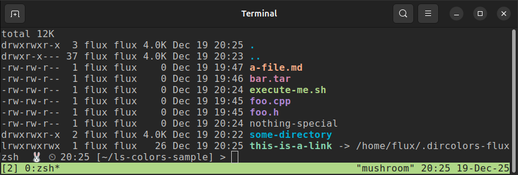
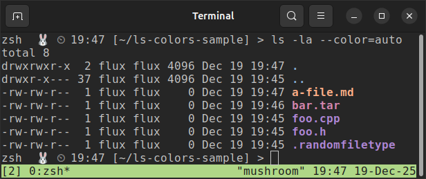
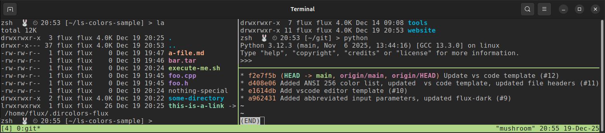

<!--___________________________________________________________________|
|______________________________________________________________________|
|        _   __   _   _ _   _   _   _         _                        |
|   |   |_| | _  | | | V | | | | / |_/ |_| | /                         |
|   |__ | | |__| |_| |   | |_| | \ |   | | | \_                        |
|    _  _         _ ___  _       _ ___   _                    / /      |
|   /  | | |\ |  \   |  | / | | /   |   \                    (^^)      |
|   \_ |_| | \| _/   |  | \ |_| \_  |  _/                    (____)o   |
|______________________________________________________________________|
|______________________________________________________________________|
|                                                                      |
|----------------------------------------------------------------------|
|   Copyright 2025, Rebecca Rashkin                                    |
|   -------------------------------                                    |
|   This code may be copied, redistributed, transformed, or built      |
|   upon in any format for educational, non-commercial purposes.       |
|                                                                      |
|   Please give me appropriate credit should you choose to use this    |
|   resource. Thank you :)                                             |
|----------------------------------------------------------------------|
|                                                                      |
|______________________________________________________________________|
|   //\^.^/\\  //\^.^/\\  //\^.^/\\  //\^.^/\\  //\^.^/\\  //\^.^/\\   |
|____________________________________________________________________-->
<!--DESCRIPTION
|   Reference page for LS_COLORS and dircolors
|____________________________________________________________________-->

The shell environment variable `LS_COLORS` is used to define the colors displayed when listing file types with the `ls` command. It is configured via the `dircolors` command, which typically runs during your shell's startup.



There are two ways to modify the file type display colors, i.e. the `LS_COLORS` environment variable:

1. Execute `dircolors` using a file that sets the colors.
2. Edit `LS_COLORS` directly.

---

## Set `LS_COLORS` with `dircolors`

This section explains how to set file type colors using the `dircolors` command.

### TL;DR

1. Save a `.dircolors` file with your preferred coloring per file type.
2. Insert the following commands in your `.bashrc` or `.bash_profile`:
   ```bash
   eval `dircolors -b path/to/your/.dircolors/file`
   alias ls='ls --color=auto'
   ```

### Sample `.dircolors` File

For reference, here is [my `.dircolors` file](https://github.com/rebeccajennifer/setup-files/blob/main/.dircolors-flux).

### Default `dircolors`

You can see the default file type colors by executing the following command.

```bash
dircolors -p
```
Summarized output:
```bash
# Configuration file for dircolors, a utility to help you set the
# LS_COLORS environment variable used by GNU ls with the --color option.
...
#.cmd 01;32 # executables (bright green)
#.exe 01;32
#.com 01;32
#.btm 01;32
#.bat 01;32
...
```

### Change `LS_COLORS` Using `dircolors`

1. Save the output of `dircolors -p` to a file. In this example we are naming the file `.dircolors-mod`, but you can name your file whatever you'd like.

   ```bash
   dircolors -p > ~/.dircolors-mod
   ```

2. Edit `.dircolors-mod` using a preferred text editor.

   ```bash
   gedit ~/.dircolors-mod
   ```

3. Execute

   ```bash
   # This syntax works using bash and zsh
   eval `dircolors -b ~/.dircolors-mod`
   ```

### Test `dircolors` Output

Any modifications made to `.dircolors-mod` will be reflected in `LS_COLORS`. To test:

1. Add the following text to the end of `.dircolors-mod`

   ```bash
   .randomfiletype 01;35
   ```

1. Execute

   ```bash
   eval `dircolors -b ~/.dircolors-mod`
   ```

4. Print `LS_COLORS` to the screen.

   ```bash
   echo $LS_COLORS
   ```

   Summarized sample output:
   ```bash
   s=0:di=01;34:ln=01;36:mh=00:pi=40;33
   ...
   *.randomfiletype=01;35:
   ```

5. Notice that the value `*.randomfiletype=01;35` is now shown at the end of the `LS_COLORS` printout.

6. Save a file with the name `.randomfiletype` and run the command

   ```bash
   # Use the -la to display hidden files
   ls -la --color=auto
   ```

   The file named `.randomfiletype` should be displayed in the color magenta, or whatever you have ANSI color 5 set to. See [this page](./ansi-color-explained.qmd) for more information about ANSI color codes.

   

## Set `LS_COLORS` Directly

Set the environment variable `LS_COLORS` using the following format:

```bash
export LS_COLORS="*.ext0=<attr>;<color>:*.ext1=<attr>;<color>"
```

Where

```bash
<attr>    : Attribute code, listed below
<color>   : Color code, listed below
ext0, ext1: File extensions
```

Note that the color codes correspond with the ANSI 16 color codes as described [here](./ansi-color-explained.qmd#ansi-16-color-codes).

### Add to `.bashrc` or `.bash_profile`

Once you decide which file types to color, you can save your definition of `LS_COLORS` to your  `.bashrc` or `.bash_profile`.

__Note:__ If you are running `zsh` as your environment, make sure you are not overwriting theses colors in your `.zshrc` or theme file.

### Attribute Codes

Code | Attribute
-|-
`00` | none
`01` | bold
`04` | underscore
`05` | blink
`07` | reverse
`08` | concealed

### Foreground Text Color Codes

Code | Color
-|-
`30` | black
`31` | red
`32` | green
`33` | yellow
`34` | blue
`35` | magenta
`36` | cyan
`37` | white

### Background Color Codes

Code | Color
-|-
`40` | black
`41` | red
`42` | green
`43` | yellow
`44` | blue
`45` | magenta
`46` | cyan
`47` | white

---

## `tmux` Caveat

`tmux` is a terminal multiplexer that allows you to create and manage multiple panes within a single window. It's a neat way to streamline your workflow.



Using `tmux` can affect your environment, particularly how colors are displayed. You may need to set the `TERM` environment variable explicitly to ensure colors render correctly. See [this page](./term-env-var.qmd) for more information.
