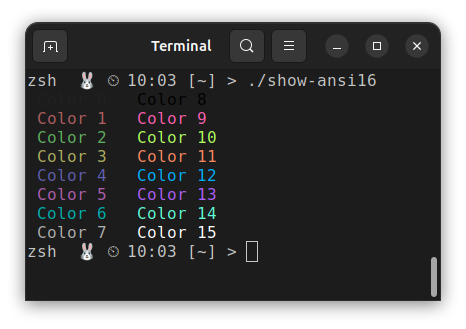

<!--___________________________________________________________________|
|______________________________________________________________________|
|        _   __   _   _ _   _   _   _         _                        |
|   |   |_| | _  | | | V | | | | / |_/ |_| | /                         |
|   |__ | | |__| |_| |   | |_| | \ |   | | | \_                        |
|    _  _         _ ___  _       _ ___   _                    / /      |
|   /  | | |\ |  \   |  | / | | /   |   \                    (^^)      |
|   \_ |_| | \| _/   |  | \ |_| \_  |  _/                    (____)o   |
|______________________________________________________________________|
|______________________________________________________________________|
|                                                                      |
|----------------------------------------------------------------------|
|   Copyright 2025, Rebecca Rashkin                                    |
|   -------------------------------                                    |
|   This code may be copied, redistributed, transformed, or built      |
|   upon in any format for educational, non-commercial purposes.       |
|                                                                      |
|   Please give me appropriate credit should you choose to use this    |
|   resource. Thank you :)                                             |
|----------------------------------------------------------------------|
|                                                                      |
|______________________________________________________________________|
|   //\^.^/\\  //\^.^/\\  //\^.^/\\  //\^.^/\\  //\^.^/\\  //\^.^/\\   |
|____________________________________________________________________-->
<!--DESCRIPTION
|   Reference page for TERM environment variable
|____________________________________________________________________-->

<style>
img {background-color: transparent; border: none;}
</style>

The environment variable `TERM` specifies the terminal type and the set of features, such as color support, that applications can rely on when rendering output.

This page shows examples of how colors are printed on the command line and within a Vim color scheme for different values of the `TERM` environment variable, both inside and outside of `tmux`.

## TL;DR

To ensure full ANSI 256 color support, set `TERM` as follows:

Context | `TERM` Value
-|-
Before launching `tmux` | `xterm-256color`
Inside `tmux`           | `tmux-256color`

## Common Values of `TERM`

The table below summarizes common `TERM` values and how each affects color rendering.

TERM Value        | Color Support Description
-|-
`screen`          | Supports only the base 8 colors as defined by the terminal program.
`xterm-256color`  | Supports the full ANSI 256 color set.
`tmux-256color`   | Supports the full ANSI 256 color set for applications running inside `tmux`.

## Without `tmux`

These examples show how color rendering differs for various values of `TERM` when not using `tmux`. They were created in a zsh environment, but the behavior is the same in bash.

### Base Colors Print

These screenshots show how the base 16 colors, as defined by the terminal program’s color settings, render when `TERM` is set to `screen` and `xterm-256color`, respectively.

In both cases, the colors render correctly.

`TERM=screen` | `TERM=xterm-256color`
:-:|:-:
 | 

### Vim Syntax Highlight Example

These screenshots show how the same code renders under different values of the `TERM` environment variable, using a Vim color scheme. The colors displayed are defined by the _Vim_ color scheme, not by the terminal settings.

`TERM=screen` | `TERM=xterm-256color`
:-:|:-:
 | 

Some syntax highlighting is not displayed when using `TERM=screen` because the corresponding colors, as defined by the Vim color scheme, fall outside the base 8 color set. In summary:

Base 8 colors (render correctly with `TERM=screen`):

```text
Violet  : types
Cyan    : return statement
Green   : numbers
```

ANSI 256 colors (render incorrectly, not part of the base 8):

```text
Blue        : #include statement
Red         : strings
Yellow      : `%d` format specifier
Dark Green  : Comment color
```

## Using `tmux`

These examples show how color rendering differs for various values of `TERM` when using `tmux`. For the columns labeled `TERM=screen` or `TERM=xterm-256color`, the `TERM` variable was set *before* launching `tmux`.

These examples were generated by starting zsh, launching `tmux`, and then opening a new shell inside `tmux`. Inside `tmux`, the `TERM` value defaulted to `tmux-256color`.

Shell choice does not affect color rendering; the behavior shown here is the same in bash and zsh.

### Base Colors Print

These screenshots show how the base 16 colors, as defined by the terminal program’s color settings, render when `TERM` is set to `screen` and `xterm-256color`, respectively.

When setting `TERM=screen` inside `tmux`, colors 8-15 render the same as colors 0-7 because only the base 8 colors are advertised. When using `xterm-256color`, all colors 0-15 are advertised and therefore render distinctly.


`TERM=screen` | `TERM=xterm-256color`
:-:|:-:
 | 

### Vim Syntax Highlight Example

The color display behavior is different when using `TERM=screen` outside of `tmux` and `tmux-256color` inside `tmux` with syntax highlighting enabled. Syntax highlighting still applies colors that are defined outside of colors 0–7; however, when `TERM=screen` is used, the terminal maps those colors to the closest available base 8 color.

`TERM=screen` | `TERM=xterm-256color`
:-:|:-:
 | 

Notice that the red and blue colors defined in the Vim color scheme are brighter than the base 8 red and blue. When using `TERM=screen`, `tmux` approximates these colors by mapping them to the nearest base 8 color.
