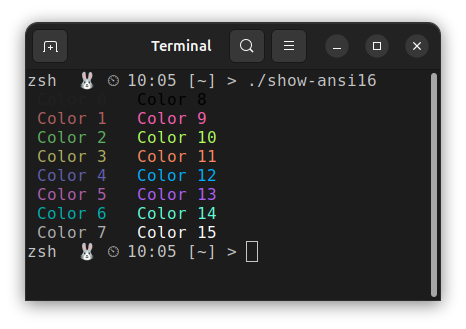
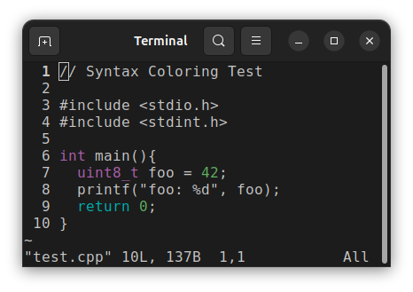
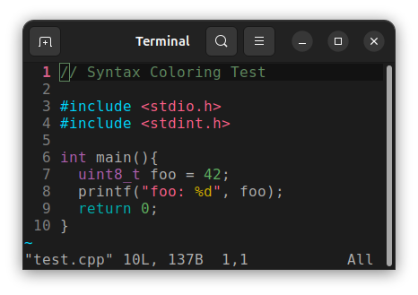
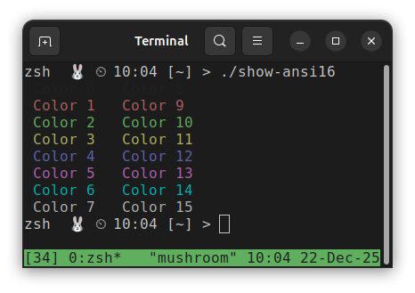
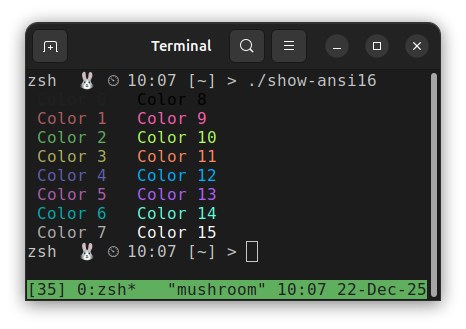
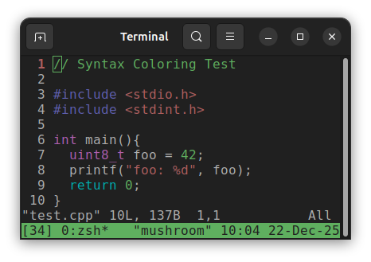
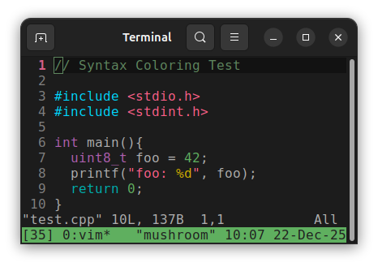

<!--___________________________________________________________________|
|______________________________________________________________________|
|        _   __   _   _ _   _   _   _         _                        |
|   |   |_| | _  | | | V | | | | / |_/ |_| | /                         |
|   |__ | | |__| |_| |   | |_| | \ |   | | | \_                        |
|    _  _         _ ___  _       _ ___   _                    / /      |
|   /  | | |\ |  \   |  | / | | /   |   \                    (^^)      |
|   \_ |_| | \| _/   |  | \ |_| \_  |  _/                    (____)o   |
|______________________________________________________________________|
|______________________________________________________________________|
|                                                                      |
|----------------------------------------------------------------------|
|   Copyright 2025, Rebecca Rashkin                                    |
|   -------------------------------                                    |
|   This code may be copied, redistributed, transformed, or built      |
|   upon in any format for educational, non-commercial purposes.       |
|                                                                      |
|   Please give me appropriate credit should you choose to use this    |
|   resource. Thank you :)                                             |
|----------------------------------------------------------------------|
|                                                                      |
|______________________________________________________________________|
|   //\^.^/\\  //\^.^/\\  //\^.^/\\  //\^.^/\\  //\^.^/\\  //\^.^/\\   |
|____________________________________________________________________-->
<!--DESCRIPTION
|   Reference page for LS_COLORS and dircolors
|____________________________________________________________________-->

---
title: TERM Environment Variable
subtitle: How $TERM affects colors.
toc: true
---

<style>
img {background-color: transparent; border: none;}
</style>

Options for TERM

Vim color schemes only display colors 0-15. Color indices 16 - 255 are not displayed - text set to these colors will default to Colors shown

Shell: zsh
$TERM: screen

screen is a basic setting that only prints the base 16 colors as defined by your terminal program. It does not support the full ANSI 256 color set.

xterm-256color allows you to print all ANSI 256 colors.

tmux-256color is a TERM value

## Without tmux
These examples show the differences with

### Base Colors Print

These screenshots show how the base 16 colors, as defined by the terminal program’s color settings, render when `TERM` is set to `screen` and `xterm-256color`, respectively.

In both cases, the colors render correctly.

`TERM=screen` | `TERM=xterm-256color`
:-:|:-:
 | 

### Vim Syntax Highlight Example

These screenshots show how the same code renders under different values of the TERM environment variable, using a Vim color scheme. The colors displayed are defined by the _Vim_ color scheme, not by the terminal settings.

`TERM=screen` | `TERM=xterm-256color`
:-:|:-:
 | 

Some syntax highlighting is not displayed when using `TERM=screen` because the corresponding colors, as defined by the color scheme, fall outside the base 16 color set. In summary:

Base 16 colors (render correctly with `TERM=screen`):

```text
Violet  : types
Cyan    : return statement
Green   : numbers
```

ANSI 256 colors (not part of the base 16):

```text
Blue        : #include statement
Red         : strings
Yellow      : `%d` format specifier
Dark Green  : Comment color
```





