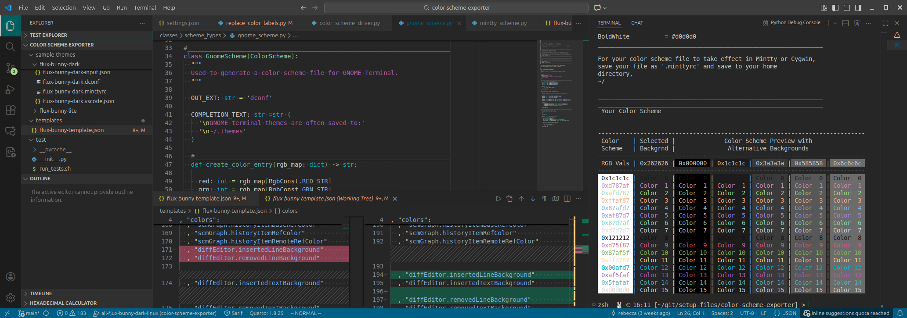
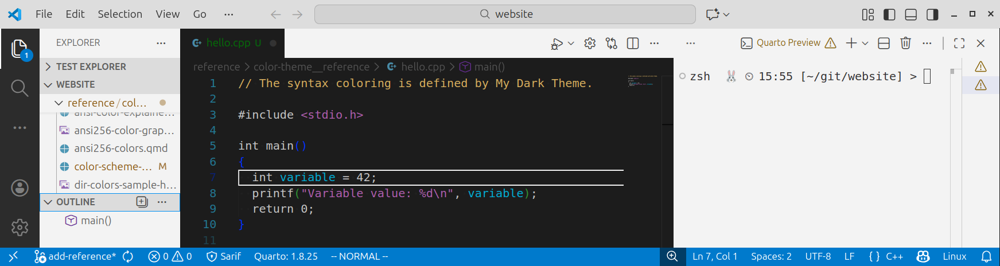
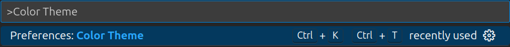
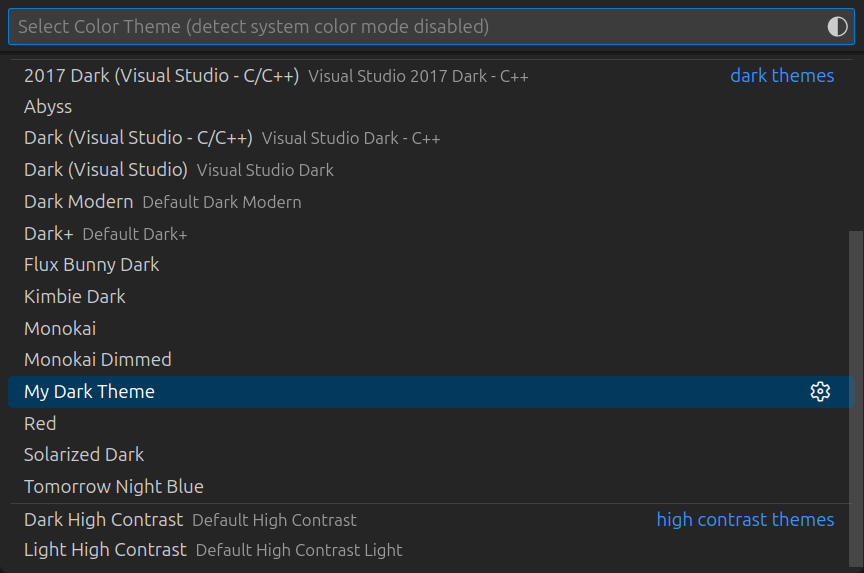
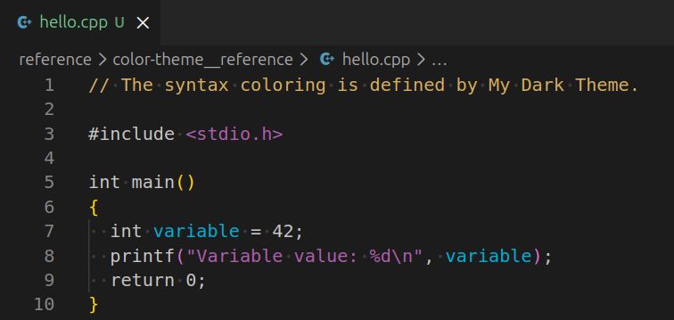

<!--___________________________________________________________________|
|______________________________________________________________________|
|        _   __   _   _ _   _   _   _         _                        |
|   |   |_| | _  | | | V | | | | / |_/ |_| | /                         |
|   |__ | | |__| |_| |   | |_| | \ |   | | | \_                        |
|    _  _         _ ___  _       _ ___   _                    / /      |
|   /  | | |\ |  \   |  | / | | /   |   \                    (^^)      |
|   \_ |_| | \| _/   |  | \ |_| \_  |  _/                    (____)o   |
|______________________________________________________________________|
|______________________________________________________________________|
|                                                                      |
|----------------------------------------------------------------------|
|   Copyright 2025, Rebecca Rashkin                                    |
|   -------------------------------                                    |
|   This code may be copied, redistributed, transformed, or built      |
|   upon in any format for educational, non-commercial purposes.       |
|                                                                      |
|   Please give me appropriate credit should you choose to use this    |
|   resource. Thank you :)                                             |
|----------------------------------------------------------------------|
|                                                                      |
|______________________________________________________________________|
|   //\^.^/\\  //\^.^/\\  //\^.^/\\  //\^.^/\\  //\^.^/\\  //\^.^/\\   |
|____________________________________________________________________-->
<!--DESCRIPTION
|   Reference page for creating a VS Code color scheme.
|____________________________________________________________________-->

---
title: VS Code Color Theme
subtitle: How to create a VS Code color theme file.
---



See [this page](https://code.visualstudio.com/api/references/theme-color) for a complete list of VS Code color theme properties.

See [this link](https://github.com/rebeccajennifer/setup-files/tree/main/vscode/flux-bunny-color-schemes) for a copy of my personally designed dark and light themes.

## Custom Theme Tutorial

### File Location

1. To install a custom theme, create a new directory in the following location (on a Linux system):

   ```bash
   ~/.vscode/extensions/
   ```

1. This example uses the directory named `my-color-themes`; you can name this directory whatever you would like.

   ```bash
   mkdir ~/.vscode/extensions/my-color-themes
   ```

1. In `my-color-themes` create a file named `package.json`.

   ```bash
   # The touch command creates a blank file
   touch ~/.vscode/extensions/my-color-themes/package.json
   ```

1. Edit `package.json` to include this minimal information.

   In this example, we are assuming there to be two theme files, `my-dark-theme.json` and `my-light-theme.json`. The `"label"` property will be displayed in the color theme drop down menu in VS Code.

   ```json
   { "name"          : "my-theme-pack"
   , "displayName"   : "My Theme Pack"
   , "publisher"     : "Your Name"
   , "version"       : "0.0.1"
   , "engines"       : { "vscode": "*" }
   , "contributes"   :

     { "themes"      :
       [ { "label"   : "My Dark theme"
         , "uiTheme" : "vs-dark"
         , "path"    : "./my-dark-theme.json"
         }
       , { "label"   : "My Light Theme"
         , "uiTheme" : "vs"
         , "path"    : "./my-light-theme.json"
         }
       ]
     }
   }
   ```

4. In `~/.vscode/extensions/my-color-themes` include the files for `my-dark-theme.json` and `my-light-theme.json`.

__Note:__ For the `uiTheme` property in `package.json`, use `vs-dark` for a dark theme and `vs` for a light theme. This ensures that any undefined properties inherit the correct default colors. In the `My Dark Theme` example, `vs` was intentionally selected instead of `vs-dark`; consequently, only the defined elements appear dark, while the rest default to the light theme pictured below.



### Minimal Color Theme File

This text is included in the minimal color theme file `my-dark-theme.json`.

```json
{
  "$schema"     : "vscode://schemas/color-theme"

, "colors":
  { "editor.background"                 : "#1c1c1c"
  , "editor.foreground"                 : "#c6c6c6"
  }

, "tokenColors":
  [ { "scope": "comment"
    , "settings": { "foreground": "#d7af5f" }
    }

  , { "scope": "string"
    , "settings": { "foreground": "#af5faf" }
    }
  ]

  // These properties override tokenColors
, "semanticTokenColors":
  { "variable"      : "#00afd7"
  }
}
```
### Load Custom Theme

#### Load From VS Code

To load the theme, from the search bar type `>Color Theme` and select `Preferences: Color Theme`. You can also pull up this search bar with the shortcut `Ctrl+Shift+p`.



The theme `My Dark Theme` should now display in the drop down options.



You should now see your defined colors in the editor window.



#### Add to `settings.json`

You can also add the color theme to your `settings.json` file:

```json
{
  "workbench.colorTheme": "My Dark Theme"
}
```

## Existing Theme

You may want to start from an existing theme file. You can use the dark theme I have created [here](https://github.com/rebeccajennifer/setup-files/blob/main/vscode/flux-bunny-color-schemes/flux-bunny-dark.json). You can also copy an existing theme from the defaults. Depending on how VS Code was installed, default theme files might be found here:

```bash
/snap/code/current/usr/share/code/resources/app/extensions/theme-*/themes
```

## Autoformat .json in Vim

If the the json file is not formatted, you can use the following Vim command to autoformat the json file:

```vim
:%!python3 -m json.tool
```
