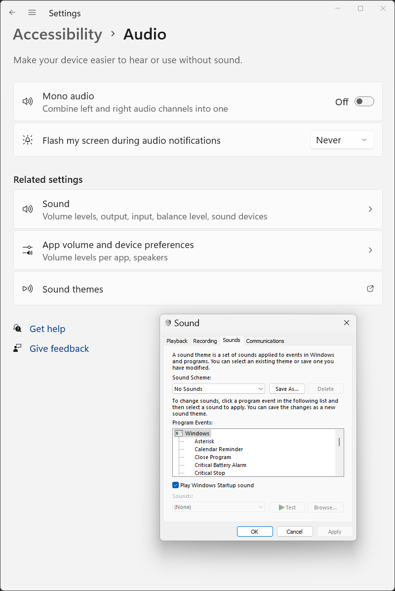

<!--___________________________________________________________________|
|______________________________________________________________________|
|        _   __   _   _ _   _   _   _         _                        |
|   |   |_| | _  | | | V | | | | / |_/ |_| | /                         |
|   |__ | | |__| |_| |   | |_| | \ |   | | | \_                        |
|    _  _         _ ___  _       _ ___   _                    / /      |
|   /  | | |\ |  \   |  | / | | /   |   \                    (^^)      |
|   \_ |_| | \| _/   |  | \ |_| \_  |  _/                    (____)o   |
|______________________________________________________________________|
|______________________________________________________________________|
|                                                                      |
|----------------------------------------------------------------------|
|   Copyright 2025, Rebecca Rashkin                                    |
|   -------------------------------                                    |
|   This code may be copied, redistributed, transformed, or built      |
|   upon in any format for educational, non-commercial purposes.       |
|                                                                      |
|   Please give me appropriate credit should you choose to use this    |
|   resource. Thank you :)                                             |
|----------------------------------------------------------------------|
|                                                                      |
|______________________________________________________________________|
|   //\^.^/\\  //\^.^/\\  //\^.^/\\  //\^.^/\\  //\^.^/\\  //\^.^/\\   |
|____________________________________________________________________-->
<!--DESCRIPTION
|   My new environment setup.
|____________________________________________________________________-->

This is my essential checklist of applications for setting up a new development environment, including links to their official install sources.

## Ubuntu

### Create root password

```bash
passwd
```

### Install from apt
Use `sudo` before all `apt` commands if you do not have a root password.

```
su
apt install build-essential
apt install cmake
apt install vim
apt install emacs
apt install nano
apt install gedit
apt install git
apt install zsh
apt install curl
apt install tmux
apt install python3-pip
apt install graphviz # Make block diagrams using a scripting language
```

### Install from snap
``
sudo snap install discord
``

### From App Center
- Steam
- Slack
- Visual Studio Code ("code")

### Install from `.deb`
#### Chrome

From directory with `.deb` file

```
sudo dpkg -i <.deb file>
```

#### DrawIO
Download `.deb` from [here](https://github.com/jgraph/drawio-desktop/releases/tag/v26.0.4).

Run with

```bash
drawio
```

If you get this error

```bash
FATAL:setuid_sandbox_host.cc(163)] The SUID sandbox helper binary was found, but is not configured correctly. Rather than run without sandboxing I'm aborting now. You need to make sure that /opt/drawio/chrome-sandbox is owned by root and has mode 4755.
```

Run this command

```bash
sudo chmod 4755 /opt/drawio/chrome-sandbox
```

[Source](https://github.com/jgraph/drawio-desktop/issues/150)

### Arduino CLI

#### Install Arduino CLI
Source:  [Arduino CLI ](https://arduino.github.io/arduino-cli/0.35/installation/)

1. Create `~/local/` if it doesn't already exist:
   ```bash
   mkdir ~/local
   ```

1. Navigate to `~/local` and run command to install `arduino-cli`
   ```bash
   curl -fsSL https://raw.githubusercontent.com/arduino/arduino-cli/master/install.sh | sh
   ```

1. Pre-pended `$PATH` environment variable with this line in `~/.bash_profile`

   ```bash
   export PATH=~/local/bin:$PATH
   ```

1. Source `.bash_profile`
   ```bash
   source ~/.bash_profile
   ```

1. Verify `arduino-cli` was installed
   ```bash
   > which arduino-cli
   /home/flux/local/bin/arduino-cli
   ```

1. Update `arduino-cli`
   ```bash
   arduino-cli upgrade
   ```

1. See the `Arduino CLI` wiki page for information on configuration.

### Calibre
This app is used to view and print `.epub` files.

```bash
sudo -v && wget -nv -O- https://download.calibre-ebook.com/linux-installer.sh | sudo sh /dev/stdin
```

## Windows

### Turn off alert sounds

Windows makes an alert sound every time tab complete doesn't work or other silly things. Turn it off in settings.

Go to Audio - change other sound settings
or

Sound -> sound control panel -> Sounds tab -> Sound Scheme dropdown -> No Sounds

In the window labeled `Sound` -> tab labeled `Sounds` select the menu option `No Sounds`




### Cygwin

Download cygwin, install packages

- lynx
- wget
- tar
- git
- vim
- dos2unix

### Software Downloads

- Python
- Visual Studio Code
- Chrome
- Spotify
- Slack
- Steam