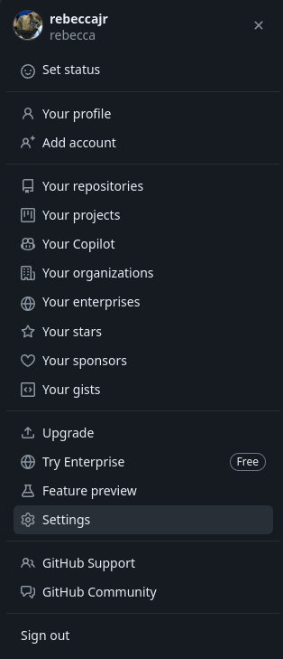
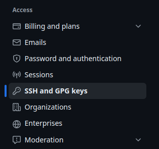
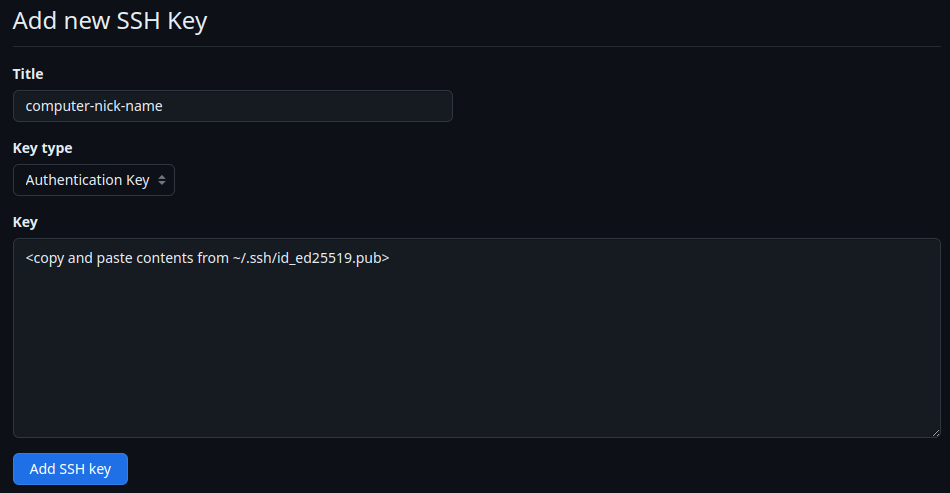
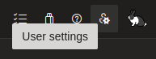
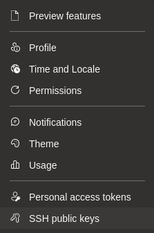
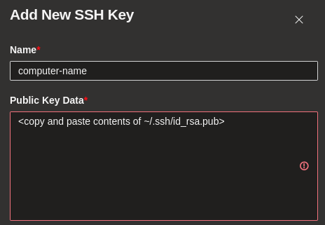

<!--___________________________________________________________________|
|______________________________________________________________________|
|        _   __   _   _ _   _   _   _         _                        |
|   |   |_| | _  | | | V | | | | / |_/ |_| | /                         |
|   |__ | | |__| |_| |   | |_| | \ |   | | | \_                        |
|    _  _         _ ___  _       _ ___   _                    / /      |
|   /  | | |\ |  \   |  | / | | /   |   \                    (^^)      |
|   \_ |_| | \| _/   |  | \ |_| \_  |  _/                    (____)o   |
|______________________________________________________________________|
|______________________________________________________________________|
|                                                                      |
|----------------------------------------------------------------------|
|   Copyright 2025, Rebecca Rashkin                                    |
|   -------------------------------                                    |
|   This code may be copied, redistributed, transformed, or built      |
|   upon in any format for educational, non-commercial purposes.       |
|                                                                      |
|   Please give me appropriate credit should you choose to use this    |
|   resource. Thank you :)                                             |
|----------------------------------------------------------------------|
|                                                                      |
|______________________________________________________________________|
|   //\^.^/\\  //\^.^/\\  //\^.^/\\  //\^.^/\\  //\^.^/\\  //\^.^/\\   |
|____________________________________________________________________-->
<!--DESCRIPTION
|   Git reference
|____________________________________________________________________-->

This page describes common Git commands that I have encountered in my personal coding projects. It it written as a reference, but by no means a comprehensive reference.

## Configuration

You can edit a git configuration either from the command line or edit a `.gitconfig` that lives in your home directory.

### Command Line Entry

To edit a parameter from the command line that will edit your git config file, run a command in the following format:
```
git config --global <section>.<key> <value>
```

For instance, if you would like to edit the user name for all commits made from an account, run the command:

```bash
git config --global user.name "Your Name"
```

Similarly, if you would like to change the default name to `main` (instead of the usual default `master`) run the following command:

```bash
git config --global init.defaultBranch main
```

### `.gitconfig` file

The `.gitconfig` file lives in your home directory, or is created upon the first run of a `git config` command. It takes the format"
```
[section0]
    key = value

[section1]
    key = value
```

## Submodules

### Add Submodule

To add a submodule, first add the repository in the web interface of your Git remote host, e.g. GitHub or Azure DevOps.

In the repository that you would like to use to contain the submodule, use the following command:

```bash
git submodule add <submodule address>
```

E.g.
```bash
git submodule add git@github.com:rebeccajr/test-submodule.git
```

### Initialization

When first adding a submodule, or when cloning a repository with submodules you must run:

```bash
git submodule update --init --recursive
```

**Note** The `--recursive` flag is only necessary if there are nested submodules, however it won't hurt anything if there aren't nested submodules.

### Update Submodule

After the initialization of a submodule, to simply update that submodule, i.e. pull down any new commits, run:

```bash
git submodule update --recursive
```

## SSH Key Setup

To enable seamless authentication for Git without repeating logins, follow these steps to configure SSH keys. This guide covers setup for both GitHub and Azure DevOps.

### GitHub

The following information was taken from the following source:

<a class="flux-button _3" href="https://docs.github.com/en/authentication/connecting-to-github-with-ssh/generating-a-new-ssh-key-and-adding-it-to-the-ssh-agent">GitHub SSH Key Setup Reource</a>

1. Generate an SSH key.

   ```bash
   ssh-keygen -t ed25519 -C "email@address.com"
   ```

   Output

   ```bash
   Generating public/private ed25519 key pair.
   ```

2. Hit enter after each of the following prompts.

   ```bash
   Enter file in which to save the key (/home/<user_name>/.ssh/id_ed25519):
   Enter passphrase (empty for no passphrase):
   Enter same passphrase again:
   ```

   Output

   ```bash
   Your identification has been saved in /home/<user_name>/.ssh/id_ed25519
   Your public key has been saved in /home/<user_name>/.ssh/id_ed25519.pub
   The key fingerprint is:
   ################################################## email@address.com
   The key's randomart image is:
   +--[ED25519 256]--+
   |   ###########   |
   |   ###########   |
   |   ###########   |
   |   ###########   |
   |   ###########   |
   |   ###########   |
   |   ###########   |
   |   ###########   |
   |   ###########   |
   +----[SHA256]-----+
   ```

3. Start the SSH Agent in the background.

   ```bash
   eval "$(ssh-agent -s)"
   ```

   Output

   ```bash
   Agent pid 59566
   ```

4. Register your private SSH key with the SSH Agent.

   ```bash
   ssh-add ~/.ssh/id_ed25519
   ```

   Output
   ```bash
   Identity added: /home/flux/.ssh/id_ed25519 (email@address.com)
   ```


1. Go to settings.

   

1. Go to SSH keys.

   

1. Click `New SSH key` button.

   


### Azure DevOps

The following information was taken from the following source:

<a class="flux-button _3" href="https://learn.microsoft.com/en-us/azure/virtual-machines/linux/create-ssh-keys-detailed">Azure DevOps Key Setup Reource</a>

1. Generate an SSH key.

   ```bash
   ssh-keygen -m PEM -t rsa -b 4096
   ```

   Output

   ```bash
   Generating public/private rsa key pair.
   ```

2. Hit enter after each of the following prompts.

   ```bash
   Enter file in which to save the key (/home/<user_name>/.ssh/id_rsa): (hit enter)
   Enter passphrase (empty for no passphrase): (hit enter)
   Enter same passphrase again: (hit enter)
   ```

   Output
   ```bash
   Your identification has been saved in /home/<user_name>/.ssh/id_rsa
   Your public key has been saved in /home/<user_name>/.ssh/id_rsa.pub
   The key fingerprint is:
   SHA256:########################################### user@computer
   The key's randomart image is:
   +---[RSA 4096]----+
   |   ###########   |
   |   ###########   |
   |   ###########   |
   |   ###########   |
   |   ###########   |
   |   ###########   |
   |   ###########   |
   |   ###########   |
   |   ###########   |
   +----[SHA256]-----+
   ```

3. Start the SSH Agent in the background.

   ```bash
   eval "$(ssh-agent -s)"
   ```

   Output

   ```bash
   Agent pid 12956
   ```

1. From Azure DevOps web interface

   

   

   