<!--___________________________________________________________________|
|______________________________________________________________________|
|        _   __   _   _ _   _   _   _         _                        |
|   |   |_| | _  | | | V | | | | / |_/ |_| | /                         |
|   |__ | | |__| |_| |   | |_| | \ |   | | | \_                        |
|    _  _         _ ___  _       _ ___   _                    / /      |
|   /  | | |\ |  \   |  | / | | /   |   \                    (^^)      |
|   \_ |_| | \| _/   |  | \ |_| \_  |  _/                    (____)o   |
|______________________________________________________________________|
|______________________________________________________________________|
|                                                                      |
|----------------------------------------------------------------------|
|   Copyright 2025, Rebecca Rashkin                                    |
|   -------------------------------                                    |
|   This code may be copied, redistributed, transformed, or built      |
|   upon in any format for educational, non-commercial purposes.       |
|                                                                      |
|   Please give me appropriate credit should you choose to use this    |
|   resource. Thank you :)                                             |
|----------------------------------------------------------------------|
|                                                                      |
|______________________________________________________________________|
|   //\^.^/\\  //\^.^/\\  //\^.^/\\  //\^.^/\\  //\^.^/\\  //\^.^/\\   |
|____________________________________________________________________-->
<!--DESCRIPTION
|   Reference page for PuTTY configuration
|____________________________________________________________________-->

This page describes how to access a configuration file for a saved PuTTY session. Each saved session is saved in a `*.reg` file and can be imported or exported through the Windows `Registry Editor`.

## Access Saved Session Configurations

1. `Windows key` + `r`, type `regedit`. Click `OK`.

   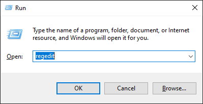

1. On the left sidebar, navigate to `HKEY_CURRENT_USER/SOFTWARE/SimonTatham/PuTTY/Sessions/<saved-session-name>`. By default, there should be a saved session called `Default%20Settings`.

   __Note:__ `%20` corresponds with the ASCII code for space, so `Default%20Settings` translates to `Default Settings`

   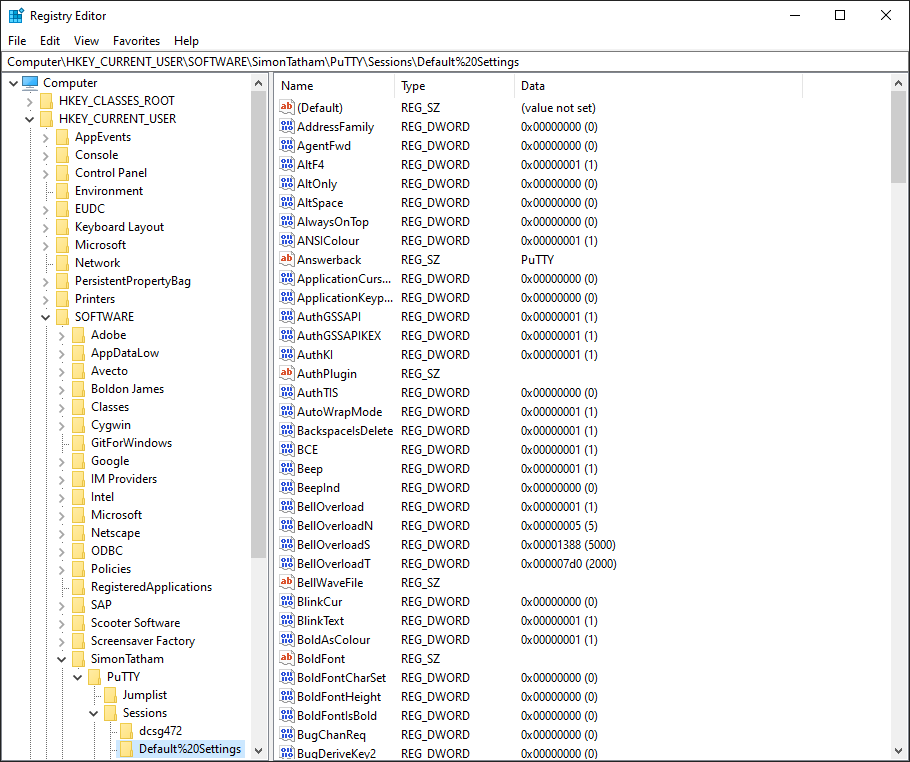

## Export Configuration

1. From the Registry Editor, [access the saved configuration](#access-saved-session-configurations) you would like to export.

1. Right-click on the directory corresponding with the saved session to export. Select `Export`.

   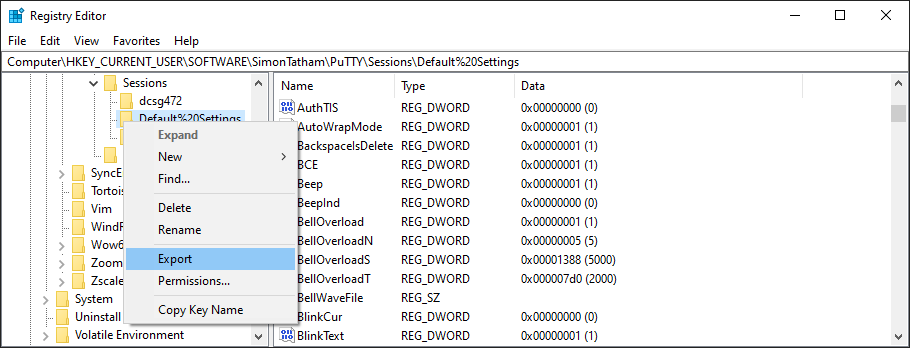

1. Name the file and save the configuration in your preferred location.

   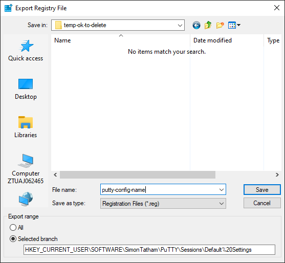

## Import Configuration

1. From the Registry Editor, go to `File > Import`.

   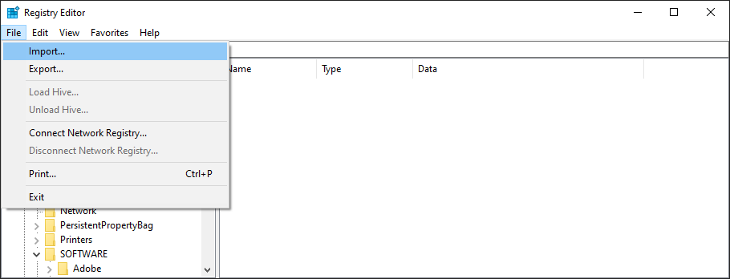

1. Navigate to the saved configuration `.reg` file. Click `Open`.

   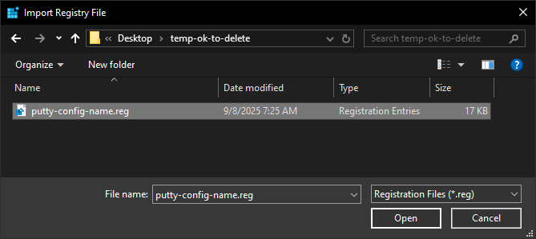

1. There will be a dialog box confirming that settings were imported. Click `OK`.

   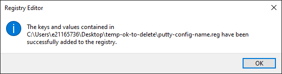

## Color Settings

Follow [these instructions](../environment-setup/putty.html#import-configuration) to customize your PuTTY terminal color scheme.

## All Configuration Settings

This section contains screenshots of all the configuration settings of a PuTTY window.

### Session

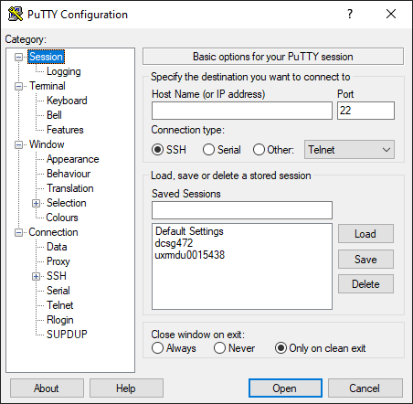
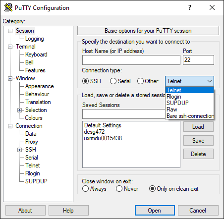
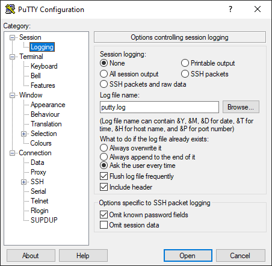

### Terminal

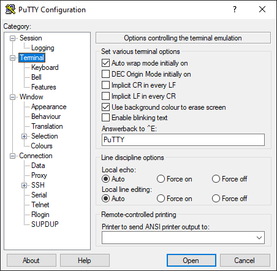
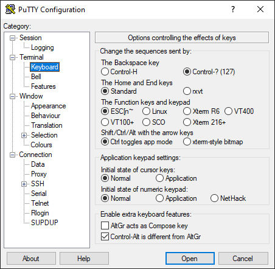
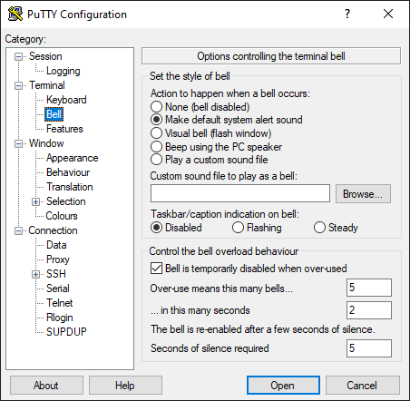
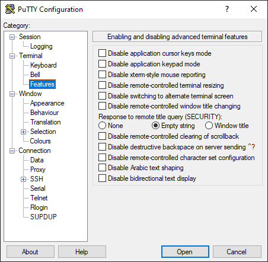

### Window

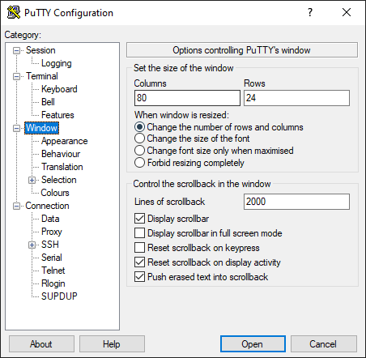
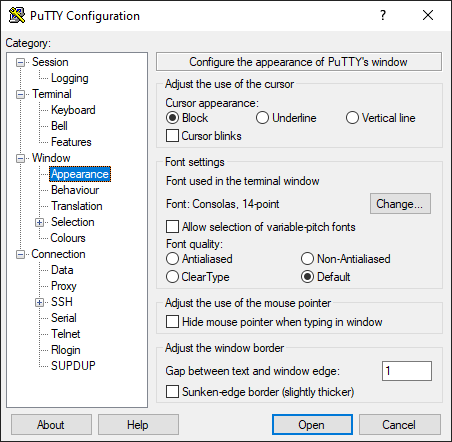
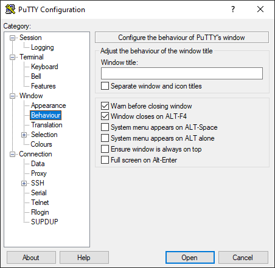
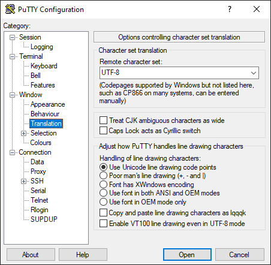
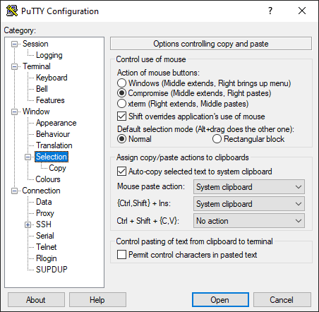
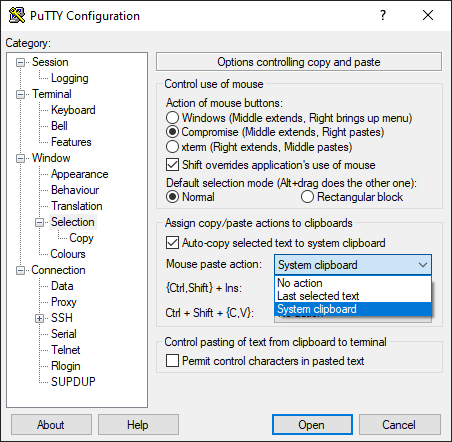
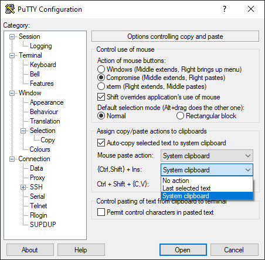
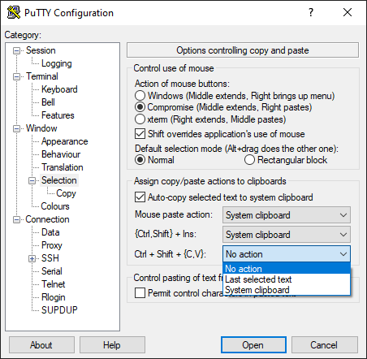
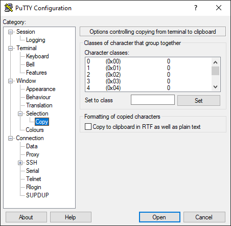
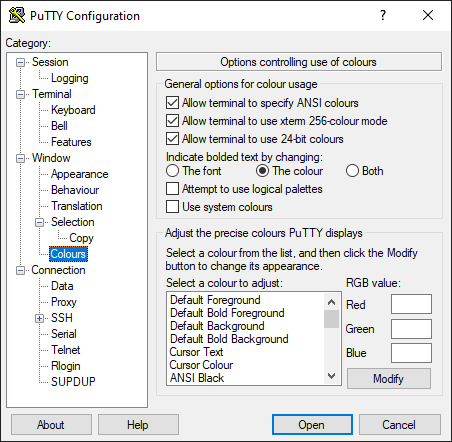

### Connection

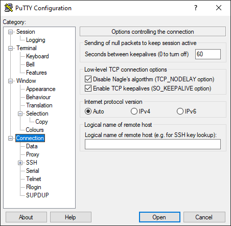
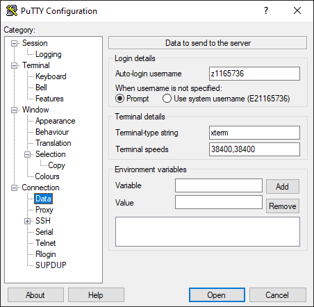
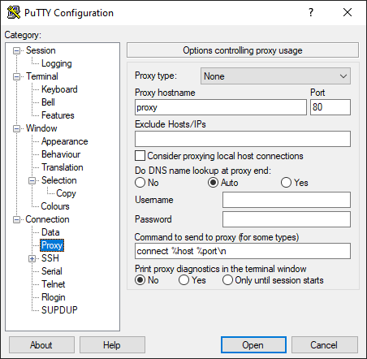
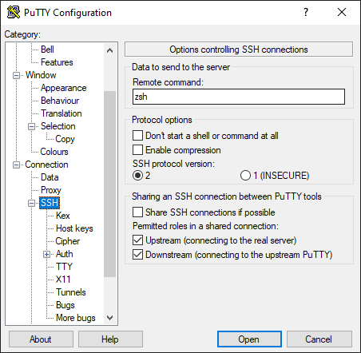
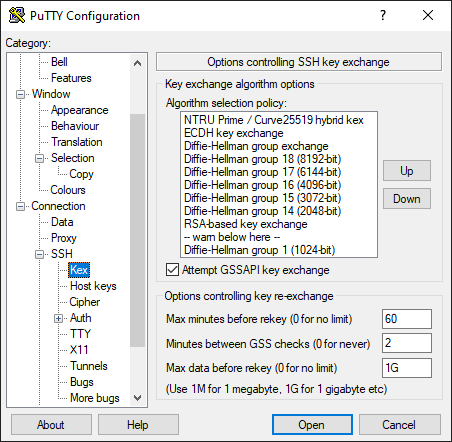
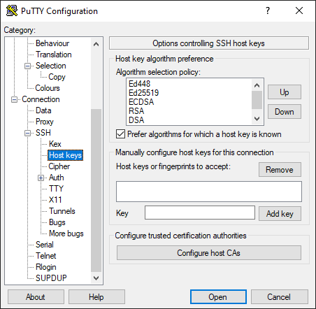
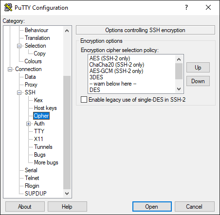

#### Auth

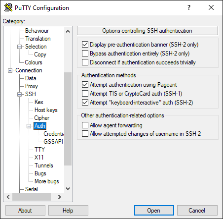
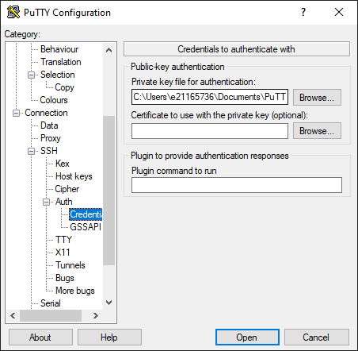
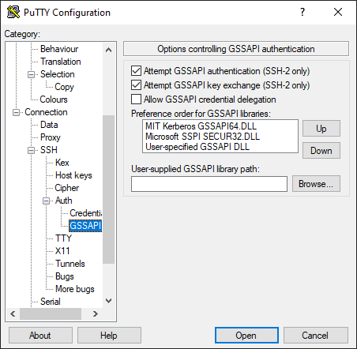
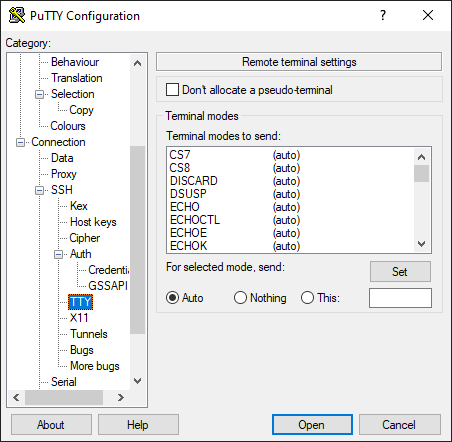
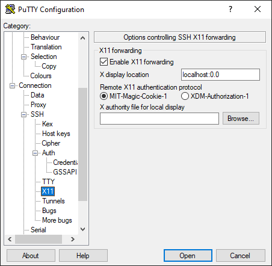
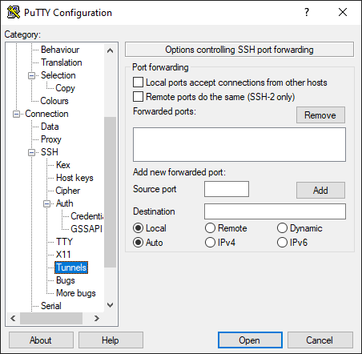

#### Bugs

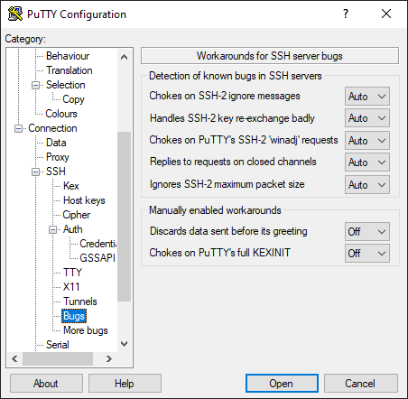
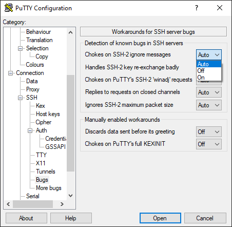
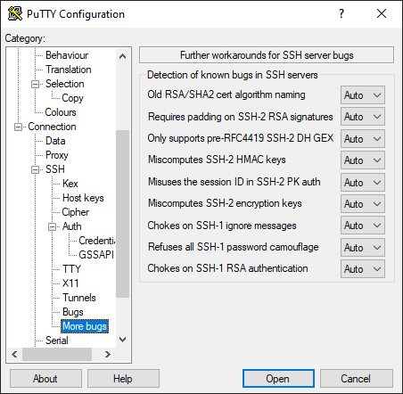
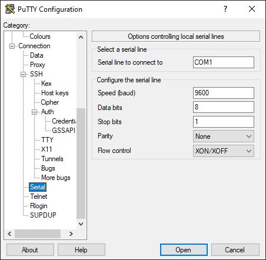
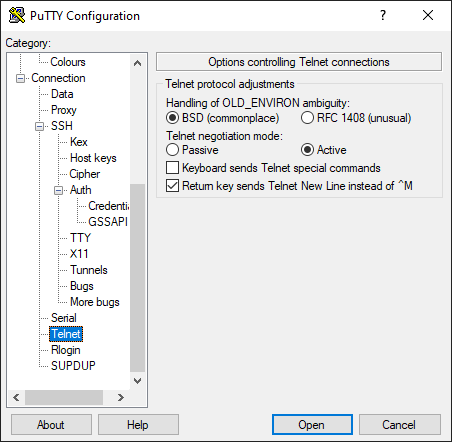
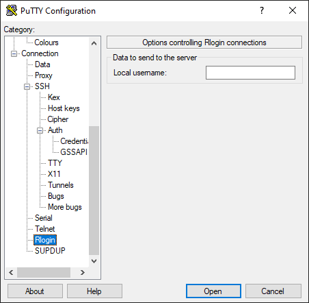
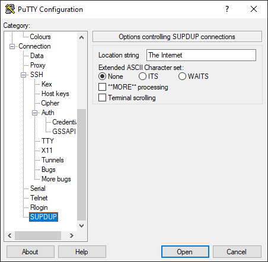
