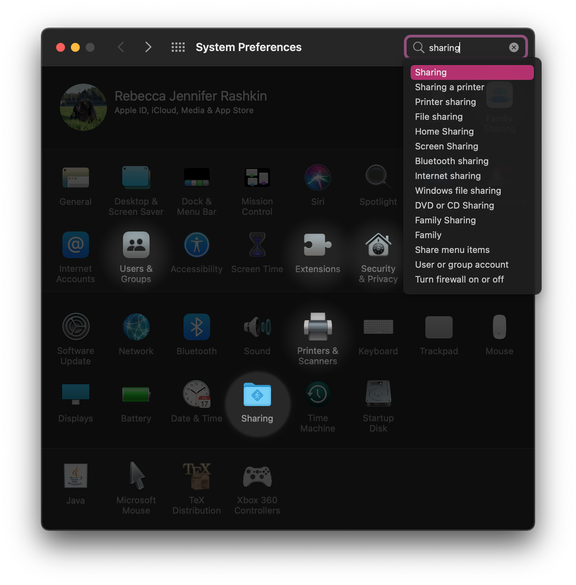
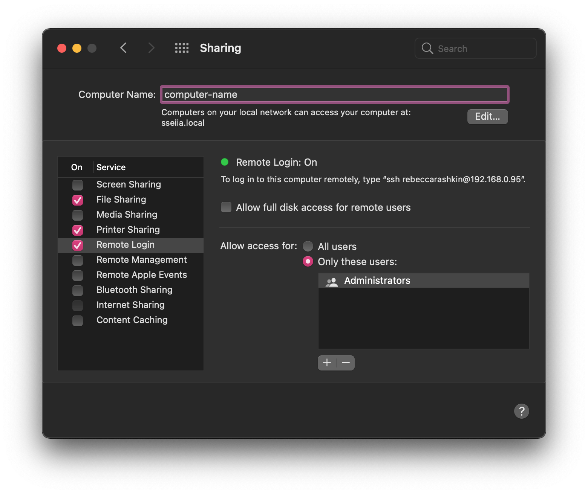

<!--___________________________________________________________________|
|______________________________________________________________________|
|        _   __   _   _ _   _   _   _         _                        |
|   |   |_| | _  | | | V | | | | / |_/ |_| | /                         |
|   |__ | | |__| |_| |   | |_| | \ |   | | | \_                        |
|    _  _         _ ___  _       _ ___   _                    / /      |
|   /  | | |\ |  \   |  | / | | /   |   \                    (^^)      |
|   \_ |_| | \| _/   |  | \ |_| \_  |  _/                    (____)o   |
|______________________________________________________________________|
|______________________________________________________________________|
|                                                                      |
|----------------------------------------------------------------------|
|   Copyright 2026, Rebecca Rashkin                                    |
|   -------------------------------                                    |
|   This code may be copied, redistributed, transformed, or built      |
|   upon in any format for educational, non-commercial purposes.       |
|                                                                      |
|   Please give me appropriate credit should you choose to use this    |
|   resource. Thank you :)                                             |
|----------------------------------------------------------------------|
|                                                                      |
|______________________________________________________________________|
|   //\^.^/\\  //\^.^/\\  //\^.^/\\  //\^.^/\\  //\^.^/\\  //\^.^/\\   |
|____________________________________________________________________-->
<!--DESCRIPTION
|   Enable SSH reference
|____________________________________________________________________-->

SSH allows you to access another computer from the command line. It lets you run commands on a remote system and transfer files between machines.

To accept incoming connections, the SSH server must be enabled on the target computer. This page describes how to enable the SSH server on Linux and macOS systems.

## Linux

### Reference

```bash
sudo sudo systemctl  enable --now ssh    # Enable ssh
sudo sudo systemctl disable --now ssh    # Disable ssh
ifconfig                                 # Network interface configuration utility
```

### Enable SSH Procedure

1. Install `openssh-server`.

   ```bash
   sudo apt update
   sudo apt install openssh-server
   ```

1. Check if ssh is enabled. In this example, ssh is disabled

   ```bash
   > systemctl status ssh

   ○ ssh.service - OpenBSD Secure Shell server
        Loaded: loaded (/usr/lib/systemd/system/ssh.service; disabled; preset: enabled)
        Active: inactive (dead)
   TriggeredBy: ● ssh.socket
          Docs: man:sshd(8)
                man:sshd_config(5)
   ```

1. Enable ssh

   ```bash
   > sudo systemctl enable --now ssh

   Synchronizing state of ssh.service with SysV service script with /usr/lib/systemd/systemd-sysv-install.
   Executing: /usr/lib/systemd/systemd-sysv-install enable ssh
   Created symlink /etc/systemd/system/sshd.service → /usr/lib/systemd/system/ssh.service.
   Created symlink /etc/systemd/system/multi-user.target.wants/ssh.service → /usr/lib/systemd/system/ssh.service.
   ```

## MacOS

1. Open `System Preferences` and select `Sharing`.


1. From the sidebar, select `Remote Login`.


## Test Connection

In this example, the local machine will be my Macbook, and the remote machine will be the Linux host.

1. On the _remote_ machine, run `ifconfig` to check its IP address. It will likely be in the form `192.168.0.##`.

   This computer is connected to the network using WiFi, so the key in ifconfig is labeled `wlo1`.

   ```bash
   > ifconfig

   ...

   wlo1: flags=4163<UP,BROADCAST,RUNNING,MULTICAST>  mtu 1500
           inet 192.168.0.##  netmask 255.255.255.0  broadcast 192.168.0.255

   ...
   ```

1. From the _local_ machine, run `ping`. If the remote computer is reachable on the network, the terminal will display periodic replies indicating that the connection is active.

   ```bash
   > ping 192.168.0.##

   PING 192.168.0.## (192.168.0.##): 56 data bytes
   64 bytes from 192.168.0.##: icmp_seq=0 ttl=64 time=0.068 ms
   64 bytes from 192.168.0.##: icmp_seq=1 ttl=64 time=0.100 ms
   64 bytes from 192.168.0.##: icmp_seq=2 ttl=64 time=0.108 ms
   ```

1. Try to remote in using `ssh`. Type in the password for the remote user.

   __Successful Login Example__

   ```bash
   > ssh <remote-user-name>@192.168.0.##

   <remote-user-name>@192.168.0.##'s password:

   Welcome to Ubuntu 24.04.4 LTS (GNU/Linux 6.17.0-20-generic x86_64)
    * Documentation:  https://help.ubuntu.com
    * Management:     https://landscape.canonical.com
    * Support:        https://ubuntu.com/pro
   Expanded Security Maintenance for Applications is not enabled.
   88 updates can be applied immediately.
   To see these additional updates run: apt list --upgradable
   35 additional security updates can be applied with ESM Apps.
   Learn more about enabling ESM Apps service at https://ubuntu.com/esm
   Last login: Fri Apr 17 21:24:14 2026 from 192.168.0.95
   ```

   __Unsuccessful Login Example__

   In this example, SSH access is disabled for the remote host, so the login attempt failed.

   ```bash
   > ssh <remote-user-name>@192.168.0.##

   ssh: connect to host 192.168.0.## port 22: Connection refused
   ```
