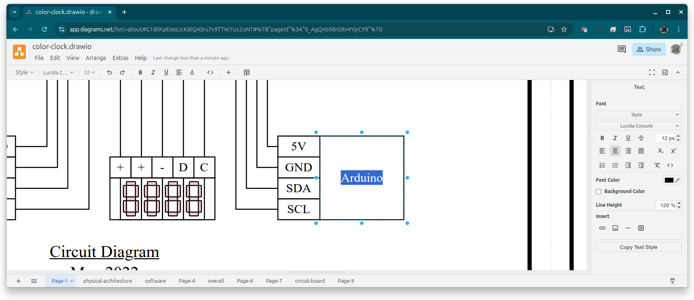
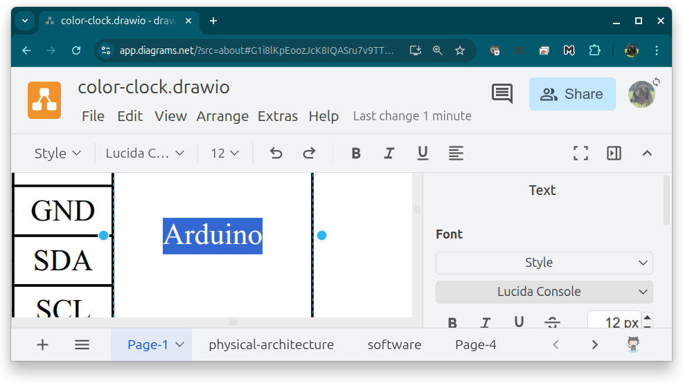
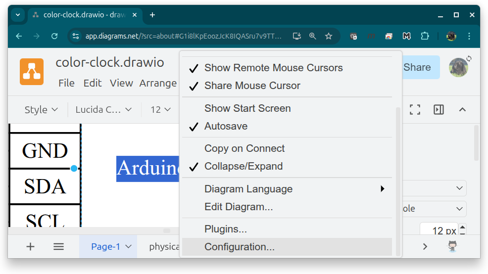
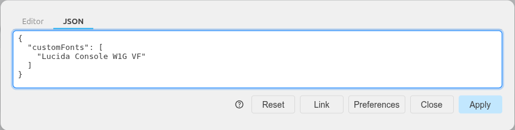
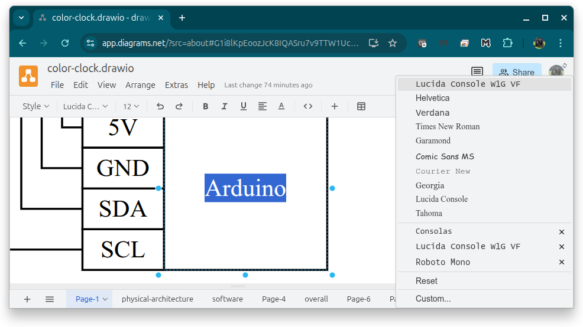
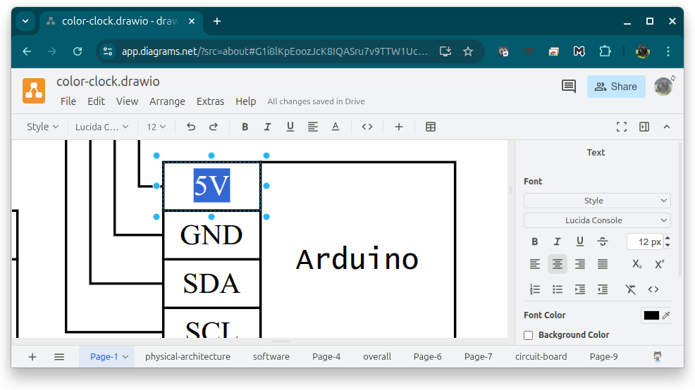
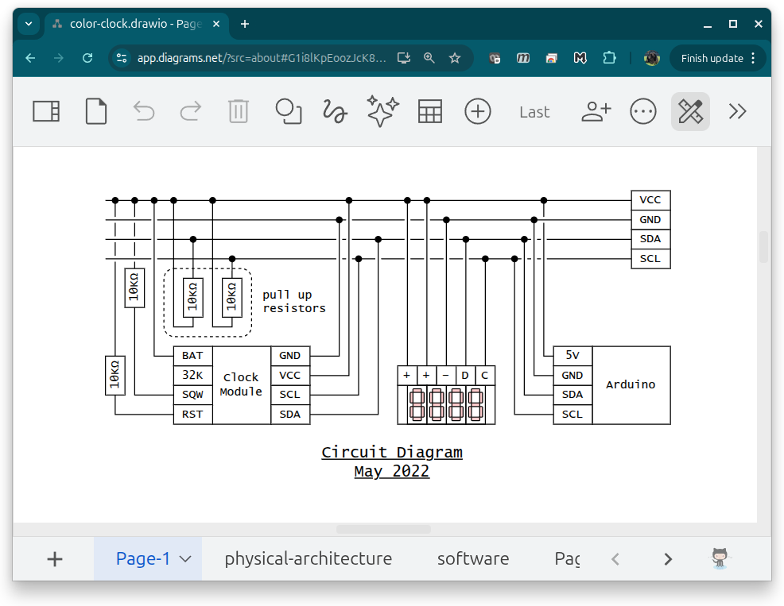

In the image displayed below, the font `Lucida Console`, a monospace font*, should be used for all text in the image, however, the font is showing up incorrectly. This is because the font is not installed properly on the machine I am currently working on.



\* A monospace font is one in which each character has the same width. It is often used for displaying code.

## Linux

### View Installed Fonts

To view installed fonts, run the following command.

```bash
fc-list
```

Example Output

```text
/usr/share/fonts/truetype/lato/Lato-Medium.ttf: Lato,Lato Medium:style=Medium,Regular
/usr/share/fonts/truetype/msttcorefonts/comicbd.ttf: Comic Sans MS:style=Bold,Negreta,tučné,fed,Fett,Έντονα,Negrita,Lihavoitu,Gras,Félkövér,Grassetto,Vet,Halvfet,Pogrubiony,Negrito,Полужирный,Fet,Kalın,Krepko,Lodia
/usr/share/fonts/truetype/tuffy/tuffy_bold.ttf: Tuffy:style=Bold
/usr/share/fonts/truetype/lato/Lato-SemiboldItalic.ttf: Lato,Lato Semibold:style=Semibold Italic,Italic
...
```

### Font Search

To search for a specific font in your installed fonts run the following command.

```bash
# The argument i is used to ignore case
fc-list | grep -i 'font-name'
```

If the font is installed, grep will return matching results. If the font is not installed, the `fc-list | grep` command will produce no output.

__Example__

```bash
> fc-list | grep -i 'lucida console'
/usr/share/fonts/LucidaConsoleW1GVF.ttf: Lucida Console W1G VF:style=Regular
/usr/share/fonts/LucidaConsoleW1GVF.ttf: Lucida Console W1G VF:style=Semi Bold
/usr/share/fonts/LucidaConsoleW1GVF.ttf: Lucida Console W1G VF
/usr/share/fonts/LucidaConsoleW1GVF.ttf: Lucida Console W1G VF:style=Medium
/usr/share/fonts/LucidaConsoleW1GVF.ttf: Lucida Console W1G VF:style=Bold
```

\* Note that the name for `Lucida Console` on this machine is specifically named `Lucida Console W1G VF`.


### Install Font

1. Download the font file. If the download is compressed, extract the file. Save the `.ttf` in `/usr/share/fonts`.

   You will likely need to use `sudo` to save in this directory.

3. To install for all users, run the following command.

   ```bash
   sudo fc-cache -v
   ```

## draw.io

In this example, the font `Lucida Console`* installed on the machine, but [`draw.io`](https://draw.io), a web-based app, is not displaying the font correctly.



\* Note that the name for `Lucida Console` on this machine is specifically named `Lucida Console W1G VF`.

### Configure `draw.io` For System Fonts

In `draw.io` go to `Extras > Configuration`. Select the `JSON` tab and enter the following:

```json
{
  "customFonts": [
    "Correctly Named Font"
  ]
}
```



__Example__

In this example, the font that was installed was named `Lucida Console W1G VF`, _not_ simply `Lucida Console` which is what is used throughout the drawing.

1. Change the text in the drawing to the installed font - in this example, `Lucida Console W1G VF`. You might need to select `Custom...` and enter the font manually.

   

1. The selected text now displays the correct font. However, the rest of the text in the drawing is still set to `Lucida Console` instead of the installed font name `Lucida Console W1G VF`.

   

   To avoid reassigning every text object with the new font name, create a [font alias](#create-font-alias).

1. Restart the browser so draw.io detects the new font alias.

   

### Create Font Alias

This configuration allows applications to reference an installed font using an alternate family name. In this example, the name `Lucida Console` is mapped to the installed font family `Lucida Console W1G VF`.


1. Edit or create the file `~/.config/fontconfig/fonts.conf` to include the following text:

   ```json
   <?xml version="1.0"?>
   <!DOCTYPE fontconfig SYSTEM "fonts.dtd">
   <fontconfig>

     <alias>
       <family>Lucida Console</family>
       <prefer>
         <family>Lucida Console W1G VF</family>
       </prefer>
     </alias>

   </fontconfig>
   ```

1. Rebuild the font cache with the following command.

   ```bash
   fc-cache -v
   ```

1. Verify the alias resolves.

   Command

   ```bash
   fc-match "Lucida Console"
   ```

   Output

   ```bash
   LucidaConsoleW1GVF.ttf: "Lucida Console W1G VF" "Regular"
   ```