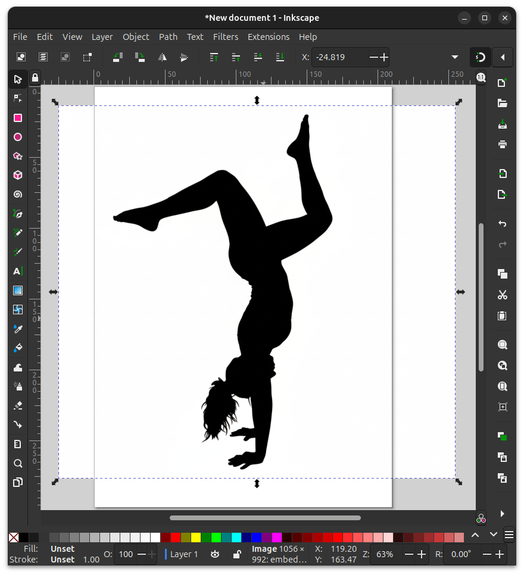
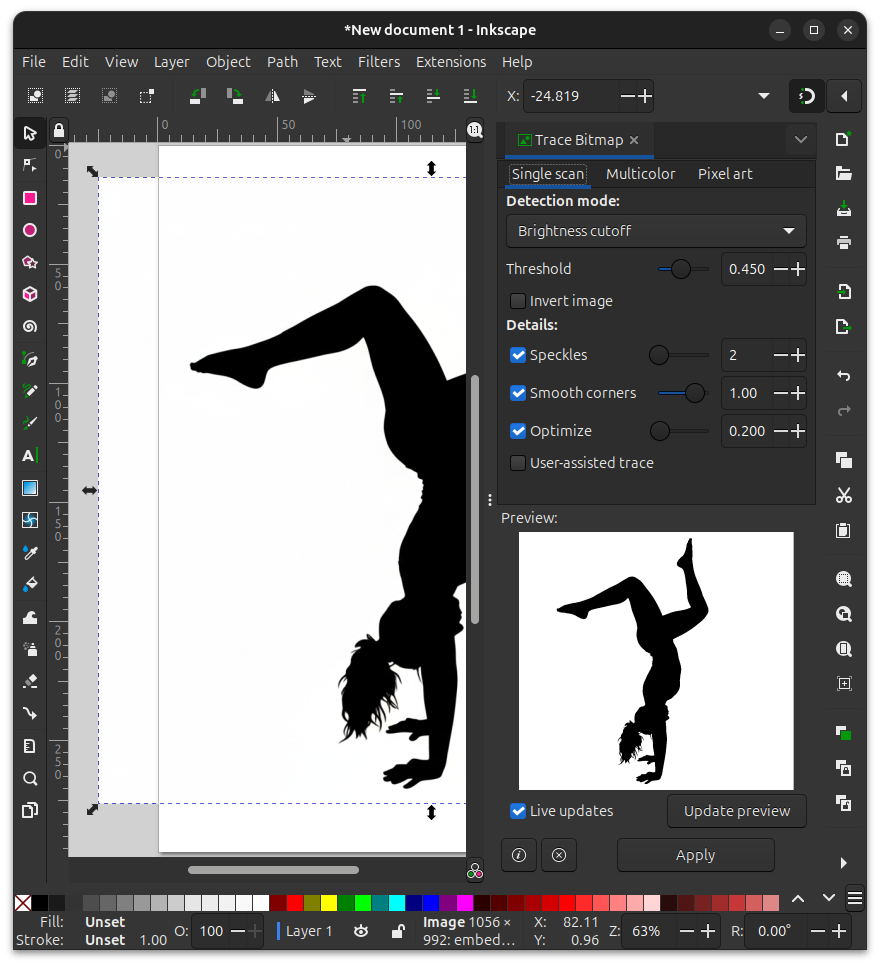
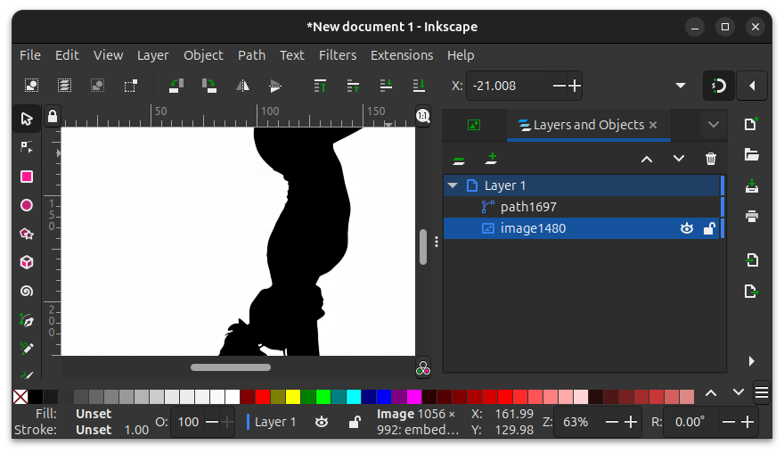
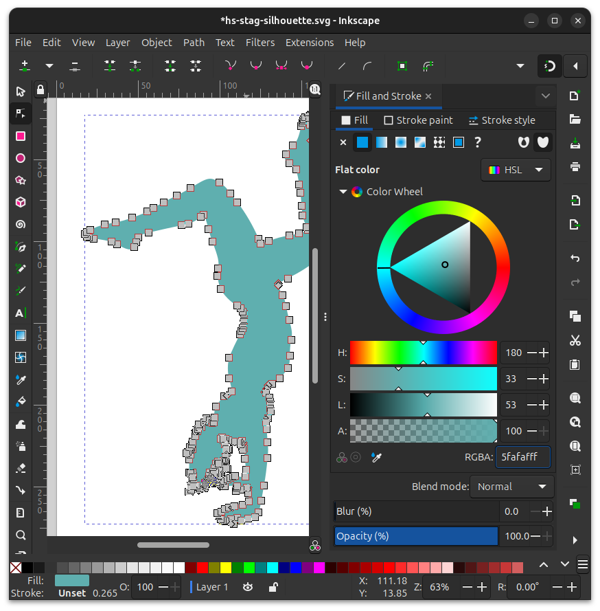

## Official Docs

Click here for the official Inkscape tutorial on the Trace Bitmap feature.

<a class="flux-button _3" href="https://inkscape-manuals.readthedocs.io/en/latest/tracing-an-image.html">Tracing an Image</a>

## Steps

1. Open Inkscape and import your image, either from `File > Import...` or drag and drop the image onto the canvas.

1. Press `S` for the selection tool. Click on the image.

   

1. From the top menu, go to `Path > Trace Bitmap...` (`Shift + Alt + B`). Select your options and click `Apply`.

   

1. Go to the `Layers` panel with `Ctrl+Shift+L` or from the top menu navigate to `Layer > Layers and Objects...`.

1. Expand `Layer 1`. Click the image object and hit the `Delete` key.

   

1. Select the newly created path object to see the nodes.

1. To change the color, navigate to `Object > Fill and Stroke...` (`Ctrl+Shift+F`) and select your preferred color.

   

## The Vector Image

