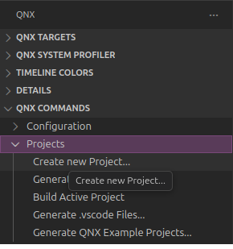
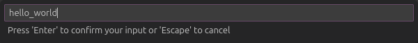
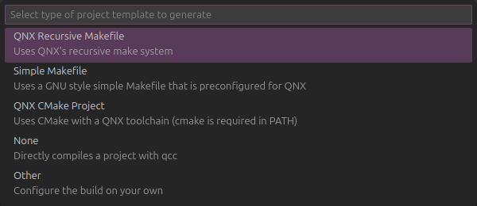
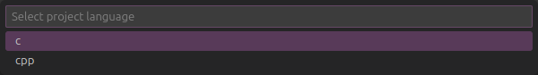
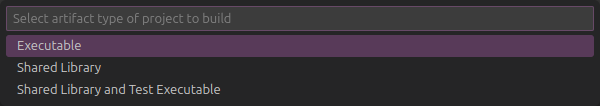
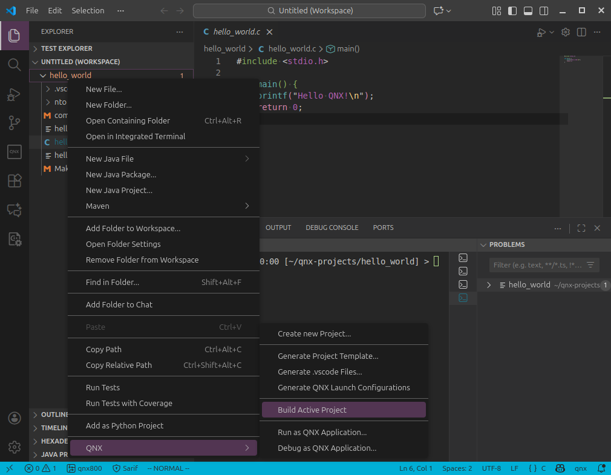
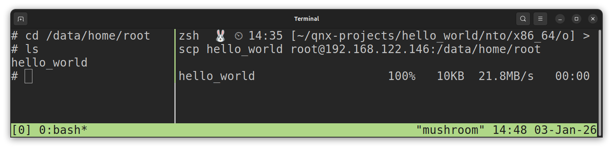
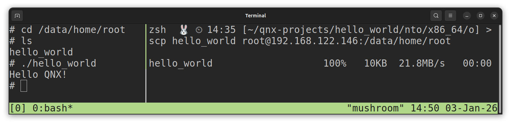

## Official QNX Resources

### Tutorial Video

This video demonstrates how to run a simple project using a Raspberry Pi target; however, on this page we are using a virtual target instead.



### Quickstart Guide

[Quickstart Guide](https://www.qnx.com/developers/docs/8.0/com.qnx.doc.qnxtoolkit.user_guide/topic/quickstart_guide.html){class="flux-button _3"}

## Create New Project

1. In VS Code, select QNX from the Activity Bar on the left side of the screen.

   

1. From the left sidebar under `QNX COMMANDS` select `Projects > Create new Project...`.

   

1. Type the name of your project, e.g. `hello_world`.

   

1. Select `QNX Recursive Makefile` for the template.

   

1. Select `c` for language.

   

1. Select `Executable` for build artifact.

   

1. A default `Hello World` program is added to `hello_world.c`

   ```c
   #include <stdio.h>

    int main() {
        printf("Hello QNX!\n");
        return 0;
    }
   ```

1. To compile, right-click on the project folder and go to `QNX > Build Active Project`.

   

   Example Terminal Output (From VS Code):

   ```bash
    *  Executing task in folder hello_world: make DEBUG=-g OPTIMIZE_TYPE=NONE

   make  -Cnto -fMakefile
   make[1]: Entering directory '/home/flux/qnx-projects/hello_world/nto'
   make  -Caarch64 -fMakefile
   make[2]: Entering directory '/home/flux/qnx-projects/hello_world/nto/aarch64'
   make -j 1 -Co-le -fMakefile
   make[3]: Entering directory '/home/flux/qnx-projects/hello_world/nto/aarch64/o-le'
   make[3]: Nothing to be done for 'first'.
   make[3]: Leaving directory '/home/flux/qnx-projects/hello_world/nto/aarch64/o-le'
   make[2]: Leaving directory '/home/flux/qnx-projects/hello_world/nto/aarch64'
   make  -Cx86_64 -fMakefile
   make[2]: Entering directory '/home/flux/qnx-projects/hello_world/nto/x86_64'
   make -j 1 -Co -fMakefile
   make[3]: Entering directory '/home/flux/qnx-projects/hello_world/nto/x86_64/o'
   make[3]: Nothing to be done for 'first'.
   make[3]: Leaving directory '/home/flux/qnx-projects/hello_world/nto/x86_64/o'
   make[2]: Leaving directory '/home/flux/qnx-projects/hello_world/nto/x86_64'
   make[1]: Leaving directory '/home/flux/qnx-projects/hello_world/nto'
    *  Terminal will be reused by tasks, press any key to close it.
  ```

## Run Project Through Command Line

1. [Set up a virtual target using `mkqnximage`](./qnx-vm.qmd#create-target-using-bash). Make sure to include the `--ssh-ident` parameter.

1. To [run the virtual target](./qnx-vm.qmd#run-target-after-creation) in the terminal, from the directory where the target was created, execute this command:

   Command (From Linux Host):

   ```bash
   mkqnximage --run
   ```

   Example Output (From Running Target):

   ```
   SeaBIOS (version 1.16.3-debian-1.16.3-2)
   ...
   QNX noname 8.0.0 2025/07/30-19:24:08EDT x86pc x86_64
   ```

1. From the terminal of the running target, run `ifconfig` to determine its IP address. The address appears in the `vtnet0` section after `inet`; in this example, it is `192.168.122.146`.

   Example Output (From Running Target):

   ```bash
   # ifconfig
   enc0: flags=0<> metric 0 mtu 1536
           groups: enc
           nd6 options=21<PERFORMNUD,AUTO_LINKLOCAL>
   lo0: flags=8049<UP,LOOPBACK,RUNNING,MULTICAST> metric 0 mtu 16384
           options=680003<RXCSUM,TXCSUM,LINKSTATE,RXCSUM_IPV6,TXCSUM_IPV6>
           inet 127.0.0.1 netmask 0xff000000
           inet6 ::1 prefixlen 128
           inet6 fe80::1%lo0 prefixlen 64 scopeid 0x2
           groups: lo
           nd6 options=21<PERFORMNUD,AUTO_LINKLOCAL>
   pflog0: flags=0<> metric 0 mtu 33144
           groups: pflog
   pfsync0: flags=0<> metric 0 mtu 1500
           syncpeer: 0.0.0.0 maxupd: 128 defer: off
           syncok: 1
           groups: pfsync
   vtnet0: flags=8863<UP,BROADCAST,RUNNING,SIMPLEX,MULTICAST> metric 0 mtu 1500
           options=4c07bb<RXCSUM,TXCSUM,VLAN_MTU,VLAN_HWTAGGING,JUMBO_MTU,VLAN_HWCSUM,TSO4,TSO6,LRO,VLAN_HWTSO,LINKSTATE,TXCSUM_IPV6>
           ether 52:54:00:75:e8:8f
           inet6 fe80::5054:ff:fe75:e88f%vtnet0 prefixlen 64 scopeid 0x5
           inet 192.168.122.146 netmask 0xffffff00 broadcast 192.168.122.255
           media: Ethernet autoselect (10Gbase-T <full-duplex>)
           status: active
           nd6 options=1<PERFORMNUD>
   ```

1. Open a new terminal window and navigate to the output executable of your project. It might be in the following location:

   ```bash
   <project-path>/nto/x86_64/o
   ```

1. Locate the executable. This is usually named after the project directory and has no file extension. In this case, it is named `hello_world`.

   Example Commands (From Linux Host):

   ```bash
   (linux host): cd ~/qnx-projects/hello_world/nto/x86_64/o # Navigate to output directory
   (linux host): ls # List contents of directory
   hello_world  hello_world.dep  hello_world.o  Makefile
   ```

1. From the Linux host, use `scp` (secure copy) to copy the executable to the running target.

   Example Command (From Linux Host):

   ```bash
   (linux host): scp hello_world root@192.168.122.146:/data/home/root
   ```

   Example Output (From Linux Host):

   ```bash
   hello_world                   100%   10KB  21.8MB/s   00:00
   ```

1. On the running target, navigate to `/data/home/root` and execute `ls`. You should see your `hello_world` executable.

   In this screenshot, the left pane is the running target, and the right pane is the Linux host computer.

   

1. From the target terminal, run the executable.

   Example Command (From Running Target):

   ```bash
   ./hello_world
   ```

   Example Output (From Running Target):

   ```bash
   Hello QNX!
   ```

   Screenshot:

   
