<!--___________________________________________________________________|
|______________________________________________________________________|
|        _   __   _   _ _   _   _   _         _                        |
|   |   |_| | _  | | | V | | | | / |_/ |_| | /                         |
|   |__ | | |__| |_| |   | |_| | \ |   | | | \_                        |
|    _  _         _ ___  _       _ ___   _                    / /      |
|   /  | | |\ |  \   |  | / | | /   |   \                    (^^)      |
|   \_ |_| | \| _/   |  | \ |_| \_  |  _/                    (____)o   |
|______________________________________________________________________|
|______________________________________________________________________|
|                                                                      |
|----------------------------------------------------------------------|
|   Copyright 2025, Rebecca Rashkin                                    |
|   -------------------------------                                    |
|   This code may be copied, redistributed, transformed, or built      |
|   upon in any format for educational, non-commercial purposes.       |
|                                                                      |
|   Please give me appropriate credit should you choose to use this    |
|   resource. Thank you :)                                             |
|----------------------------------------------------------------------|
|                                                                      |
|______________________________________________________________________|
|   //\^.^/\\  //\^.^/\\  //\^.^/\\  //\^.^/\\  //\^.^/\\  //\^.^/\\   |
|____________________________________________________________________-->
<!--DESCRIPTION
|   How to install QNX SDP.
|____________________________________________________________________-->

## Official QNX Tutorial



## Installation

1. Sign up for myQNX account from <https://qnx.com>.

1. Log in with myQNX. Hover over `Developers`, then click `FREE Non-Commercial License`.

   

1. If you click this more than once, you will see this screen after you've already requested a license.

   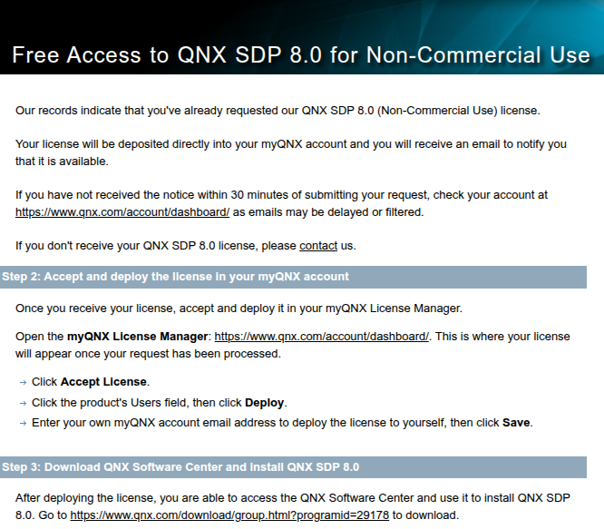

1. You should receive an email within 30 minutes indicating that your Non-Commercial license is ready.

1. Go to <https://qnx.com/account/dashboard/>.

   

1. Under the `Users` column, click on the text `Click to deploy to users` then on the button `Deploy`. Type the email address used for your QNX account.

   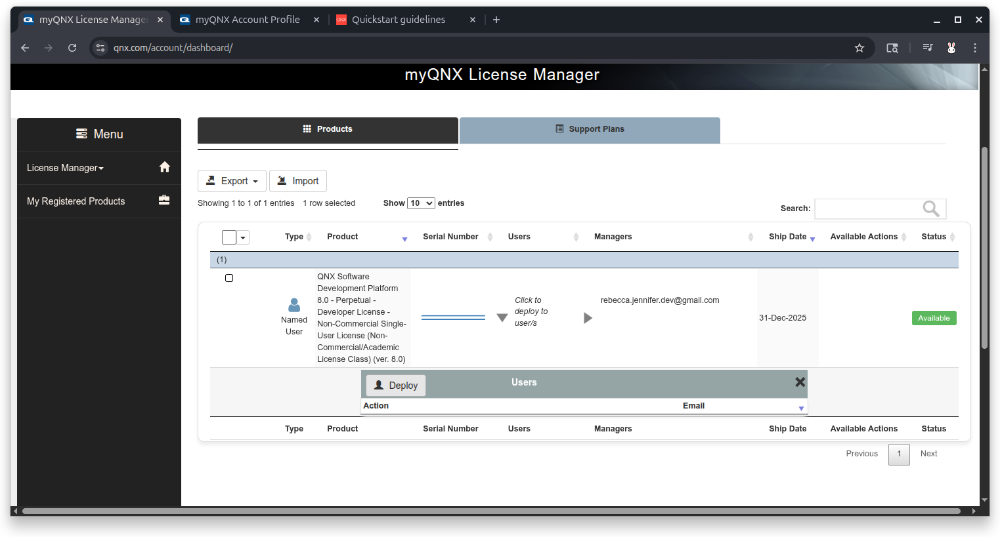
   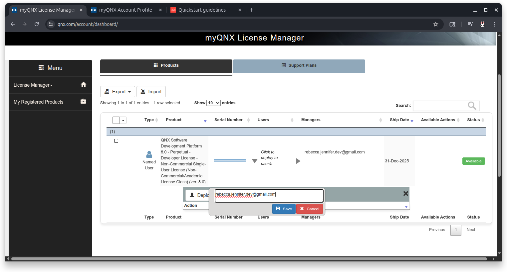

1. From myQNX home <https://qnx.com/account>, click on the `QNX Software Center` link.

   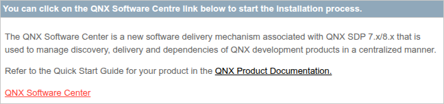

1. Scroll down to the download section and select the appropriate version for your OS.

   

1. In your terminal window, navigate to the downloaded file and make the file executable.

   ```bash
   (linux): cd ~/Downloads
   (linux): chmod +x qnx-setup-2.0.4-202501021438-linux.run
   ```

1. Run the file to install software center.

   ```bash
   (linux): ./qnx-setup-2.0.4-202501021438-linux.run
   ```

1. Scroll to the bottom of the license agreement by hitting `<enter>` several times or type `q` to jump to the bottom.

   

1. Type `y` to accept agreement.

   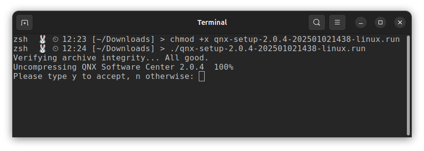

1. Specify installation path. Hit `<enter>` to accept the default install location.

   Example:

   ```bash
   Specify installation path (default: /home/flux/qnx):
   ```

1. After specifying the installation path, your terminal will look similar to this.

   ```bash
   (linux): chmod +x qnx-setup-2.0.4-202501021438-linux.run
   (linux): ./qnx-setup-2.0.4-202501021438-linux.run
   Verifying archive integrity... All good.
   Uncompressing QNX Software Center 2.0.4  100%
   Please type y to accept, n otherwise: y
   Current directory: /home/flux/Downloads
   Specify installation path (default: /home/flux/qnx):

   Installing QNX Software Center into /home/flux/qnx/qnxsoftwarecenter
   User configuration is stored in /home/flux/.qnx
   Launching QNX Software Center using /home/flux/qnx/qnxsoftwarecenter/qnxsoftwarecenter
   ```

1. Type your myQNX credentials.

   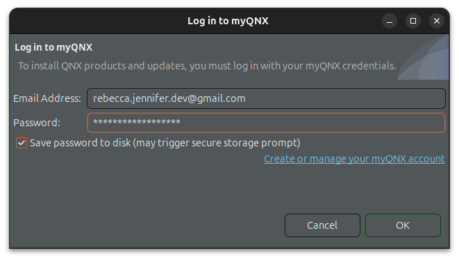
   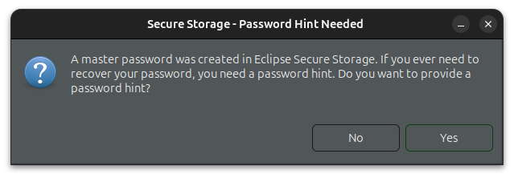

1. From the QNX Software Center window, click `Add Installation`.

   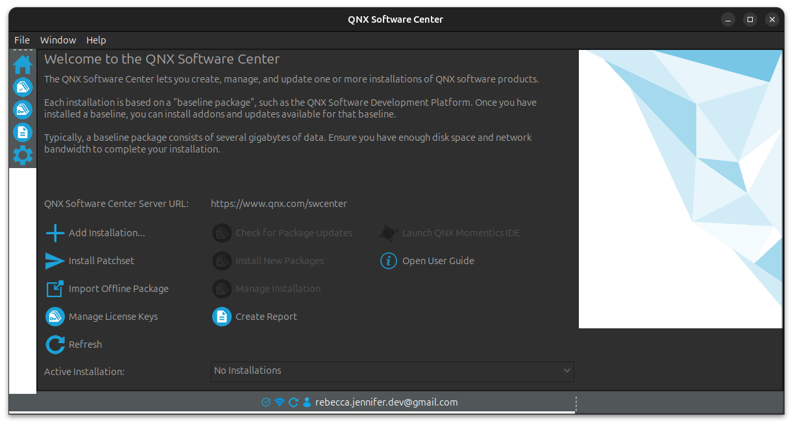

1. Expand `QNX Software Development Platform 8.0`, select `QNX Software Development Platform 8.0` and click `Next` on this and the following window.

   
   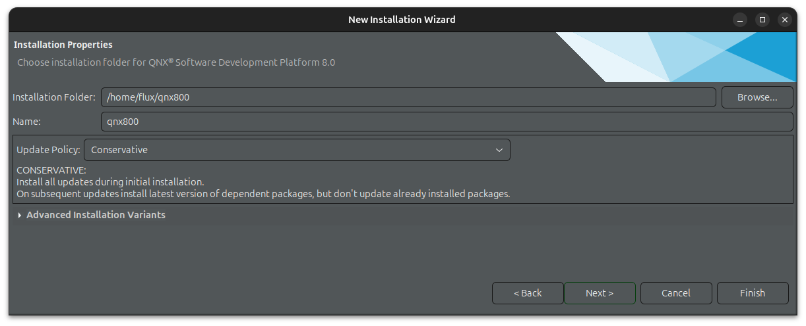

1. The window might show `Synchronizing with remote repository, it may take a while` for a few minutes. Click `Next` when the window changes. Click `Next` for the next couple screens.
   
   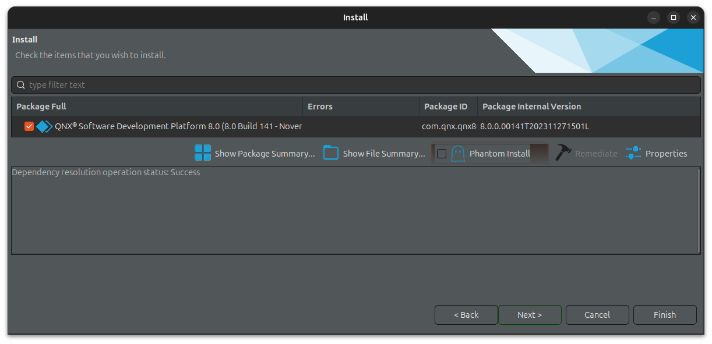
   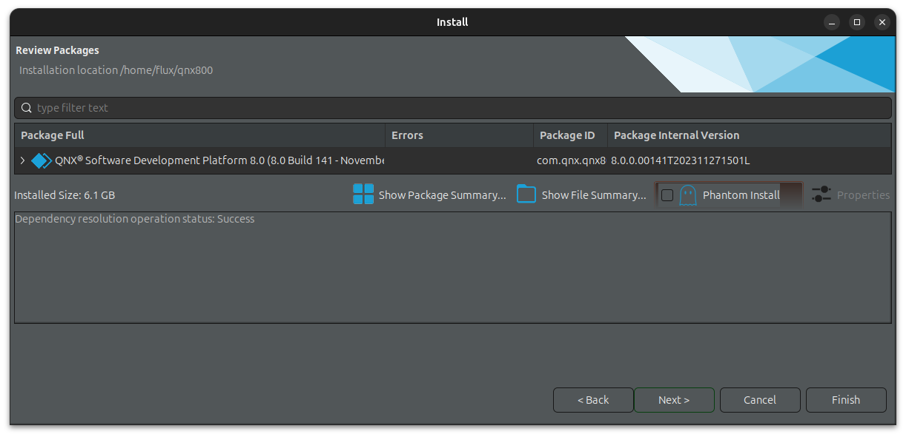

1. Accept the license agreement and click `Finish`.

   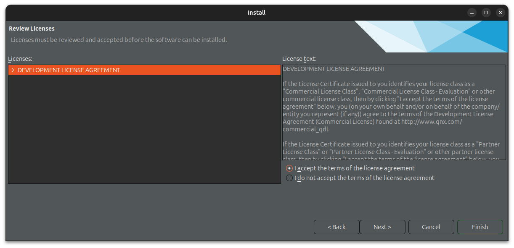

1. After a few minutes, this window will pop up. Click `Close`.

   

1. From QNX Software Center, click `Installed` and expand `QNX Software Development Platform 8.0` to view installed packages.

   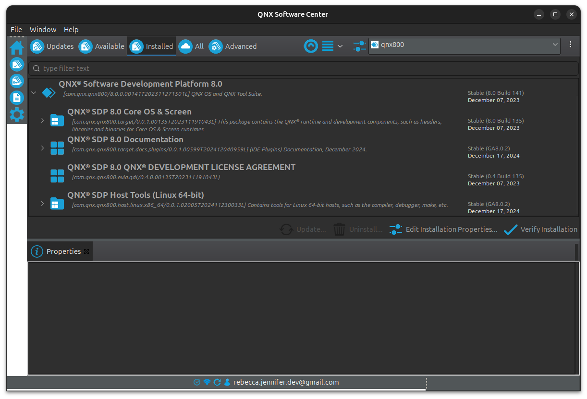

## Installed Files

After installation, in your terminal, show the contents of th QNX installation folder.

```bash
(linux): ls ~/qnx800
host  qnxsdp-env.bat  qnxsdp-env.sh  target
```

File Object   | Description
-|-
`host`        | Contains list of host binaries included in SDP binaries that run on Linux / Development host that allow you to best interact with QNX SDP
`target`      | Contains list of binaries, libraries, tools intended to run on QNX target
`qnxsdp-env.*`| Scripts that set up the shell environment for QNX.

### Shell Setup Script

Before executing QNX commands on the command line, you must source the appropriate `qnxsdp-env`.

```bash
# Sets up shell environment for QNX development
# Sets environment variables:
# QNX_HOST=/home/username/qnx800/host/linux/x86_64
# QNX_TARGET=/home/username/qnx800/target/qnx
# MAKEFLAGS=-I/home/username/qnx800/target/qnx/usr/include
source qnxsdp-env.sh
```

## QNX Momentix IDE

QNX Momentix IDE is the IDE for QNX that comes with QNX Software Center. Follow instructions from the video to install this software.

## Visual Studio Code QNX Toolkit

The VS Code QNX Toolkit extension allows you to create and run QNX projects from VS Code.

1. Install `QNX Toolkit` from extensions.

   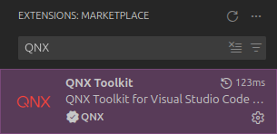

1. Ensure prerequsites are installed. These are listed in the quickstart guide on the QNX website.

   <https://www.qnx.com/developers/docs/qnxtoolkit/>

1. Click the QNX extension in the Activity Bar on the left side of the screen. In the sidebar under `QNX COMMANDS` expand `Configuration` and select `Open QNX Tookit Walkthrough`

   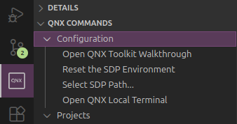

1. From the main window, click `Edit Settings`.

   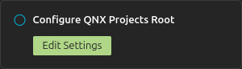

1. Go to VS Code settings with the shortcut `Ctrl + ,`.
1. Expand `Extensions` and select `QNX Toolkit`.
1. Set `Sdp Path` is set to the installation directory and `Default Projects Root` to the project directory path.

   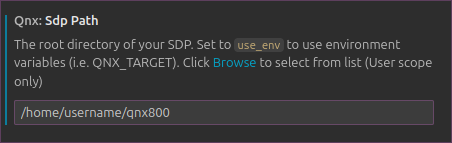
   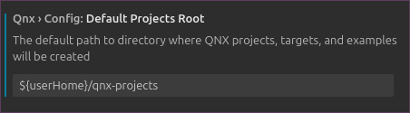

   The corresponding properties in `settings.json` are listed below.

   ```json
   "qnx.sdpPath"                   : "/home/username/qnx800"
   "qnx.config.defaultProjectsRoot": "${userHome}/qnxprojects"
   ```
