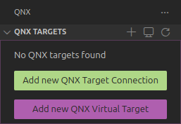
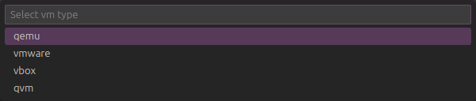
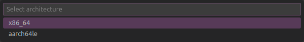
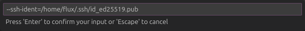
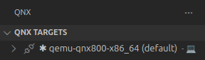

<!--___________________________________________________________________|
|______________________________________________________________________|
|        _   __   _   _ _   _   _   _         _                        |
|   |   |_| | _  | | | V | | | | / |_/ |_| | /                         |
|   |__ | | |__| |_| |   | |_| | \ |   | | | \_                        |
|    _  _         _ ___  _       _ ___   _                    / /      |
|   /  | | |\ |  \   |  | / | | /   |   \                    (^^)      |
|   \_ |_| | \| _/   |  | \ |_| \_  |  _/                    (____)o   |
|______________________________________________________________________|
|______________________________________________________________________|
|                                                                      |
|----------------------------------------------------------------------|
|   Copyright 2025, Rebecca Rashkin                                    |
|   -------------------------------                                    |
|   This code may be copied, redistributed, transformed, or built      |
|   upon in any format for educational, non-commercial purposes.       |
|                                                                      |
|   Please give me appropriate credit should you choose to use this    |
|   resource. Thank you :)                                             |
|----------------------------------------------------------------------|
|                                                                      |
|______________________________________________________________________|
|   //\^.^/\\  //\^.^/\\  //\^.^/\\  //\^.^/\\  //\^.^/\\  //\^.^/\\   |
|____________________________________________________________________-->
<!--DESCRIPTION
|   How to set up a virtual QNX target
|____________________________________________________________________-->

## Official QNX Docs

[mkqnximage](https://www.qnx.com/developers/docs/8.0/com.qnx.doc.neutrino.utilities/topic/m/mkqnximage.html){class="flux-button _3"}

## Note

On this page, commands preceded by `#` indicate that the command is run in the terminal window of a running target.

## Prerequisites

1. [Install QNX SDP 8.0](./qnx-setup.qmd).

1. [Create an SSH Key](/reference/environment-setup__reference/git.qmd#github).

1. Install the following packages via `apt`.

   ```bash
   sudo apt install qemu-system-x86 qemu-utils
   sudo apt install bridge-utils
   sudo apt install libvirt-clients libvirt-daemon-system
   sudo apt install net-tools
   ```

## Create Target Using Bash

1. Run bash if you aren't already.

   ```bash
   bash
   ```

1. Source `qnxsdp-env.sh` from your QNX installation.

   ```bash
   source ~/qnx800/qnxsdp-env.sh
   ```

   Example Output:

   ```bash
   QNX_HOST=/home/flux/qnx800/host/linux/x86_64
   QNX_TARGET=/home/flux/qnx800/target/qnx
   MAKEFLAGS=-I/home/flux/qnx800/target/qnx/usr/include
   ```

1. Check that `mkqnximage` is found.

   ```bash
   which mkqnximage
   ```

   Example Output:

   ```bash
   /home/flux/qnx800/host/common/bin/mkqnximage
   ```

1. Create a directory to hold the VM image.

   ```bash
   mkdir ~/qnx-vm
   cd ~/qnx-vm
   ```

1. Run `mkqnximage` to build the VM. Use `--run` to run the target.

   ```bash
   mkqnximage                             \
   --type=qemu                            \
   --arch=x86_64                          \
   --ssh-ident=$HOME/.ssh/id_ed25519.pub  \
   --run
   ```

1. Upon connection to the virtual target, the following will be printed to the terminal screen.

   ```bash
   SeaBIOS (version 1.16.3-debian-1.16.3-2)


   iPXE (https://ipxe.org) 00:03.0 CA00 PCI2.10 PnP PMM+3EFCACB0+3EF0ACB0 CA00


   Booting from ROM..
   non UEFI or UEFI+CSM boot
   ACPI table not found (0x4746434d)
   overriding mask for controller 2, vector_base 0
   ---> Starting slogger2
   ---> Starting PCI Services
   ---> Starting fsevmgr
   # ---> Starting devb
   ---> Mounting file systems
   Path=0 - Intel 82371SB
    target=0 lun=0     Direct-Access(0) -          QEMU HARDDISK    Rev: 2.5+
   Path=1 - Intel 82371SB
    target=0 lun=0            CD-ROM(5) - QEMU     QEMU DVD-ROM     Rev: 2.5+
   ---> Mounting file systems
   ---> Starting Networking
   ---> Starting sshd
   ---> Starting misc

   To exit QEMU, type <ctrl>a x

   Process count:22
   Startup complete
   QNX noname 8.0.0 2025/07/30-19:24:08EDT x86pc x86_64
   ```

1. Press `<Enter>` to bring up the prompt, indicated by `#`. Enter the command `uname -a` to confirm that the target is running.

   Example:

   ```bash
   # uname -a
   QNX noname 8.0.0 2025/07/30-19:24:08EDT x86pc x86_64
   ```

### Run Target After Creation

After creating the target, navigate to the target directory (in this case `~/qnx-vm`) and execute the following command. Always source `qnxsdp-env.sh` before invoking `mkqnximage`.

   ```bash
   mkqnximage --run
   ```

### Errors When Running `mkqnximage`

#### Error: Cannot Find brctl

Solution: Install `bridge-utils`:

```bash
sudo apt install bridge-utils
```

#### Error: SSH Identity File

You may encounter this error:

```bash
To allow root ssh, you need an ssh identity file. You probably want to use an option such as: --ssh-ident=~/.ssh/id_ed25519.pub
```

Solution: Include the `--ssh-ident` parameter in the `mkqnximage` command.

```bash
--ssh-ident=$HOME/.ssh/id_ed25519.pub
```

If you do not already have an SSH key set up, follow instructions from [this page](/reference/environment-setup__reference/git.qmd#github).

#### Error: Unable to Run vmrun

You may encounter this error if you use `--type=vmware`

   ```bash
   Unable to run vmrun. If you have VMWare Workstation Pro installed
   you will need to add its directory to your PATH. If you are using
   VMWare Workstation Player you will have to open the virtual
   machine local/vmware_files/vmware.vmx directly.
   ```

Solution: Install VMware. Note that in this example we are using `qemu` instead of VMware.


## Create Target Using Visual Studio Code QNX Toolkit

1. [Install the QNX Toolkit extension](./qnx-setup.qmd#visual-studio-code-qnx-toolkit).

1. Select the QNX extension from the activity bar. From `QNX TARGETS`, click the button labeled `Add new QNX Virtual Target`.

   

1. Select the virtual machine type. In this example we are using `qemu`.

   

1. Select the architecture.

   

1. For `Enter extra mkqnximage options`, add `--ssh-ident=/path/to/public/ssh/key`.

   Make sure to use the full path, i.e. `/home/username` instead of `~`. If you do not have an SSH Key set up already, follow instructions [here](/reference/environment-setup__reference/git.qmd#github).

   


1. In the sidebar under `QNX TARGETS`, a new target should be visible.

   

1. The following should be printed to the terminal window.

   ```bash
   SeaBIOS (version 1.16.3-debian-1.16.3-2)


   iPXE (https://ipxe.org) 00:03.0 CA00 PCI2.10 PnP PMM+3EFCACB0+3EF0ACB0 C0


   Booting from ROM..
   non UEFI or UEFI+CSM boot
   ACPI table not found (0x4746434d)
   overriding mask for controller 2, vector_base 0
   ---> Starting slogger2
   ---> Starting PCI Services
   ---> Starting fsevmgr
   # ---> Starting devb
   ---> Mounting file systems
   Path=0 - Intel 82371SB
    target=0 lun=0     Direct-Access(0) -          QEMU HARDDISK    Rev: 2.+
   Path=1 - Intel 82371SB
    target=0 lun=0            CD-ROM(5) - QEMU     QEMU DVD-ROM     Rev: 2.+
   ---> Mounting file systems
   ---> Starting Networking
   ---> Starting sshd
   ---> Starting misc

   To exit QEMU, type <ctrl>a x

   Process count:22
   Startup complete
   QNX qemu-qnx800-x86_64 8.0.0 2025/07/30-19:24:08EDT x86pc x86_64
   ---

   #
   ```

1. At the prompt, type `uname -a` to confirm that you are running the virtual target.

   ```bash
   # uname -a
   QNX qemu-qnx800-x86_64 8.0.0 2025/07/30-19:24:08EDT x86pc x86_64
   # ---
   ```

### Errors With Virtual Target Creation in Visual Studio Code

#### Error: Non-Existent SSH Key File

You may encounter the following error in the terminal window:

```bash
--ssh-ident refers to non-existent file: ~/.ssh/id_ed25519.pub
```

Solution: If you are confident that the path provided for the public key is correct, use the full path instead of using `~` for home.

Example:

```bash
--ssh-ident=/home/flux/id_ed25519.pub
```

#### Error: dnsmasq Not Running

You may encounter this error in the terminal:

```
dnsmasq not running on br0 for DHCP service
You might be better off installing libvirt so you can use virbr0.
To do this, run:

    sudo apt install libvirt-clients libvirt-daemon-system

or whatever is appropriate for your system.

Need to configure networking for QEMU
Unable to configure networking please run:
    /home/flux/qnx800/host/linux/x86_64/../../common/mkqnximage/qemu/check-net
Command exited with error code: 2
```

Solution: Install `libvirt`:

```bash
sudo apt install libvirt-clients libvirt-daemon-system
```
