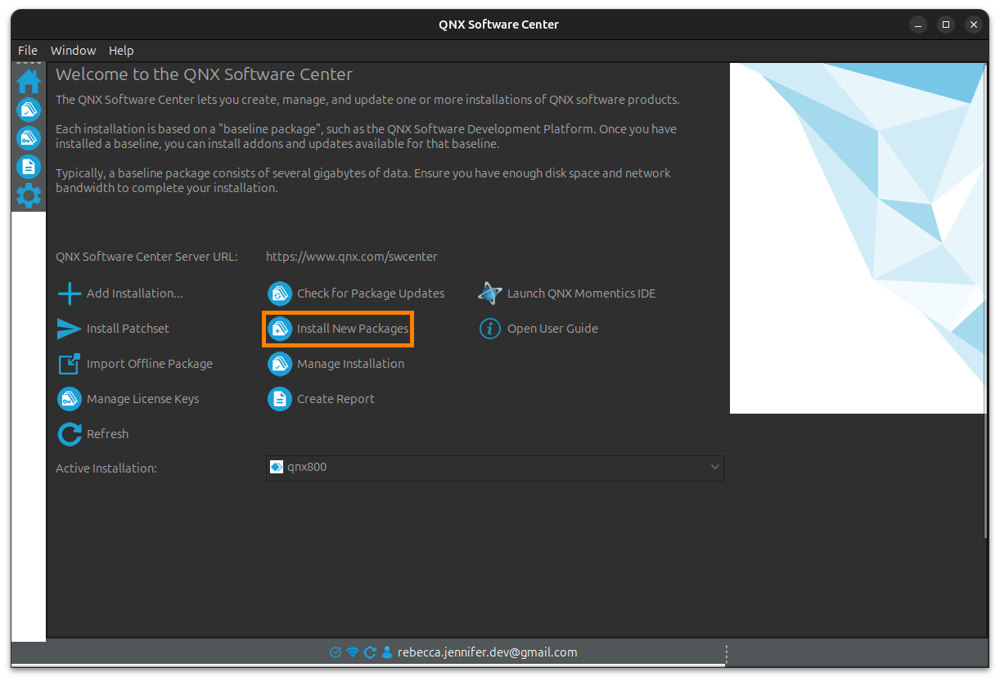
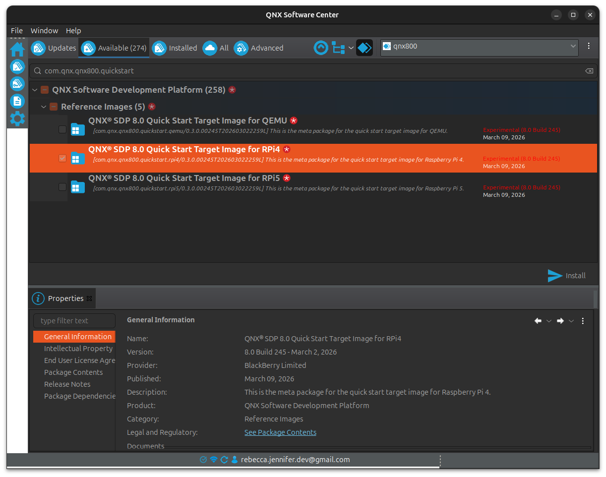
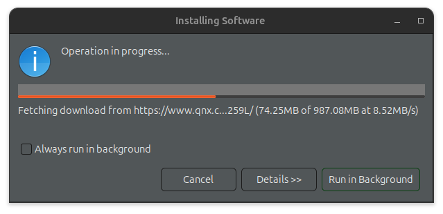
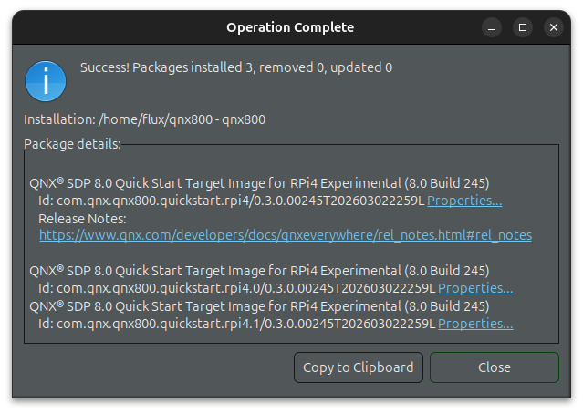

## Official Documentation

[QSTI for Raspberry Pi](https://www.qnx.com/developers/docs/qnxeverywhere/com.qnx.doc.target_images/topic/qsti/intro.html){class="flux-button _3" style="width:100%"}

[Installing the QSTI](https://www.qnx.com/developers/docs/qnxeverywhere/com.qnx.doc.target_images/topic/qsti/install.html){class="flux-button _3" style="width:100%"}

[Install addon packages](https://www.qnx.com/developers/docs/qsc/com.qnx.doc.qsc.user_guide/topic/install_addon_packages.html){class="flux-button _3" style="width:100%"}

## Note

The instructions on this page were created based on using a Linux host computer

## Required Hardware

- Host computer
- Raspberry Pi 4
- Power cable for Raspberry Pi
- [USB-TTY adapter](https://a.co/d/04hH812L)

### Note

Instructions on this page are based on the following hardware and software environment:

Item | Specification
-|-
Host Computer OS | Ubuntu 24.04.4 LTS
Raspberry Pi     | [Raspberry Pi 400](https://www.raspberrypi.com/products/raspberry-pi-400/)
USB-TTY Adapter  | [SH-U09C5](https://a.co/d/04hH812L)

## Install and Open Software Center

1. Log into your QNX account and install [software center](https://www.qnx.com/download/group.html?programid=29178) for your host system.


1. Navigate to the download, in this case `qnx-setup-2.0.4-202501021438-linux.run`, and add execute permissions:

   ```bash
   chmod 755 qnx-setup-2.0.4-202501021438-linux.run
   ```

1. Execute the file.
   ```bash
   ./qnx-setup-2.0.4-202501021438-linux.run
   ```

   Command line output:

   ```bash
   [press q to scroll to the bottom of this agreement]
   DEVELOPMENT LICENSE AGREEMENT

   If the software product you have licensed is SDP 7.1 or later (or software compatible with SDP 7.1 or later), then the following terms apply:

   If the License Certificate issued to you identifies your license class as a "Commercial License Class", "Commercial License Class - Evaluation" or other commercial license class, then by clicking "I accept the terms of the license agreement" or "I agree" or by providing any other affirmation of assent below, you (on your own behalf and/or on behalf of the company/entity you represent (if any)) agree to the terms of the Development License Agreement (Commercial License) found at http://www.qnx.com/commercial_qdl.

   If the License Certificate issued to you identifies your license class as a "Partner License Class" or "Partner License Class - Evaluation" or other partner license class, then by clicking "I accept the terms of the license agreement" or "I agree" or by providing any other affirmation of assent below, you (on your own behalf and/or on behalf of the company/entity you represent (if any)) agree to the terms of the Development License Agreement (Partner License) found at http://www.qnx.com/partner_qdl.

   If the License Certificate issued to you identifies your license class as a "Non-commercial/Academic License Class" or other non-commercial license class, then by clicking "I accept the terms of the license agreement" or "I agree" or by providing any other affirmation of assent below, you (on your own behalf and/or on behalf of the company/entity you represent (if any)) agree to the terms of the Development License Agreement (Non-Commercial/Academic License) found at http://www.qnx.com/nc_qdl.

   If the software product you have licensed is SDP 7.0 (or software compatible with SDP 7.0), see latest version of the license applicable to SDP 7.0 found at: http://www.qnx.com/legal/licensing/document_archive/current_matrix.pdf
   (END)
   ```

   Hit `q` to close the license agreement.

   ```
   > ./qnx-setup-2.0.4-202501021438-linux.run

   Verifying archive integrity... All good.
   Uncompressing QNX Software Center 2.0.4  100%
   Please type y to accept, n otherwise: y

   Specify installation path (default: /home/<username>/qnx):
   ```

1. Open QNX software center:

    ```bash
    > cd ~/qnx/qnxsoftwarecenter
    > ./qnxsoftwarecenter
    ```

## Download the Raspberry Pi Quick Start Target Image

1. Select `Install New Packages`.

   

1. Search for `com.qnx.qnx800.quickstart`. Select `QNX SDP 8.0 Quick Start Target Image for RPi4`. Click `Install`.

   

1. Click  `Finish`.

   

1. When the download is complete, click `Close`.

   

## Create a Bootable Image

1. Ensure you are running bash, and have executed the environment script as described in [QNX Setup](./qnx-setup.qmd#shell-setup-script).

   ```bash
   > bash
   > source ~/qnx800/qnxsdp-env.sh
   ```

1. Locate the bsp `.zip` file and extract it. In this example, the zip file is extracted into a directory named `pi-bcm2711`.

   ```bash
   > cd ~/qnx800/bsp

   > ls
   BSP_raspberrypi-bcm2711-rpi4_be-800_SVN1024006_JBN484.zip

   > unzip BSP_raspberrypi-bcm2711-rpi4_be-800_SVN1024006_JBN484.zip -d pi-bcm2711
   ```

1. Navigate to the directory with the extracted zip. Perform `make clean` then `make`.

   ```bash
   > cd pi-bcm2711

   > make clean
   ...
   make[1]: Leaving directory '/home/<username>/qnx800/bsp/pi-bcm2711/src'
   /bin/rm -f  -r install/*

   > make
   ...
    21375b8       81     ----     ----     etc/system/config/pci/pci_server.cfg=/tmp/mkxfs.sqkAtP
    213763c       44     ----     ----     Image-trailer
   make[1]: Leaving directory '/home/flux/qnx800/bsp/pi-bcm2711/images'
   done
   ```

1. Navigate to the directory `images`. Identify the file similar to `ifs-rpi4.bin`. This is the QNX image that you will have to write to an SD card reader that will be read by the Raspberry Pi.

   ```bash
   > ls -l
   total 44980
   -rw-r--r-- 1 <user> <user>     9015 Sep 30  2024 definitions.m4
   -rw-rw-r-- 1 <user> <user> 34305664 Mar 29 17:11 ifs-rpi4.bin
   -rw-r--r-- 1 <user> <user>     1383 Oct  4  2023 Makefile
   -rwxrwxr-x 1 <user> <user> 11542488 Mar 29 17:11 procnto-smp-instr.sym
   -rw-r--r-- 1 <user> <user>    30404 Dec 10 11:51 rpi4.build
   -rwxrwxr-x 1 <user> <user>   157296 Mar 29 17:11 startup-bcm2711-rpi4.sym
   ```

## Copy Image to SD Card Reader Computer

If your current computer has an SD card reader, you can skip this section. My SD card reader is on my MacBook, so I used `scp` to transfer the image to another computer before writing it to the SD card.

Command from local computer (in my case, my Macbook that has an SD card reader).

```bash
# The connection to user@192.168.0.x is the computer that contains the
# QNX image. In this context, my MacBook with the SD card reader is the
# "local" machine, and my Linux host is the "remote" machine.
scp user@192.168.0.x:~/path/to/ifs-rpi4.bin
```

## Write QNX Image to SD Card

These are the steps I used to write the QNX image onto an SD card on a Macbook Pro from 2014. The steps will likely be similar on a Linux machine.

1. Insert the SD card, the run:

   ```bash
   diskutil list
   ```

   Example Output

   ```bash
   /dev/disk0 (internal, physical):
   #:                       TYPE NAME                    SIZE       IDENTIFIER
   0:      GUID_partition_scheme                        *500.3 GB   disk0
   1:                        EFI EFI                     209.7 MB   disk0s1
   2:                 Apple_APFS Container disk1         500.1 GB   disk0s2

   /dev/disk1 (synthesized):
   #:                       TYPE NAME                    SIZE       IDENTIFIER
   0:      APFS Container Scheme -                      +500.1 GB   disk1
                                 Physical Store disk0s2
   1:                APFS Volume Macintosh HD - Data     455.1 GB   disk1s1
   2:                APFS Volume Preboot                 499.8 MB   disk1s2
   3:                APFS Volume Recovery                624.2 MB   disk1s3
   4:                APFS Volume VM                      3.3 GB     disk1s4
   5:                APFS Volume Macintosh HD            15.3 GB    disk1s5
   6:              APFS Snapshot com.apple.os.update-... 15.3 GB    disk1s5s1

   /dev/disk2 (internal, physical):
   #:                       TYPE NAME                    SIZE       IDENTIFIER
   0:                                                   *7.7 GB     disk2
   ```

   The identifier for the SD card will likely be something like `disk2`, not `disk2s1`.

1. Unmount the SD card.

   ```bash
   > diskutil unmountDisk /dev/disk2

   Unmount of all volumes on disk2 was successful
   ```

1. Write the `.bin` file to the raw disk. This will overwrite the entire SD card.

   ```bash
   # Note that on a linux system the value of bs= might need to be 4M (capital)
   > sudo dd if=/path/to/file.bin of=/dev/disk2 bs=4m

   Password:
   8+1 records in
   8+0 records out
   34305664 bytes transferred in 69.440696 secs (494028 bytes/sec)
   ```

1. Eject safely.

   ```bash
   > diskutil eject /dev/disk2

   Disk /dev/disk2 ejected
   ```

## Connect to Raspberry Pi

### Connect to Host Computer Using Serial

1. Obtain a USB to TTL UART adapter, e.g. [SH-U09C5](https://a.co/d/04hH812L).

1. Connect the following pins from the Raspberry Pi to the adapter:

   Raspberry Pi Pin | USB-TTY Pin
   -|-
   `GND` | `GND`
   `TXD` | `RXD`
   `RXD` | `TXD`

1. Connect the USB adapter to a USB port on the host computer.

1. From the host computer, search for the USB device. In this example the device is named `ttyUSB0` but yours might have a slightly different name.

   ```bash
   > ls /dev/ttyUSB*

   /dev/ttyUSB0
   ```

1. Connect to the device using `screen`.

   ```bash
   > sudo screen /dev/ttyUSB0
   ```