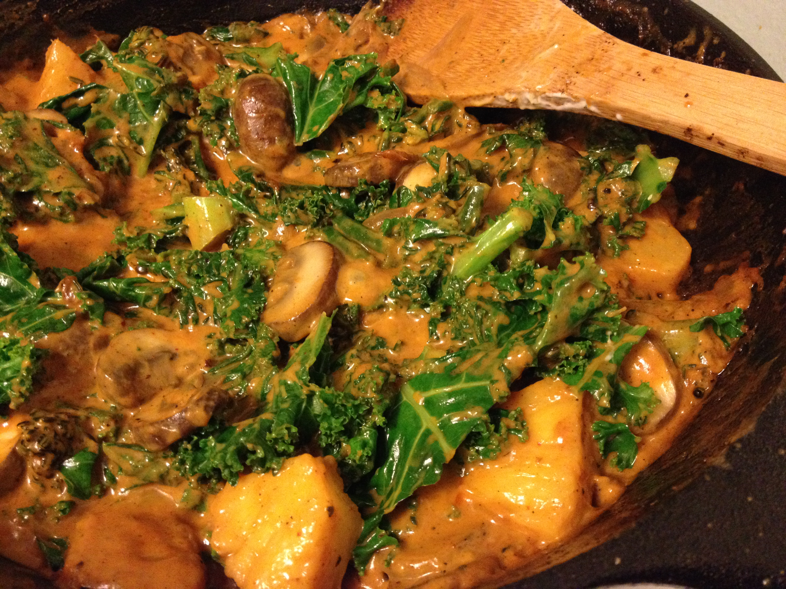

<!--___________________________________________________________________|
|______________________________________________________________________|
|        _   __   _   _ _   _   _   _         _                        |
|   |   |_| | _  | | | V | | | | / |_/ |_| | /                         |
|   |__ | | |__| |_| |   | |_| | \ |   | | | \_                        |
|    _  _         _ ___  _       _ ___   _                    / /      |
|   /  | | |\ |  \   |  | / | | /   |   \                    (^^)      |
|   \_ |_| | \| _/   |  | \ |_| \_  |  _/                    (____)o   |
|______________________________________________________________________|
|______________________________________________________________________|
|                                                                      |
|----------------------------------------------------------------------|
|   Copyright 2025, Rebecca Rashkin                                    |
|   -------------------------------                                    |
|   This code may be copied, redistributed, transformed, or built      |
|   upon in any format for educational, non-commercial purposes.       |
|                                                                      |
|   Please give me appropriate credit should you choose to use this    |
|   resource. Thank you :)                                             |
|----------------------------------------------------------------------|
|                                                                      |
|______________________________________________________________________|
|   //\^.^/\\  //\^.^/\\  //\^.^/\\  //\^.^/\\  //\^.^/\\  //\^.^/\\   |
|____________________________________________________________________-->
<!--DESCRIPTION
|   Red curry
|____________________________________________________________________-->

---
title: Vegetable Red Curry
subtitle: Dinner in 15 min
---

To add some protein, you can incorporate chicken, tofu, or tempeh into the dish.

## Ingredients

Qty | Ingredient
-|-
`2`       | Stalks of baby broccoli cut in small pieces
`5`       | Crimini mushrooms, sliced
`1`       | Shallot, sliced
`2`       | Cloves garlic, minced
`1 tsp`   | Ginger paste / minced ginger
`6`       | Small chunks pineapple
`1`       | Handful cut kale

### Sauce

Qty | Ingredient
-|-
`1 can`     | Coconut milk
`2-3 Tbsp`  | Tablespoons red curry paste (brand: Thai Kitchen)
`2 tsp`     | Toasted sesame oil
`3 Tbsp`    | Sake (rice wine)
♥️          | Salt to taste

## Process

1. Saute shallots, mushrooms, garlic, and ginger in sesame oil over medium heat.
2. Deglaze the pan with sake.
3. Add coconut milk and curry paste. Stir to combine.
4. Add broccoli and cook for 3-5 minutes.
5. Taste and add salt.
6. Add pineapple and cook for 1 minute.
7. Add kale, cook for 1 minute then kill the heat, continuing to stir to combine.

Serve over rice. Feeds 2.

Cook time < 15 minutes