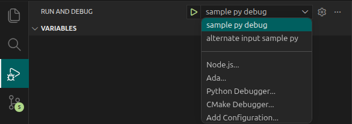

<!--___________________________________________________________________|
|______________________________________________________________________|
|        _   __   _   _ _   _   _   _         _                        |
|   |   |_| | _  | | | V | | | | / |_/ |_| | /                         |
|   |__ | | |__| |_| |   | |_| | \ |   | | | \_                        |
|    _  _         _ ___  _       _ ___   _                    / /      |
|   /  | | |\ |  \   |  | / | | /   |   \                    (^^)      |
|   \_ |_| | \| _/   |  | \ |_| \_  |  _/                    (____)o   |
|______________________________________________________________________|
|______________________________________________________________________|
|                                                                      |
|----------------------------------------------------------------------|
|   Copyright 2026, Rebecca Rashkin                                    |
|   -------------------------------                                    |
|   This code may be copied, redistributed, transformed, or built      |
|   upon in any format for educational, non-commercial purposes.       |
|                                                                      |
|   Please give me appropriate credit should you choose to use this    |
|   resource. Thank you :)                                             |
|----------------------------------------------------------------------|
|                                                                      |
|______________________________________________________________________|
|   //\^.^/\\  //\^.^/\\  //\^.^/\\  //\^.^/\\  //\^.^/\\  //\^.^/\\   |
|____________________________________________________________________-->
<!--DESCRIPTION
|   VS Code debugger setup
|____________________________________________________________________-->

## Visual Studio Code Documentation

[Debug Configuration](https://code.visualstudio.com/docs/debugtest/debugging-configuration){class="flux-button _3"}


## Procedure

1. Open the workspace directory in VS Code.
1. In the workspace root, create a `.vscode` directory if it does not already exist.
1. Inside `.vscode`, create a file named `launch.json`.

## Python Example

### Example Python Program

```python
#_______________________________________________________________
# This file is named arg_test.py
#_______________________________________________________________
import argparse

if __name__ == '__main__':
  parser: argparse.ArgumentParser = argparse.ArgumentParser()
  parser.add_argument('--in0', '-i0', help='Input 0', action='store')
  parser.add_argument('--in1', '-i1', help='Input 1', action='store')
  args: argparse.Namespace = parser.parse_args()

  print(str(
    f'\nInput argument 0: {args.in0}'
    f'\nInput argument 1: {args.in1}'
    )
  )
```

### Sample `launch.json`

This `launch.json` file contains two Python debug configurations with alternative inputs.

```json
{ "version":        "0.2.0"

, "configurations":
  [ { "name"    : "sample py debug"
    , "type"    : "debugpy"
    , "request" : "launch"
    , "program" : "${workspaceFolder}/arg_test.py"
    , "console" : "integratedTerminal"
    , "args"    :
      [ "--in0", "42"
      , "-i1"  , "3.14"
      ]
    }

  , { "name"    : "alternate input sample py"
    , "type"    : "debugpy"
    , "request" : "launch"
    , "program" : "${workspaceFolder}/arg_test.py"
    , "console" : "integratedTerminal"
    , "args"    :
      [ "--in0", "64"
      , "--in1", "4096"
      ]
    }
  ]
}
```

#### Key Descriptions

Key       | Description
-|-
`name`    | Name of configuration.
`type`    | Type of debugger. Common values are `debugpy` for python, `gdb` for `cpp`.
`request` | Specifies what kind of debugging action VS Code should perform. <br>`launch` = Start a new program<br>`attach` = Attach debugger to a program that is already running.
`program` | Path to program to execute.
`console` | Use `integratedTerminal` to use the VS Code terminal for program execution.
`args`    | Arguments passed to the program.

### Run Debug Configuration

1. Select the icon for `Run and Debug` from the activity bar. Click the drop down menu and select a configuration in `launch.json`.

   

1. Click the triangle (▷) play symbol to run the debug configuration.

## C++ Example

### Notes

1. Debugging a C++ program requires debug symbols. When using `g++`, enable them with the `-g` command-line option.
1. You can create a VS Code [task](./tasks-json.qmd) to build the C++ program using debug symbols.

### Example C++ Program

```cpp
#include <cstdio>
#include <cstdlib>

int main(int argc, char* argv[])
{
  int i = -1;

  // Convert command line input C-style string (e.g. char*) to integer
  if (argc > 1)
  {
    i = std::atoi(argv[1]);
  }

  printf(
    "\n\nHello there :)"
    "\n\nInput argument: %d"
    "\n\n"
    , i
  );

  return 0;
}
```

### Sample `launch.json` C++ Configuration

```json
{ "version": "0.2.0"
, "configurations":
  [ { "name"            : "hello-cpp-debug"
    , "type"            : "cppdbg"
    , "request"         : "launch"
    , "cwd"             : "${workspaceFolder}"
    , "program"         : "${workspaceFolder}/hello/hello.out"
    , "args"            : ["42"]
    , "stopAtEntry"     : true
    , "externalConsole" : false
    }
  ]
}
```

#### Key Descriptions

Key               | Description
-|-
`name`            | Name of configuration.
`type`            | Type of debugger. Common value for C++ is "cppdbg"
`request`         | Specifies what kind of debugging action VS Code should perform. <br>`launch` = Start a new program<br>`attach` = Attach debugger to a program that is already running.
`cwd`             | Defines the working directory used when running the command.
`program`         | Path to program to execute.
`args`            | Arguments passed to the program.
`stopAtEntry`     | Sets a breakpoint at program entry.
`externalConsole` | Use `integratedTerminal` to use the VS Code terminal for program execution.

### Sample `tasks.json` C++ Debug Build

The following `tasks.json` example defines a VS Code [task](./tasks-json.qmd) that builds a C++ program with debug symbols using the `-g` option of `g++`.

```json
{ "version": "2.0.0"
, "tasks":
  [
    { "label"   : "compile-hello-debug"
    , "type"    : "shell"
    , "command" : "g++"
    , "args"    :
      [ "${workspaceFolder}/hello/hello.cpp"
      , "-g"
      , "-o"
      , "${workspaceFolder}/hello/hello.out"
      ]

      // Close task terminal after execution
    , "presentation"  :
      { "close": true
      }

      // Disable error detection for task
    , "problemMatcher": []
    }
  ]
}
```