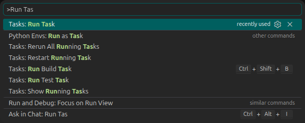
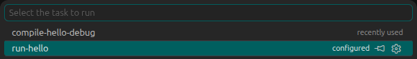
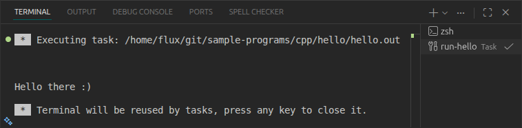

<!--___________________________________________________________________|
|______________________________________________________________________|
|        _   __   _   _ _   _   _   _         _                        |
|   |   |_| | _  | | | V | | | | / |_/ |_| | /                         |
|   |__ | | |__| |_| |   | |_| | \ |   | | | \_                        |
|    _  _         _ ___  _       _ ___   _                    / /      |
|   /  | | |\ |  \   |  | / | | /   |   \                    (^^)      |
|   \_ |_| | \| _/   |  | \ |_| \_  |  _/                    (____)o   |
|______________________________________________________________________|
|______________________________________________________________________|
|                                                                      |
|----------------------------------------------------------------------|
|   Copyright 2026, Rebecca Rashkin                                    |
|   -------------------------------                                    |
|   This code may be copied, redistributed, transformed, or built      |
|   upon in any format for educational, non-commercial purposes.       |
|                                                                      |
|   Please give me appropriate credit should you choose to use this    |
|   resource. Thank you :)                                             |
|----------------------------------------------------------------------|
|                                                                      |
|______________________________________________________________________|
|   //\^.^/\\  //\^.^/\\  //\^.^/\\  //\^.^/\\  //\^.^/\\  //\^.^/\\   |
|____________________________________________________________________-->
<!--DESCRIPTION
|   VS Code tasks
|____________________________________________________________________-->

## Visual Studio Code Documentation

[Tasks](https://code.visualstudio.com/docs/debugtest/tasks){class="flux-button _3"}


## Procedure

1. Open the workspace directory in VS Code.
1. In the workspace root, create a `.vscode` directory if it does not already exist.
1. Inside `.vscode`, create a file named `tasks.json`.

## Example

### Hello World Program

Assume you have a simple C++ `Hello World` program:

```cpp
#include <stdio.h>

int main()
{
  printf("\nHello!\n\n");
  return 0;
}
```

## Sample `tasks.json`

This `tasks.json` file contains two tasks, one that compiles the file (`compile-hello`) and another that runs the executable (`run-hello`).

```json
{ "version": "2.0.0"
, "tasks":
  [
    { "label": "compile-hello-debug"
    , "type": "shell"
    , "command": "g++"
    , "args":
      [ "${workspaceFolder}/hello.cpp"
      , "-g"
      , "-o"
      , "hello.out"
      ]
    , "presentation":
      { "close": true
      }
    , "problemMatcher": []
    }

  , { "label": "run-hello"
    , "type": "shell"
    , "command": "${workspaceFolder}/hello.out"
    , "dependsOn":
      [ "compile-hello"
      ]
    , "problemMatcher": []
    }
  ]
}
```

### Key Descriptions

Key               | Description
-|-
`label`           | Name of the task.
`command`         | Command to execute.
`args`            | Arguments passed to the command.
`presentation`    | Set `"close": true` to automatically close the task terminal when the task completes.
`problemMatcher`  | Specifies how VS Code detects errors and warnings in task output and displays them in the Problems panel.. Set to `[]` to disable this behavior.
`dependsOn`       | List of tasks that must run before this task.

## Run Task

1. Press `Ctrl+Shift+P` to enter a command in the command palette. Start to type `Run Task`. Select `Tasks: Run Task`.

   

1. Select the task you would like to run.

   

   Terminal Output

   
