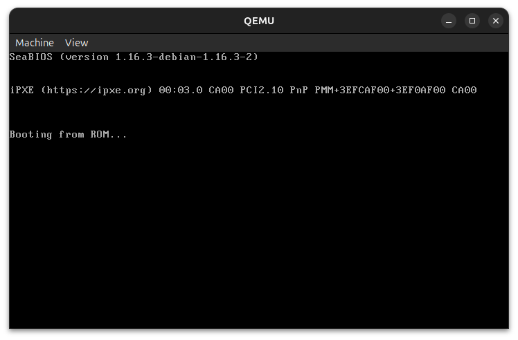

<!--___________________________________________________________________|
|______________________________________________________________________|
|        _   __   _   _ _   _   _   _         _                        |
|   |   |_| | _  | | | V | | | | / |_/ |_| | /                         |
|   |__ | | |__| |_| |   | |_| | \ |   | | | \_                        |
|    _  _         _ ___  _       _ ___   _                    / /      |
|   /  | | |\ |  \   |  | / | | /   |   \                    (^^)      |
|   \_ |_| | \| _/   |  | \ |_| \_  |  _/                    (____)o   |
|______________________________________________________________________|
|______________________________________________________________________|
|                                                                      |
|----------------------------------------------------------------------|
|   Copyright 2026, Rebecca Rashkin                                    |
|   -------------------------------                                    |
|   This code may be copied, redistributed, transformed, or built      |
|   upon in any format for educational, non-commercial purposes.       |
|                                                                      |
|   Please give me appropriate credit should you choose to use this    |
|   resource. Thank you :)                                             |
|----------------------------------------------------------------------|
|                                                                      |
|______________________________________________________________________|
|   //\^.^/\\  //\^.^/\\  //\^.^/\\  //\^.^/\\  //\^.^/\\  //\^.^/\\   |
|____________________________________________________________________-->
<!--DESCRIPTION
|   Reference page for PuTTY configuration
|____________________________________________________________________-->

### Notes

1. These instructions were executed on a Linux machine, version `Ubuntu 24.04.4 LTS (Noble Numbat)`.
1. Lines starting with `>` represent commands entered at the command prompt.
1. Instructions were taken from official references.

## Official VxWorks Links

[Download page](https://forums.windriver.com/t/vxworks-software-development-kit-sdk/43)
[README](https://d13321s3lxgewa.cloudfront.net/downloads/wrsdk-vxworks7-docs/2603/README_qemu.html)

Prerequisites

```bash
sudo apt install build-essential libc6:i386
sudo apt install python3-pip
sudo apt install python3-pyftpdlib
sudo apt install qemu-system-x86
```

VxWorks SDK for IA - QEMU (x86-64)

1. Extract the compressed file. This may take a couple minutes.

   ```bash
   # x = extract
   # j = use bzip2 compression
   # f = filename follows
   tar -xjf wrsdk-vxworks7-qemu-1.17.0.tar.bz2
   ```

1. If preferred, move the extracted directory.

   ```bash
   # Make new directory
   > mkdir ~/apps/wind-river

   # Move extracted directory to new location
   > mv wrsdk-vxworks7-qemu-1.17.0 ~/apps/wind-river
   ```

1. Navigate to the extracted directory and source `sdkenv.sh`.

   ```bash
   > cd ~/apps/wind-river/wrsdk-vxworks7-qemu-1.17.0
   > source sdkenv.sh
   ```

   __Note:__ If you get this error after sourcing the file, [reconfigure `/bin/sh/` to bash](#reconfigure-binsh):

   ```bash
   > source sdkenv.sh
   The default shell is dash, please change your default shell to bash.
   ```

1. Verify that the environment `$WIND_HOME` has been set.

   ```bash
   > echo $WIND_HOME
   /home/flux/apps/wind-river/wrsdk-vxworks7-qemu-1.17.0
   ```

1. Boot VxWorks on QEMU

   ```bash
   > qemu-system-x86_64 -m 1024M -kernel vxsdk/bsps/itl_generic_3_0_0_5/vxWorks \
     -net nic -net user,hostfwd=tcp::1534-:1534,hostfwd=tcp::2345-:2345         \
     -display none -serial stdio -monitor none                                  \
     -append "bootline:fs(0,0)host:vxWorks h=10.0.2.2 e=10.0.2.15 u=target pw=vxTarget o=gei0"
   ```

   ```bash
   Instantiating /ram0 as rawFs, device = 0x1
   Instantiating /ram0 as rawFs,  device = 0x1
   Formatting /ram0 for HRFS v1.2
   Formatting...OK.
   Target Name: vxTarget
   Instantiating /tmp as rawFs, device = 0x10001
   Instantiating /tmp as rawFs,  device = 0x10001
   Formatting /tmp for HRFS v1.2
   Formatting...OK.

    _________            _________
    \........\          /......../
     \........\        /......../
      \........\      /......../
       \........\    /......../
        \........\   \......./
         \........\   \...../              VxWorks SMP 64-bit
          \........\   \.../
           \........\   \./     Release version: 26.03
            \........\   -      Build date: May  6 2026 15:25:23
             \........\
              \......./         Copyright Wind River Systems, Inc.
               \...../   -                 1984-2026
                \.../   /.\
                 \./   /...\
                  -   -------

                      Board: x86_64 Processor (ACPI_BOOT_OP) SMP/SMT
                  CPU Count: 1
             OS Memory Size: ~958MB
           ED&R Policy Mode: Deployed
        Debug Agent: Started (always)
            Stop Mode Agent: Not started

   Instantiating /ram as rawFs,  device = 0x20001
   Formatting /ram for DOSFS
   Instantiating /ram as rawFs, device = 0x20001
   Formatting...Retrieved old volume params with %38 confidence:
   Volume Parameters: FAT type: FAT32, sectors per cluster 0
     0 FAT copies, 0 clusters, 0 sectors per FAT
     Sectors reserved 0, hidden 0, FAT sectors 0
     Root dir entries 0, sysId (null)  , serial number 110000
     Label:"           " ...
   Disk with 64 sectors of 512 bytes will be formatted with:
   Volume Parameters: FAT type: FAT12, sectors per cluster 1
     2 FAT copies, 54 clusters, 1 sectors per FAT
     Sectors reserved 1, hidden 0, FAT sectors 2
     Root dir entries 112, sysId VXDOS12 , serial number 110000
     Label:"           " ...
   OK.

    Adding 28098 symbols for standalone.

   ->
   ```

   __Note:__ If the VxWorks image did not load, a terminal window will pop up and might look like this:

   

   If you click on the QEMU terminal, you might not be able to click anywhere on your machine. press `Ctrl+Alt+G` to release the grab.

## Hello World on VxWorks

1. Create a `hello` project.

   ```cpp
   #include <stdio.h>

   int main(void)
     {
       printf("hello, world!\n");
       return 0;
     }
   ```

1. Source the `sdkenv.sh` script from the root of the SDK.

   ```bash
   > cd ~/apps/wind-river/wrsdk-vxworks7-qemu-1.17.0
   > source sdkenv.sh
   ```

1. Compile the source file.

   ```bash
   wr-cc -rtp hello.c -static -o hello.exe
   ```

## Run Application

1. Start an FTP server.

   ```bash
   > sudo python3 -m pyftpdlib -p 21 -u target -P vxTarget -d $HOME
   [I 2026-05-16 19:58:35] concurrency model: async
   [I 2026-05-16 19:58:35] masquerade (NAT) address: None
   [I 2026-05-16 19:58:35] passive ports: None
   [I 2026-05-16 19:58:35] >>> starting FTP server on 0.0.0.0:21, pid=406255 <<<
   ```

1. Move the FTP server process to the background by pressing `Ctrl+Z`. Run `bg` to keep the process running.

   ```bash
     ^Z
   zsh: suspended  sudo python3 -m pyftpdlib -p 21 -u target -P vxTarget -d $HOME

   > bg
   [3]    continued  sudo python3 -m pyftpdlib -p 21 -u target -P vxTarget -d $HOME
   ```

### Reconfigure `/bin/sh`

The script `sdkenv.sh` assumes that `/bin/sh` is configured to `bash`, but in this example, it was configured to `dash`. This section describes how to reconfigure `/bin/sh` to `bash`.

1. Verify `/bin/sh` is pointing to `dash`.

   ```bash
   > ls -la /bin/sh
   rwxrwxrwx 1 root root 4 Mar 31  2024 /bin/sh -> dash
   ```

1. Force `/bin/sh` to link to `bash`.

   ```bash
   > sudo ln -sf /usr/bin/bash /bin/sh
   ```

1. Verify `/bin/sh` has been reconfigured to `/usr/bin/bash`.

   ```bash
   > readlink -f /bin/sh
   /usr/bin/bash
   ```
